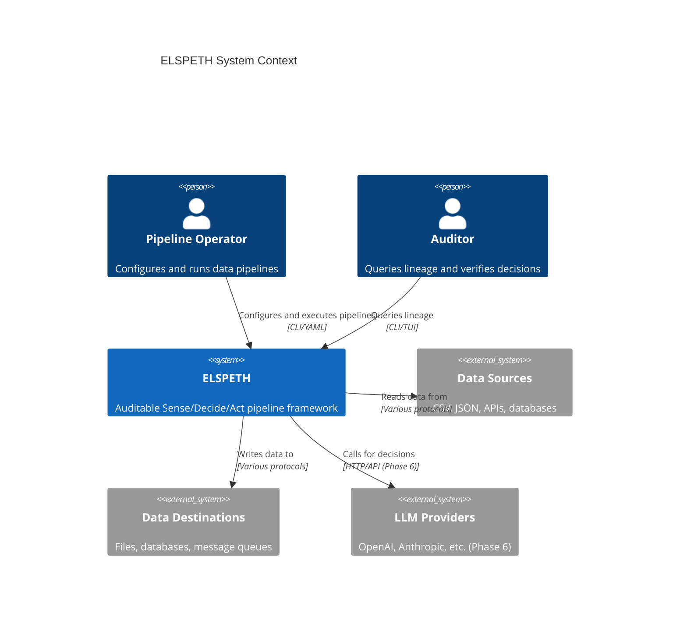
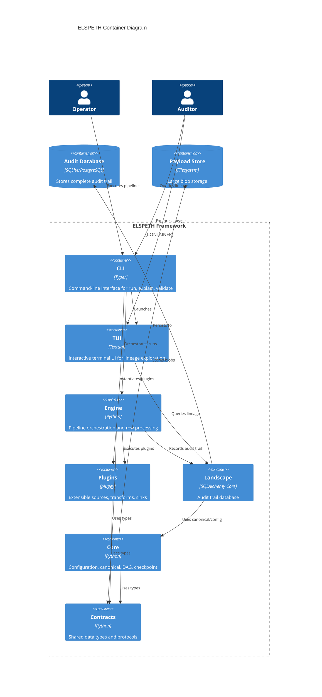
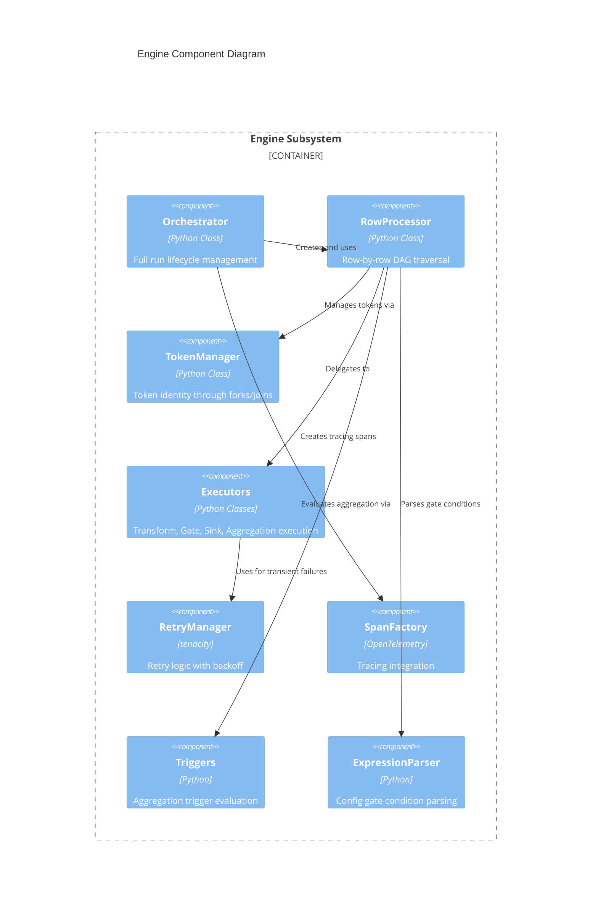
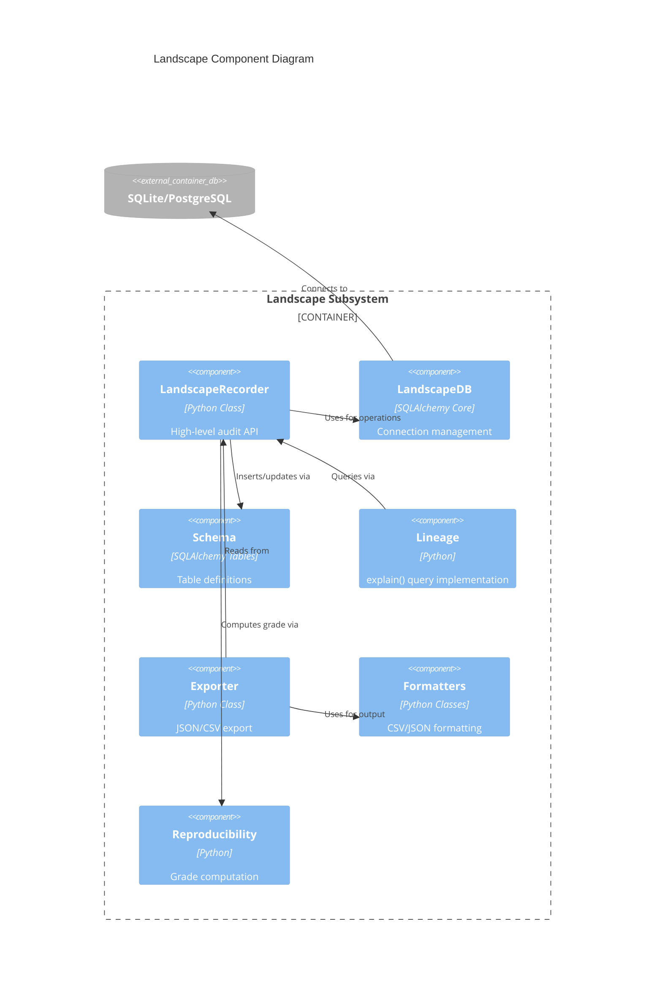
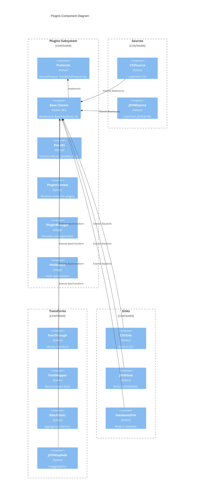
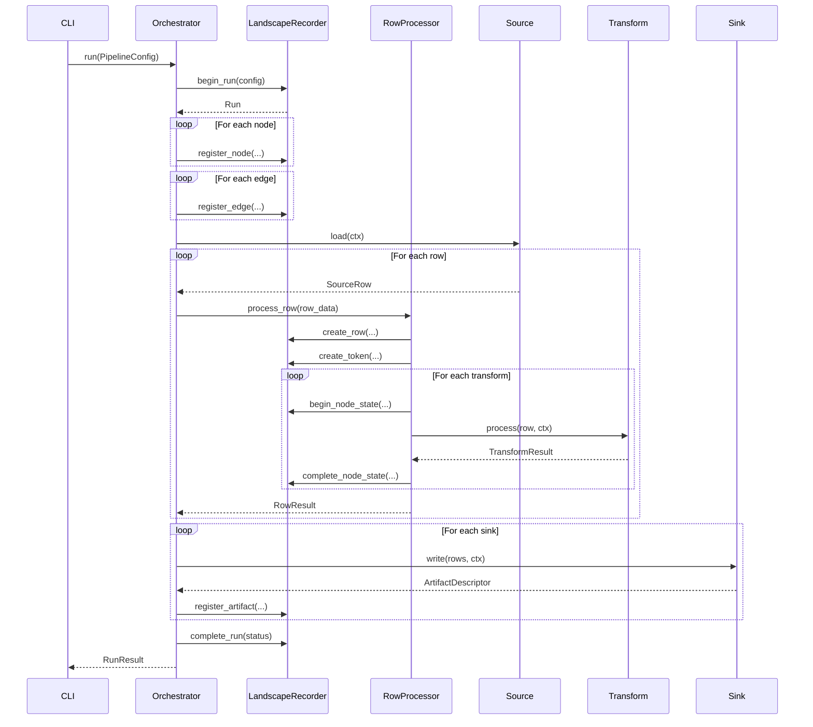
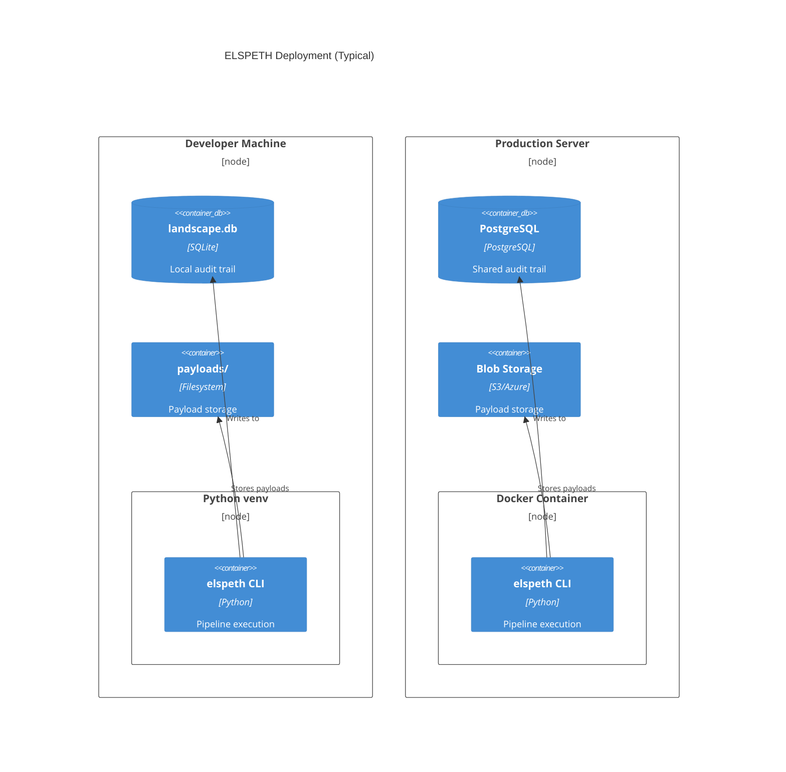
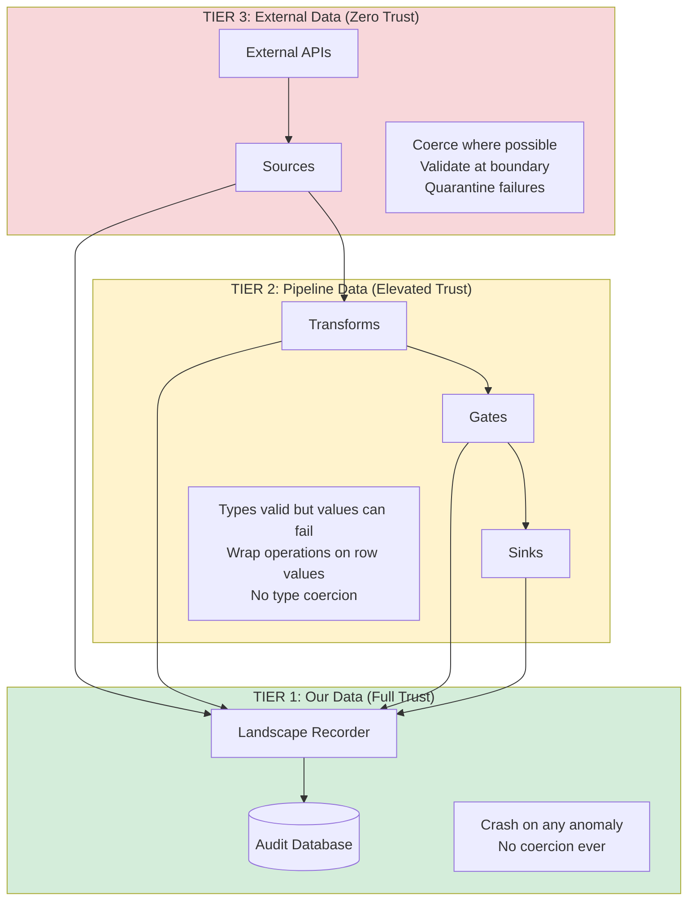

# ELSPETH Architecture

C4 model documentation for the ELSPETH auditable pipeline framework.

---

## At a Glance

| Question | Answer |
|----------|--------|
| **What is ELSPETH?** | Auditable Sense/Decide/Act pipeline framework |
| **Core subsystems?** | CLI, Engine, Plugins, Landscape (audit), Core |
| **Data flow?** | Source → Transforms/Gates → Sinks (all recorded) |
| **Audit storage?** | SQLite (dev) / PostgreSQL (prod) |
| **Extension model?** | pluggy-based plugin system |

---

## How to Read This Document

| Audience | Start Here |
|----------|------------|
| **New developers** | [System Context](#level-1-system-context-diagram) → [Container Diagram](#level-2-container-diagram) |
| **Plugin authors** | [Plugins Components](#33-plugins-components) |
| **Engine contributors** | [Engine Components](#31-engine-components) → [Pipeline Execution Flow](#pipeline-execution-flow) |
| **Operators** | [Deployment View](#deployment-view) |

---

## Table of Contents

- [Level 1: System Context](#level-1-system-context-diagram)
- [Level 2: Container Diagram](#level-2-container-diagram)
- [Level 3: Component Diagrams](#level-3-component-diagrams)
  - [Engine Components](#31-engine-components)
  - [Landscape Components](#32-landscape-components)
  - [Plugins Components](#33-plugins-components)
- [Data Flow Diagrams](#data-flow-diagrams)
  - [Pipeline Execution Flow](#pipeline-execution-flow)
  - [Token Lifecycle](#token-lifecycle)
- [Deployment View](#deployment-view)
- [Trust Boundary Diagram](#trust-boundary-diagram)
- [Summary](#summary)

---

## Level 1: System Context Diagram

Shows ELSPETH's relationship with external actors and systems.



**Key relationships:**

| Actor/System | Interaction |
|--------------|-------------|
| Pipeline Operator | Configures YAML, executes via CLI, monitors runs |
| Auditor | Queries lineage via CLI/TUI, verifies decisions |
| Data Sources | CSV, JSON, APIs - read by Source plugins |
| Data Destinations | Files, databases - written by Sink plugins |
| LLM Providers | External calls for classification (Phase 6) |

---

## Level 2: Container Diagram

Shows the major subsystems within ELSPETH.



### Container Responsibilities

| Container | Technology | Purpose |
|-----------|------------|---------|
| **CLI** | Typer | User commands: `run`, `explain`, `validate`, `resume` |
| **TUI** | Textual | Interactive lineage exploration |
| **Engine** | Python | Run lifecycle, row processing, DAG execution |
| **Plugins** | pluggy | Extensible sources, transforms, gates, sinks |
| **Landscape** | SQLAlchemy Core | Audit recording and querying |
| **Core** | Python | Config, canonical JSON, DAG, checkpoint, rate limit |
| **Contracts** | Python | Shared dataclasses, enums, protocols |
| **Audit DB** | SQLite/PostgreSQL | Complete audit trail storage |
| **Payload Store** | Filesystem | Large blob storage with retention |

---

## Level 3: Component Diagrams

### 3.1 Engine Components

The Engine orchestrates pipeline execution and row processing.



| Component | Responsibility |
|-----------|----------------|
| **Orchestrator** | Begin run → register nodes/edges → process rows → complete run |
| **RowProcessor** | Work queue-based DAG traversal, fork/join handling |
| **TokenManager** | Create, fork, coalesce, expand tokens |
| **Executors** | Execute transforms, gates, sinks, aggregations |
| **RetryManager** | Retry transient failures with exponential backoff |
| **SpanFactory** | Create OpenTelemetry spans for observability |
| **Triggers** | Evaluate count/timeout triggers for aggregation |
| **ExpressionParser** | Parse and evaluate gate condition expressions |

### 3.2 Landscape Components

The Landscape records and queries the audit trail.



### Audit Trail Tables

```
runs → nodes → edges
  ↓
rows → tokens → token_parents
         ↓
    node_states → routing_events
         ↓           ↓
      calls     batches → batch_members
                   ↓
              batch_outputs
                   ↓
               artifacts

validation_errors, transform_errors (error tracking)
```

### 3.3 Plugins Components

The plugin system provides extensible pipeline components.



| Component | Purpose |
|-----------|---------|
| **Protocols** | Runtime-checkable interfaces (`SourceProtocol`, `TransformProtocol`, etc.) |
| **Base Classes** | Abstract implementations with common functionality |
| **Results** | Typed results (`TransformResult`, `GateResult`, `SourceRow`) |
| **PluginContext** | Runtime context passed to all plugin methods |
| **PluginManager** | pluggy-based discovery and registration |

---

## Data Flow Diagrams

### Pipeline Execution Flow

This sequence shows how a row flows through the pipeline with audit recording at each step.



**Key audit points:**

1. `begin_run` - Configuration hash stored
2. `register_node/edge` - DAG structure recorded
3. `create_row/token` - Row identity established
4. `begin/complete_node_state` - Transform input/output hashes recorded
5. `register_artifact` - Sink output hash recorded
6. `complete_run` - Final status and timestamps

### Token Lifecycle

Tokens track row identity through forks, joins, and routing decisions.

```mermaid
stateDiagram-v2
    [*] --> Created: Source yields row
    Created --> Processing: Enter transform chain

    state Processing {
        [*] --> Transform
        Transform --> Transform: Continue
        Transform --> Gate: Route decision

        Gate --> Forked: fork_to_paths
        Gate --> Routed: route_to_sink
        Gate --> Transform: continue

        state Forked {
            [*] --> Child1
            [*] --> Child2
            Child1 --> Processing
            Child2 --> Processing
        }
    }

    Processing --> Completed: Reach output sink
    Processing --> Routed: Gate routes to sink
    Processing --> Quarantined: Validation failure
    Processing --> Failed: Processing error
    Processing --> ConsumedInBatch: Aggregated
    Forked --> Coalesced: Merge point

    Completed --> [*]
    Routed --> [*]
    Quarantined --> [*]
    Failed --> [*]
    ConsumedInBatch --> [*]
    Coalesced --> [*]
```

**Terminal states:**

| State | Meaning |
|-------|---------|
| `COMPLETED` | Reached output sink |
| `ROUTED` | Gate sent to named sink |
| `FORKED` | Split to multiple paths (parent token) |
| `CONSUMED_IN_BATCH` | Aggregated into batch |
| `COALESCED` | Merged at join point |
| `QUARANTINED` | Failed validation, stored for investigation |
| `FAILED` | Processing error, not recoverable |

---

## Deployment View



| Environment | Audit DB | Payload Store |
|-------------|----------|---------------|
| Development | SQLite (`landscape.db`) | Local filesystem |
| Production | PostgreSQL | S3/Azure Blob Storage |

---

## Trust Boundary Diagram

The Three-Tier Trust Model defines how data is handled at each boundary.



### Trust Tier Summary

| Tier | Trust Level | Coercion | On Error |
|------|-------------|----------|----------|
| **Tier 1** (Audit DB) | Full trust | Never | Crash immediately |
| **Tier 2** (Pipeline) | Elevated ("probably OK") | Never | Return error result |
| **Tier 3** (External) | Zero trust | At boundary | Quarantine row |

---

## Summary

### Key Architectural Decisions

| Decision | Rationale |
|----------|-----------|
| **SQLAlchemy Core** (not ORM) | Audit trail needs precise SQL, not object mapping |
| **pluggy** | Battle-tested (pytest), clean hook system |
| **Canonical JSON** | Deterministic hashing for audit integrity |
| **Token-based lineage** | Tracks identity through forks/joins |
| **Three-tier trust** | Clear rules for coercion and error handling |

### What This Document Covers

1. **Context** - How ELSPETH fits in the system landscape
2. **Containers** - 7 major subsystems and relationships
3. **Components** - Internal structure of Engine, Landscape, Plugins
4. **Data Flow** - How rows flow with audit recording
5. **Token Lifecycle** - State transitions for row processing
6. **Deployment** - Development and production configurations
7. **Trust Boundaries** - Three-tier data trust model

All diagrams use Mermaid syntax for version control compatibility.

---

## See Also

- [README.md](README.md) - Project overview and quick start
- [PLUGIN.md](PLUGIN.md) - Plugin development guide
- [CLAUDE.md](CLAUDE.md) - Complete project context and patterns
- [docs/reference/](docs/reference/) - Configuration reference
