# ELSPETH Architecture

C4 model documentation for the ELSPETH auditable pipeline framework.

**Last Updated:** 2026-02-13 (synchronized with RC-3 branch)
**Framework Version:** 0.3.0 (RC-3)
**Architecture Grade:** A- (Production Ready)

---

## At a Glance

| Question | Answer |
|----------|--------|
| **What is ELSPETH?** | Auditable Sense/Decide/Act pipeline framework |
| **Core subsystems?** | 20 subsystems across 5 architectural tiers |
| **Data flow?** | Source → Transforms/Gates → Sinks (all recorded) |
| **Audit storage?** | SQLite/SQLCipher (dev) / PostgreSQL (prod) |
| **Extension model?** | pluggy-based plugin system |
| **Production LOC** | ~76,000 Python lines |
| **Test LOC** | ~207,000 Python lines (2.7:1 ratio) |
| **Architecture Grade** | A- (Production Ready) |

---

## How to Read This Document

| Audience | Start Here |
|----------|------------|
| **New developers** | [System Context](#level-1-system-context-diagram) → [Container Diagram](#level-2-container-diagram) → [Quality Assessment](#quality-assessment) |
| **Plugin authors** | [Plugins Components](#33-plugins-components) → [Schema Contract Validation](#schema-contract-validation-flow) |
| **Engine contributors** | [Engine Components](#31-engine-components) → [Pipeline Execution Flow](#pipeline-execution-flow) → [Fork/Join Processing](#forkjoin-processing-flow) |
| **Operators** | [Deployment View](#deployment-view) → [Telemetry Flow](#telemetry-flow-diagram) |
| **Architects** | [Dependency Graph](#dependency-graph) → [ADRs](#architecture-decision-records-adrs) → [Quality Assessment](#quality-assessment) |
| **Auditors** | [Trust Boundary](#trust-boundary-diagram) → [Landscape Components](#32-landscape-components) |

---

## Table of Contents

- [Level 1: System Context](#level-1-system-context-diagram)
- [Level 2: Container Diagram](#level-2-container-diagram)
- [Level 3: Component Diagrams](#level-3-component-diagrams)
  - [Engine Components](#31-engine-components)
  - [Landscape Components](#32-landscape-components)
  - [Plugins Components](#33-plugins-components)
- [Data Flow Diagrams](#data-flow-diagrams)
  - [Pipeline Execution Flow](#pipeline-execution-flow)
  - [Token Lifecycle](#token-lifecycle)
  - [Fork/Join Processing Flow](#forkjoin-processing-flow)
- [Deployment View](#deployment-view)
- [Telemetry Flow Diagram](#telemetry-flow-diagram)
- [Dependency Graph](#dependency-graph)
- [Schema Contract Validation Flow](#schema-contract-validation-flow)
- [Trust Boundary Diagram](#trust-boundary-diagram)
- [Architecture Decision Records](#architecture-decision-records-adrs)
- [Quality Assessment](#quality-assessment)
- [Summary](#summary)

---

## Level 1: System Context Diagram

Shows ELSPETH's relationship with external actors and systems.

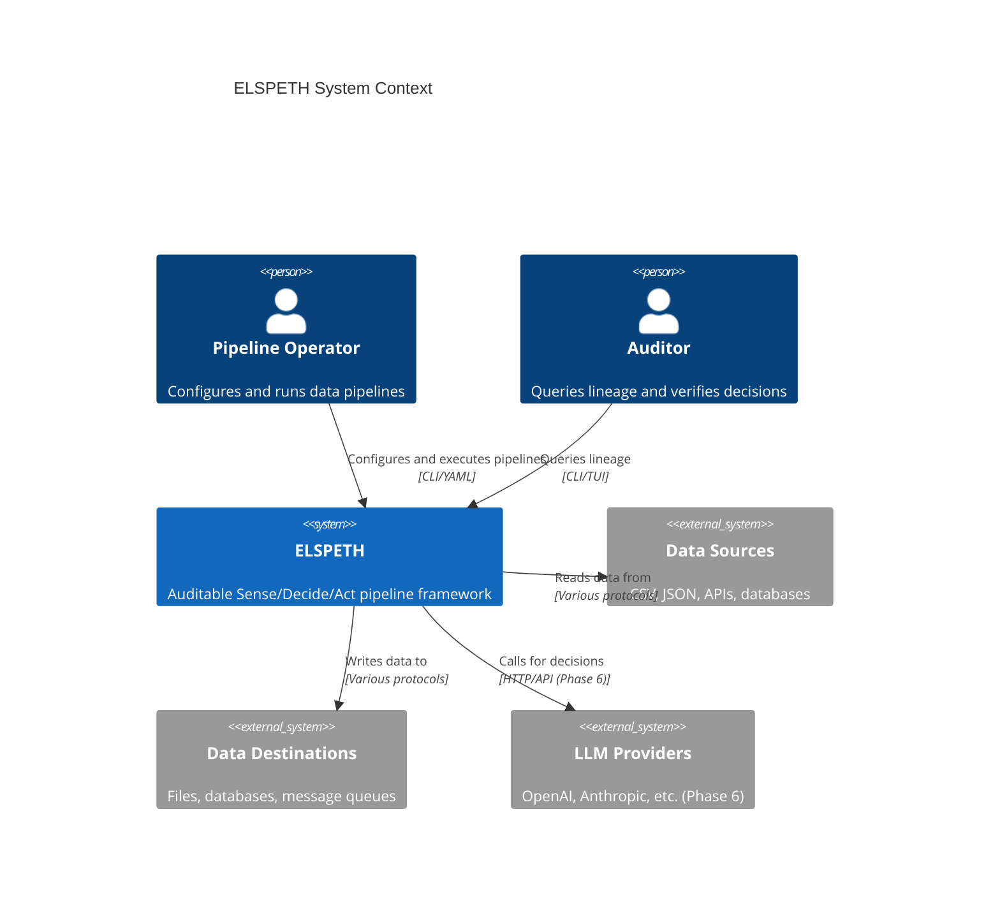

**Key relationships:**

| Actor/System | Interaction |
|--------------|-------------|
| Pipeline Operator | Configures YAML, executes via CLI, monitors runs |
| Auditor | Queries lineage via CLI/TUI, verifies decisions |
| Data Sources | CSV, JSON, APIs - read by Source plugins |
| Data Destinations | Files, databases - written by Sink plugins |
| LLM Providers | External calls for classification (Phase 6) |

---

## Level 2: Container Diagram

Shows the major subsystems within ELSPETH.

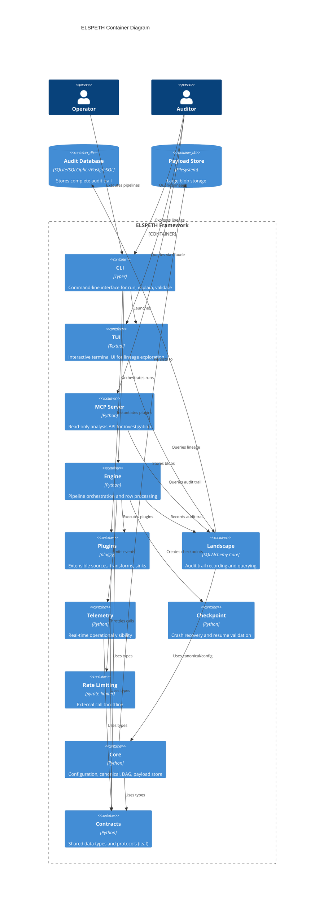

### Container Responsibilities

| Container | Technology | LOC | Purpose |
|-----------|------------|-----|---------|
| **CLI** | Typer | ~2,200 | User commands: `run`, `explain`, `validate`, `resume` |
| **TUI** | Textual | ~800 | Interactive lineage exploration |
| **MCP Server** | Python | ~3,600 | Read-only analysis API with domain-specific analyzers |
| **Engine** | Python | ~12,000 | Run lifecycle, row processing, DAG execution |
| **Plugins** | pluggy | ~20,600 | Extensible sources, transforms, sinks, LLM, clients |
| **Landscape** | SQLAlchemy Core | ~7,000 | Audit recording and querying, SQLCipher support |
| **Testing** | Python | ~9,500 | ChaosLLM, ChaosWeb, ChaosEngine test servers |
| **Telemetry** | Python | ~1,200 | Real-time event export (OTLP, Datadog, Azure Monitor) |
| **Checkpoint** | Python | ~600 | Crash recovery with topology validation |
| **Rate Limiting** | pyrate-limiter | ~300 | External call throttling with persistence |
| **Core** | Python | ~5,000 | Config, canonical JSON, DAG package, payload store |
| **Contracts** | Python | ~8,300 | Shared dataclasses, enums, protocols (leaf module) |
| **Audit DB** | SQLite/SQLCipher/PostgreSQL | — | Complete audit trail storage (21 tables) |
| **Payload Store** | Filesystem | — | Content-addressable blob storage with retention |

**Total Production LOC:** ~74,000 | **Total Test LOC:** ~207,000 | **Test Ratio:** 2.7:1

---

## Level 3: Component Diagrams

### 3.1 Engine Components

The Engine orchestrates pipeline execution and row processing.

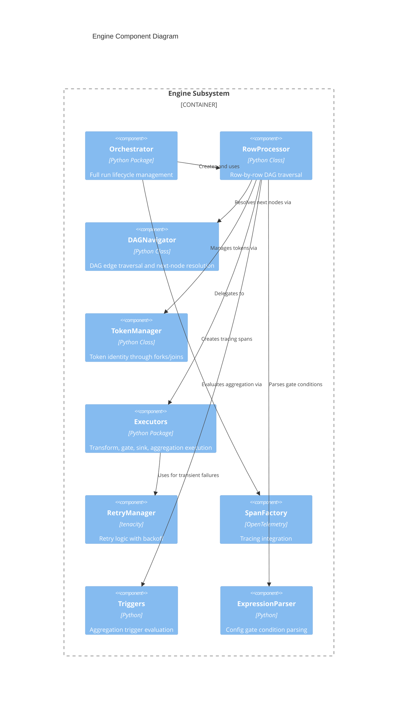

| Component | File | LOC | Responsibility |
|-----------|------|-----|----------------|
| **Orchestrator** | `orchestrator/` | ~3,500 | Begin run → register nodes/edges → process rows → complete run |
| **RowProcessor** | `processor.py` | ~1,860 | Work queue-based DAG traversal, fork/join handling |
| **DAGNavigator** | `dag_navigator.py` | ~250 | DAG edge traversal and next-node resolution |
| **TokenManager** | `tokens.py` | ~393 | Create, fork, coalesce, expand tokens |
| **Executors** | `executors/` | ~2,190 | Transform, gate, sink, aggregation execution (5 modules) |
| **CoalesceExecutor** | `coalesce_executor.py` | ~1,054 | Fork/join merge barrier with policy-driven merging |
| **RetryManager** | `retry.py` | ~146 | Tenacity-based retry with exponential backoff |
| **SpanFactory** | `spans.py` | ~298 | Create OpenTelemetry spans for observability |
| **Triggers** | `triggers.py` | ~301 | Evaluate count/timeout/condition triggers for aggregation |
| **ExpressionParser** | `expression_parser.py` | ~652 | Safe AST-based expression evaluation (no eval) |
| **BatchAdapter** | `batch_adapter.py` | ~226 | Batch transform output routing |
| **Clock** | `clock.py` | ~11 | Testable time abstraction |

### 3.2 Landscape Components

The Landscape records and queries the audit trail.

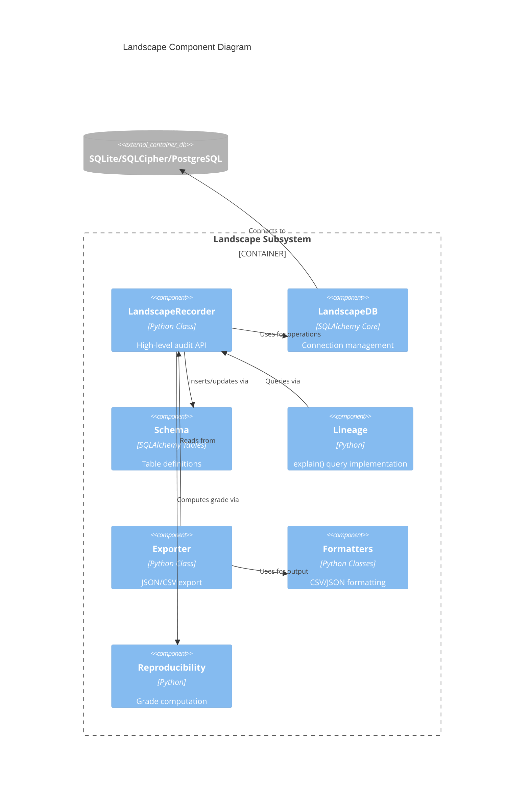

| Component | File | LOC | Responsibility |
|-----------|------|-----|----------------|
| **LandscapeRecorder** | `recorder.py` + mixins | ~3,200 | High-level recording API (47+ methods, split into recording mixins) |
| **LandscapeDB** | `database.py` | ~477 | Connection management, schema validation, SQLCipher support |
| **Schema** | `schema.py` | ~510 | SQLAlchemy table definitions (21 tables) |
| **Repositories** | `repositories.py` | ~581 | Row→Object conversion with Tier 1 validation |
| **Lineage** | `lineage.py` | ~210 | `explain()` queries for complete lineage |
| **Exporter** | `exporter.py` | ~554 | Audit data export (JSON, CSV) |
| **Formatters** | `formatters.py` | ~229 | Data serialization, datetime handling |
| **Journal** | `journal.py` | ~290 | JSONL change journaling backup stream |
| **Reproducibility** | `reproducibility.py` | ~153 | Grade computation (FULL → ATTRIBUTABLE_ONLY) |

### Audit Trail Tables (21 Total)

```
runs (run lifecycle) → nodes (DAG nodes) → edges (DAG edges)
  ↓
rows (source data) → tokens (row instances) → token_parents (lineage)
         ↓
    node_states (processing) → routing_events (gate decisions)
         ↓                           ↓
      calls (external APIs)     batches → batch_members
                                   ↓
                              batch_outputs
                                   ↓
                               artifacts (sink outputs)

validation_errors, transform_errors (error tracking)
token_outcomes (terminal states)
secret_resolutions (Key Vault usage)
field_resolutions (header normalization)
```

**Critical Pattern:** Composite PK `(node_id, run_id)` on `nodes` table requires using denormalized `node_states.run_id` directly in queries (see CLAUDE.md).

### 3.3 Plugins Components

The plugin system provides extensible pipeline components.

```mermaid
C4Component
    title Plugins Component Diagram

    Container_Boundary(plugins, "Plugins Subsystem") {
        Component(protocols, "Protocols", "Python", "SourceProtocol, TransformProtocol, etc.")
        Component(base, "Base Classes", "Python ABC", "BaseSource, BaseTransform, etc.")
        Component(results, "Results", "Python", "TransformResult, GateResult, etc.")
        Component(context, "PluginContext", "Python", "Runtime context for plugins")
        Component(manager, "PluginManager", "pluggy", "Discovery and registration")
        Component(hookspecs, "Hookspecs", "pluggy", "Hook specifications")
    }

    Container_Boundary(sources, "Sources (4)") {
        Component(csv_source, "CSVSource", "Python", "Load from CSV")
        Component(json_source, "JSONSource", "Python", "Load from JSON/JSONL")
        Component(azure_blob_source, "AzureBlobSource", "Python", "Load from Azure Blob")
        Component(null_source, "NullSource", "Python", "Empty source for testing")
    }

    Container_Boundary(transforms, "Transforms (11+)") {
        Component(passthrough, "PassThrough", "Python", "Identity transform")
        Component(field_mapper, "FieldMapper", "Python", "Rename/select fields")
        Component(batch_stats, "BatchStats", "Python", "Aggregation statistics")
        Component(batch_replicate, "BatchReplicate", "Python", "Row replication")
        Component(json_explode, "JSONExplode", "Python", "Deaggregation")
        Component(truncate, "Truncate", "Python", "String truncation")
        Component(keyword_filter, "KeywordFilter", "Python", "Keyword-based filtering")
        Component(web_scrape, "WebScrape", "Python", "HTML extraction")
    }

    Container_Boundary(llm, "LLM Transforms (6)") {
        Component(azure_llm, "AzureLLM", "Python", "Azure OpenAI row-level")
        Component(azure_batch, "AzureBatchLLM", "Python", "Azure Batch API")
        Component(azure_multi, "AzureMultiQuery", "Python", "Multiple queries per row")
        Component(openrouter_llm, "OpenRouterLLM", "Python", "OpenRouter row-level")
    }

    Container_Boundary(sinks, "Sinks (4)") {
        Component(csv_sink, "CSVSink", "Python", "Write to CSV")
        Component(json_sink, "JSONSink", "Python", "Write to JSON/JSONL")
        Component(db_sink, "DatabaseSink", "Python", "Write to database")
        Component(azure_blob_sink, "AzureBlobSink", "Python", "Write to Azure Blob")
    }

    Container_Boundary(clients, "Audited Clients (4)") {
        Component(http_client, "AuditedHTTPClient", "Python", "HTTP with audit recording")
        Component(llm_client, "AuditedLLMClient", "Python", "LLM with audit recording")
        Component(replayer, "ReplayerClient", "Python", "Replay recorded calls")
        Component(verifier, "VerifierClient", "Python", "Verify against recorded calls")
    }

    Rel(base, protocols, "Implements")
    Rel(csv_source, base, "Extends BaseSource")
    Rel(json_source, base, "Extends BaseSource")
    Rel(azure_blob_source, base, "Extends BaseSource")
    Rel(passthrough, base, "Extends BaseTransform")
    Rel(field_mapper, base, "Extends BaseTransform")
    Rel(batch_stats, base, "Extends BaseTransform")
    Rel(json_explode, base, "Extends BaseTransform")
    Rel(web_scrape, base, "Extends BaseTransform")
    Rel(azure_llm, base, "Extends BaseTransform")
    Rel(azure_llm, llm_client, "Uses")
    Rel(web_scrape, http_client, "Uses")
    Rel(csv_sink, base, "Extends BaseSink")
    Rel(json_sink, base, "Extends BaseSink")
    Rel(db_sink, base, "Extends BaseSink")
    Rel(azure_blob_sink, base, "Extends BaseSink")
```

| Component | Count/Purpose |
|-----------|---------------|
| **Protocols** | 4 runtime-checkable interfaces (Source, Transform, BatchTransform, Sink) |
| **Base Classes** | Abstract implementations with common functionality |
| **Results** | Typed results (`TransformResult`, `GateResult`, `SourceRow`) |
| **PluginContext** | Runtime context passed to all plugin methods |
| **PluginManager** | pluggy-based discovery and registration |
| **Sources** | 4 plugins (csv, json, azure_blob, null) |
| **Transforms** | 11+ plugins (field_mapper, passthrough, truncate, batch_stats, web_scrape, etc.) |
| **LLM Transforms** | 6 plugins (azure_llm, azure_batch, azure_multi_query, openrouter variants) |
| **Sinks** | 4 plugins (csv, json, database, azure_blob) |
| **Clients** | 4 audited clients (HTTP, LLM, Replayer, Verifier) |

**Total Plugin Ecosystem:** 29+ plugins across 4 categories

---

## Data Flow Diagrams

### Pipeline Execution Flow

This sequence shows how a row flows through the pipeline with audit recording at each step.

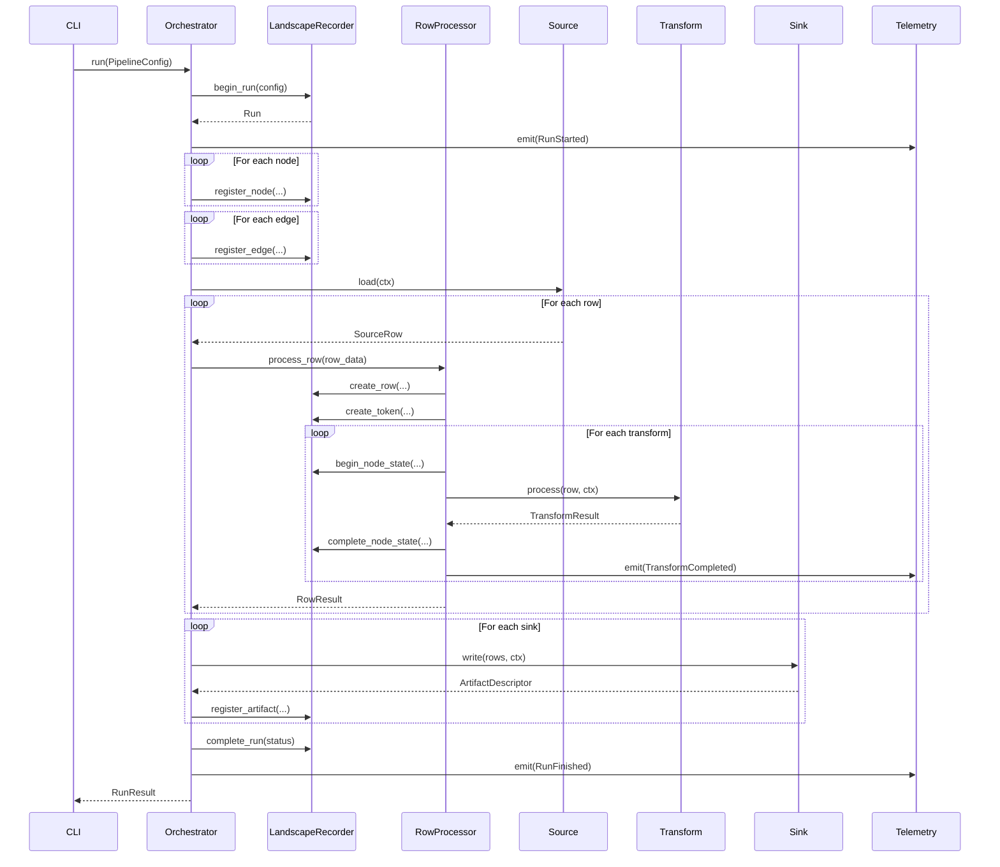

**Key audit points:**

1. `begin_run` - Configuration hash stored → Telemetry: RunStarted
2. `register_node/edge` - DAG structure recorded
3. `create_row/token` - Row identity established
4. `begin/complete_node_state` - Transform input/output hashes recorded → Telemetry: TransformCompleted
5. `register_artifact` - Sink output hash recorded
6. `complete_run` - Final status and timestamps → Telemetry: RunFinished

**Telemetry Pattern:** Events emitted AFTER Landscape recording (Landscape = source of truth, telemetry = operational visibility)

### Token Lifecycle

Tokens track row identity through forks, joins, and routing decisions.

```mermaid
stateDiagram-v2
    [*] --> Created: Source yields row
    Created --> Processing: Enter transform chain

    state Processing {
        [*] --> Transform
        Transform --> Transform: Continue
        Transform --> Gate: Route decision

        Gate --> Forked: fork_to_paths
        Gate --> Routed: route_to_sink
        Gate --> Transform: continue

        state Forked {
            [*] --> Child1
            [*] --> Child2
            Child1 --> Processing
            Child2 --> Processing
        }
    }

    Processing --> Completed: Reach output sink
    Processing --> Routed: Gate routes to sink
    Processing --> Quarantined: Validation failure
    Processing --> Failed: Processing error
    Processing --> ConsumedInBatch: Aggregated
    Forked --> Coalesced: Merge point

    Completed --> [*]
    Routed --> [*]
    Quarantined --> [*]
    Failed --> [*]
    ConsumedInBatch --> [*]
    Coalesced --> [*]
```

**Terminal states:**

| State | Meaning |
|-------|---------|
| `COMPLETED` | Reached output sink |
| `ROUTED` | Gate sent to named sink |
| `FORKED` | Split to multiple paths (parent token) |
| `CONSUMED_IN_BATCH` | Aggregated into batch |
| `COALESCED` | Merged at join point |
| `QUARANTINED` | Failed validation, stored for investigation |
| `FAILED` | Processing error, not recoverable |
| `EXPANDED` | Parent token for deaggregation (1→N expansion) |
| `BUFFERED` | Temporarily held in aggregation (non-terminal, becomes COMPLETED on flush) |

### Fork/Join Processing Flow

Detailed sequence showing how tokens split and merge through parallel paths.

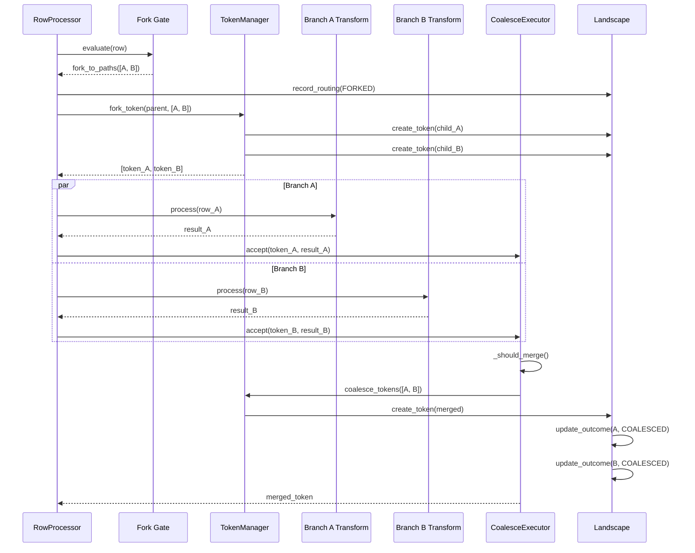

**Key Fork/Join Concepts:**

- **Fork Gate**: Creates N child tokens from 1 parent token (same row data, different paths)
- **Token Identity**: `row_id` stable, `token_id` unique per instance, `parent_token_id` for lineage
- **Coalesce Policies**: `require_all`, `quorum`, `best_effort`, `first`
- **Merge Strategies**: `union`, `nested`, `select`
- **Audit Trail**: Complete lineage from parent through children to merged output

---

## Deployment View

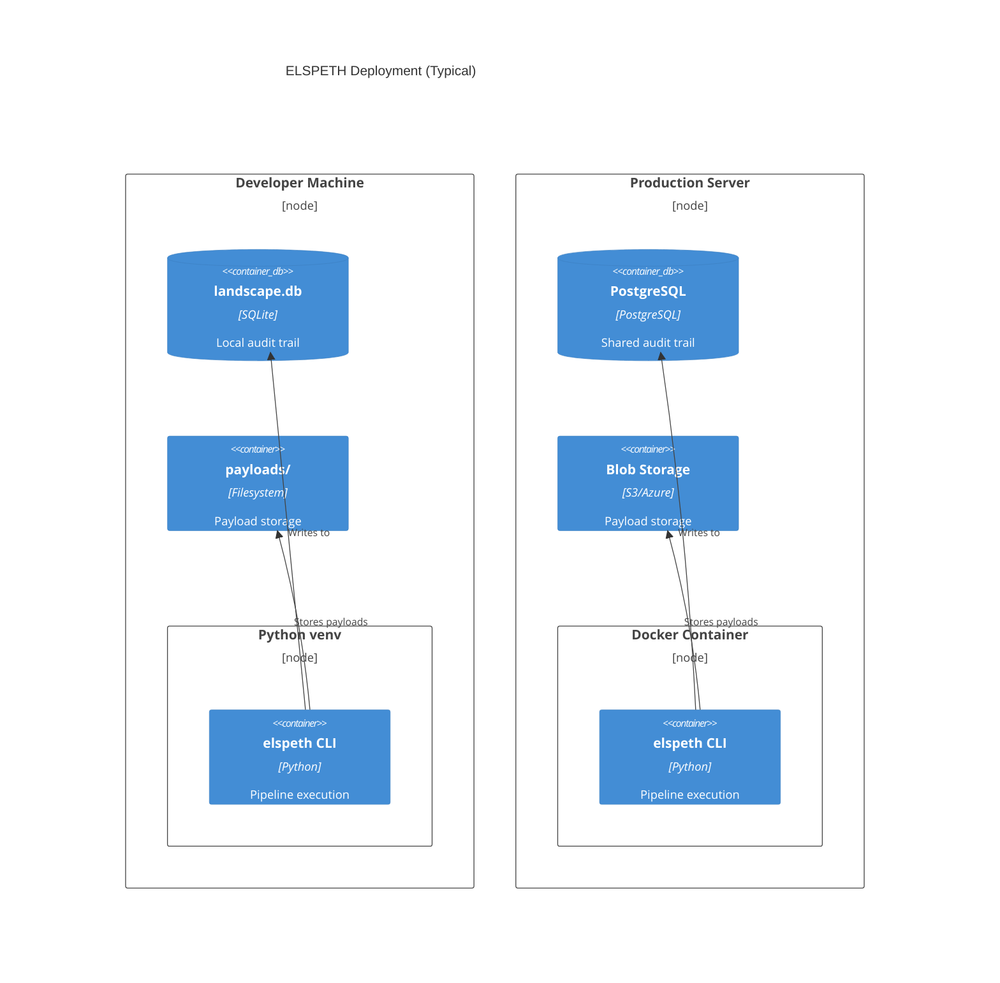

| Environment | Audit DB | Payload Store |
|-------------|----------|---------------|
| Development | SQLite/SQLCipher (`landscape.db`) | Local filesystem |
| Production | PostgreSQL | S3/Azure Blob Storage |

---

## Telemetry Flow Diagram

Shows how operational events flow from pipeline components through the telemetry system to external observability platforms.

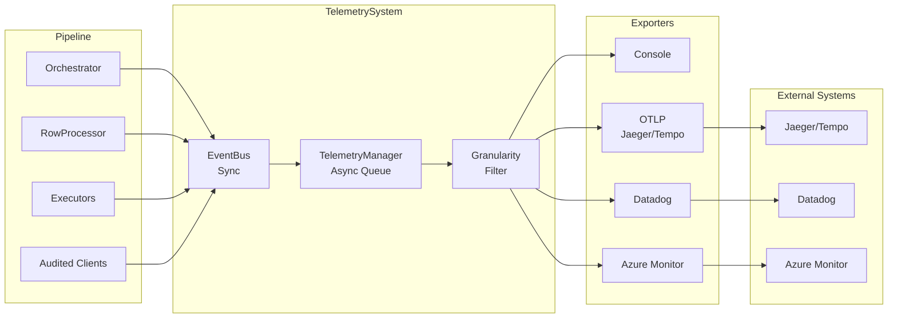

**Telemetry Granularity Levels:**

| Level | Events | Use Case |
|-------|--------|----------|
| `lifecycle` | Run start/complete, phase transitions (~10-20 events/run) | High-level monitoring |
| `rows` | Above + row creation, transform completion, gate routing (N×M events) | Detailed tracking |
| `full` | Above + external call details (LLM, HTTP, SQL) | Deep debugging |

**Backpressure Modes:**
- `block`: Wait for export completion (ensures all events delivered)
- `drop`: Drop events when queue full (fast, lossy)

**Key Pattern:** Telemetry is emitted AFTER Landscape recording. Individual exporter failures are isolated - one exporter failure doesn't affect others.

---

## Dependency Graph

Shows dependency relationships between major subsystems and the **leaf module principle**.

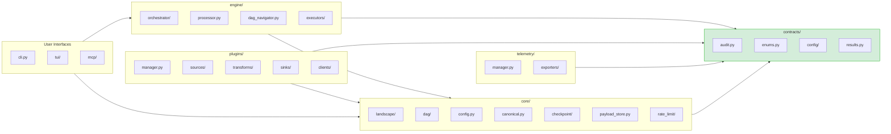

**Leaf Module Principle:** Contracts package has ZERO outbound dependencies, preventing circular imports and enabling independent testing.

**Import Hierarchy:**
```
UI Layer → Engine/Plugins/Telemetry → Core → Contracts (leaf)
```

---

## Schema Contract Validation Flow

Shows how plugin schemas are validated at DAG construction to prevent runtime type mismatches.

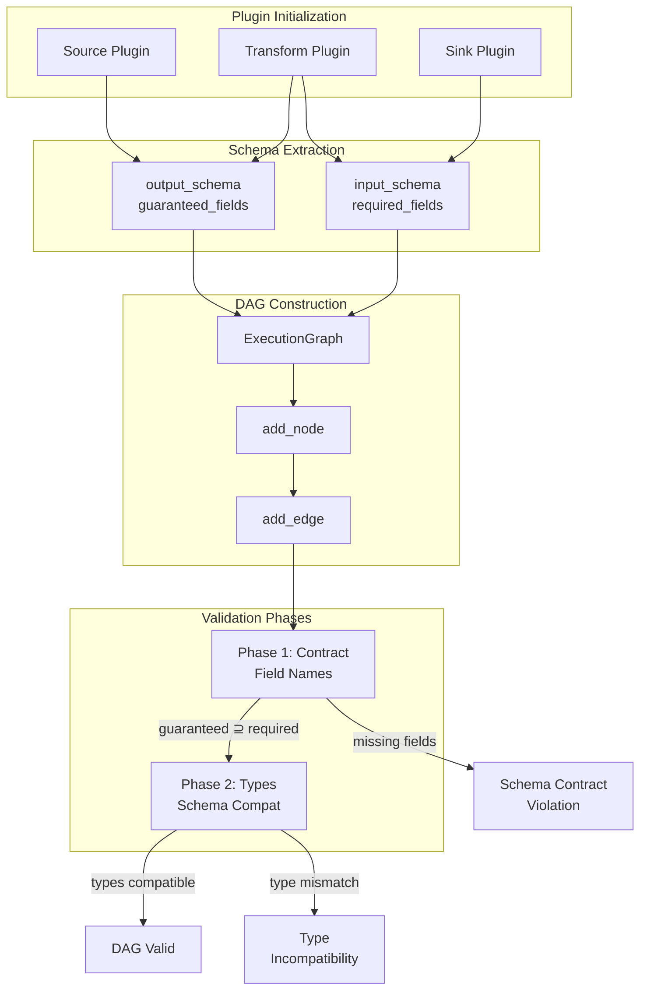

**Validation Rules:**

1. **Phase 1 (Contract)**: Upstream `guaranteed_fields` must be a superset of downstream `required_fields`
2. **Phase 2 (Types)**: Field types must be compatible across plugin boundaries
3. **Happens at**: DAG construction time (before any data processing)
4. **Failures**: Crash immediately with clear error message

**Example Template Discovery:**
```python
from elspeth.core.templates import extract_jinja2_fields

# Discover required fields from Jinja2 template
template = "Total: {{ quantity * price }}"
required = extract_jinja2_fields(template)
# → ["quantity", "price"]
```

---

## Trust Boundary Diagram

The Three-Tier Trust Model defines how data is handled at each boundary.

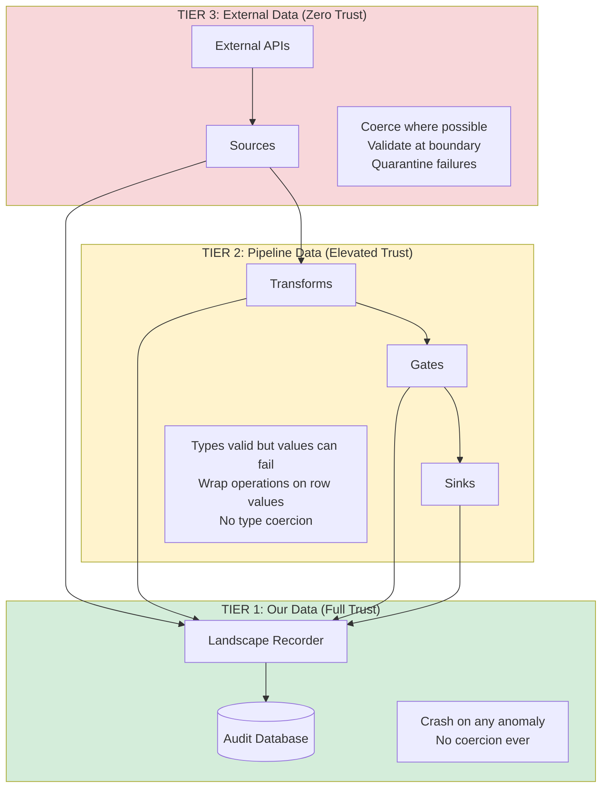

### Trust Tier Summary

| Tier | Trust Level | Coercion | On Error |
|------|-------------|----------|----------|
| **Tier 1** (Audit DB) | Full trust | Never | Crash immediately |
| **Tier 2** (Pipeline) | Elevated ("probably OK") | Never | Return error result |
| **Tier 3** (External) | Zero trust | At boundary | Quarantine row |

---

## Architecture Decision Records (ADRs)

ELSPETH uses ADRs to document significant architectural choices.

### Documented ADRs

| ADR | Title | Decision | Rationale |
|-----|-------|----------|-----------|
| **ADR-001** | Plugin-level concurrency | Pool-based with FIFO ordering | Maintains auditability while enabling parallelism |
| **ADR-002** | Routing copy mode limitation | Move-only (no copy) | Prevents ambiguous audit trail for routed tokens |
| **ADR-003** | Schema validation lifecycle | Two-phase (contract → type) at DAG construction | Catches mismatches before processing |
| **ADR-004** | Explicit sink routing | Named DAG edges replace implicit convention | Enables auditable routing decisions |
| **ADR-005** | Declarative DAG wiring | `input`/`on_success` connections | Every edge explicitly declared and validated |

### Implicit Architectural Decisions

| Technology | Choice | Rationale |
|------------|--------|-----------|
| **Database ORM** | SQLAlchemy Core (not ORM) | Audit trail needs precise SQL control, multi-DB support |
| **Plugin System** | pluggy | Battle-tested (pytest uses it), clean hook specifications |
| **Graph Library** | NetworkX | Industry-standard, topological sort, cycle detection |
| **Canonical JSON** | RFC 8785 (rfc8785 package) | Standards-based deterministic hashing |
| **Terminal UI** | Textual | Modern, cross-platform, active development |
| **Retry Library** | tenacity | Industry standard, declarative configuration |
| **Rate Limiting** | pyrate-limiter | Sliding window, SQLite persistence option |
| **Telemetry** | OpenTelemetry Protocol | Vendor-neutral, wide exporter support |

---

## Quality Assessment

Based on comprehensive analysis (2026-02-02), ELSPETH demonstrates exceptional architectural quality.

### Quality Scores

| Dimension | Grade | Status |
|-----------|-------|--------|
| **Maintainability** | A | Excellent - Clean modules, consistent patterns |
| **Testability** | A+ | Exceptional - 2.7:1 test ratio, mutation testing |
| **Type Safety** | A | Excellent - mypy strict, protocols, NewType aliases |
| **Documentation** | A- | Very Good - CLAUDE.md (10K+ words), ADRs, runbooks |
| **Error Handling** | A | Excellent - Three-tier trust model |
| **Security** | A | Excellent - HMAC fingerprinting, AST parsing, no eval |
| **Performance** | B+ | Good - Batch operations, pooling, rate limiting |
| **Complexity** | B | Acceptable - Some complex areas (aggregation, large files) |

**Overall Architecture Grade: A-** (Production Ready)

### Key Strengths

1. **Exceptional Auditability** - Complete traceability, "I don't know what happened" is never acceptable
2. **Three-Tier Trust Model** - Clear rules for data handling at each boundary
3. **Clean Layering** - Contracts as leaf module, clear separation of concerns
4. **Protocol-Based Design** - Runtime-checkable interfaces, structural typing
5. **Comprehensive Testing** - 201K test LOC vs 74K production LOC (2.7:1 ratio)
6. **No Legacy Code Policy** - Clean evolution, no backwards compatibility shims

### Areas for Future Improvement

| Area | Concern | Priority |
|------|---------|----------|
| **Large Files** | orchestrator/core.py (~2,070 LOC), processor.py (~1,860 LOC) | Medium |
| **Aggregation Complexity** | Multiple state machines (buffer/trigger/flush) | Medium |
| **Composite PK Queries** | `nodes` table joins require care | Low |
| **API Documentation** | No generated docs (pdoc/sphinx) | Low |

### Risk Assessment

| Category | Status | Evidence |
|----------|--------|----------|
| **Audit Integrity** | ✅ Low Risk | Tier 1 crash policy, NaN/Infinity rejected |
| **Type Safety** | ✅ Low Risk | mypy strict, runtime protocol verification |
| **Test Coverage** | ✅ Low Risk | 2.7:1 ratio, mutation testing, property tests |
| **Resume Safety** | ✅ Low Risk | Full topology hash (BUG-COMPAT-01 fix applied) |

---

## Summary

### Key Architectural Decisions

| Decision | Rationale |
|----------|-----------|
| **SQLAlchemy Core** (not ORM) | Audit trail needs precise SQL, not object mapping |
| **pluggy** | Battle-tested (pytest), clean hook system |
| **Canonical JSON** (RFC 8785) | Deterministic hashing for audit integrity |
| **Token-based lineage** | Tracks identity through forks/joins |
| **Three-tier trust** | Clear rules for coercion and error handling |
| **Leaf module principle** | Contracts package has zero outbound dependencies |

### What This Document Covers

1. **Context** - How ELSPETH fits in the system landscape
2. **Containers** - 11 major subsystems across 5 architectural tiers
3. **Components** - Internal structure of Engine, Landscape, Plugins (with LOC counts)
4. **Data Flow** - Pipeline execution and fork/join processing with telemetry
5. **Token Lifecycle** - State transitions for row processing (9 terminal states)
6. **Deployment** - Development and production configurations
7. **Trust Boundaries** - Three-tier data trust model
8. **Telemetry Flow** - Real-time operational visibility alongside audit trail
9. **Dependency Graph** - Subsystem relationships and leaf module principle
10. **Schema Validation** - Contract enforcement at DAG construction
11. **ADRs** - Documented architectural decisions
12. **Quality Assessment** - Architecture grade and risk analysis

**Key Metrics:**
- Production LOC: ~76,000 (234 Python files)
- Test LOC: ~201,000 (2.7:1 ratio)
- Subsystems: 22
- Plugins: 29+
- ADRs: 5
- Architecture Grade: A-

All diagrams use Mermaid syntax for version control compatibility.

---

## See Also

- [README.md](README.md) - Project overview and quick start
- [PLUGIN.md](PLUGIN.md) - Plugin development guide
- [CLAUDE.md](CLAUDE.md) - Complete project context and patterns
- [docs/reference/](docs/reference/) - Configuration reference
