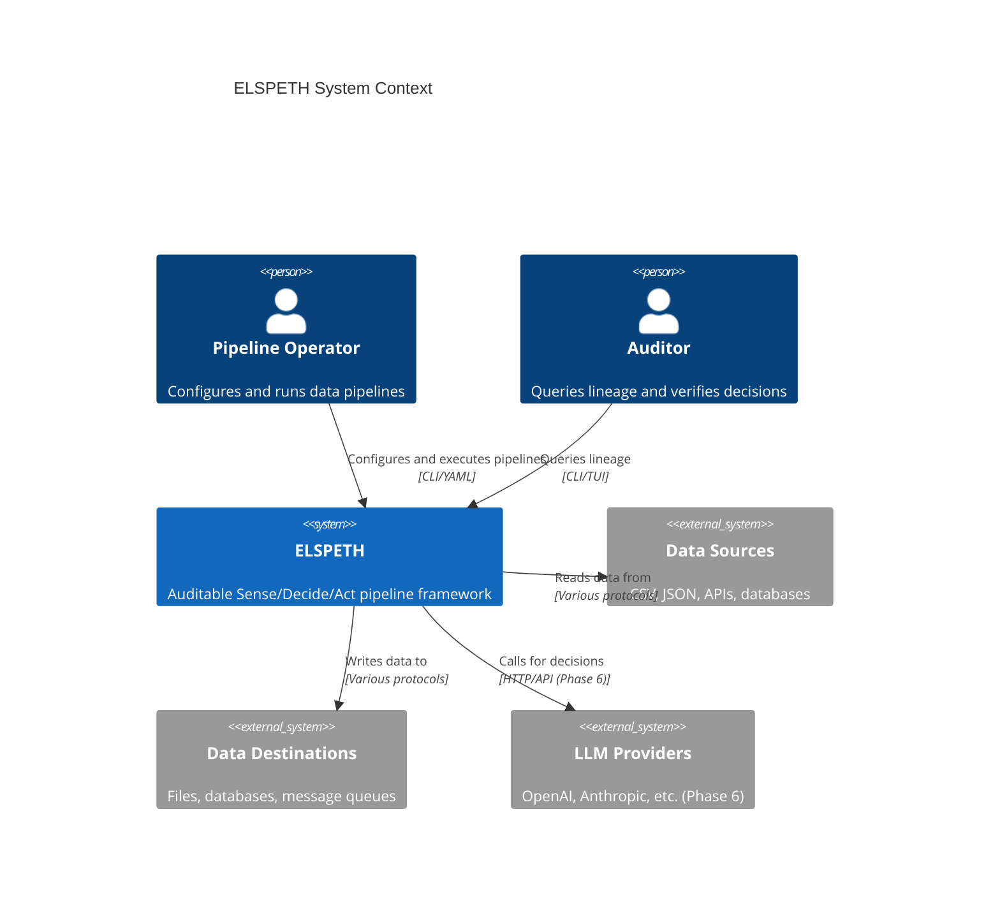
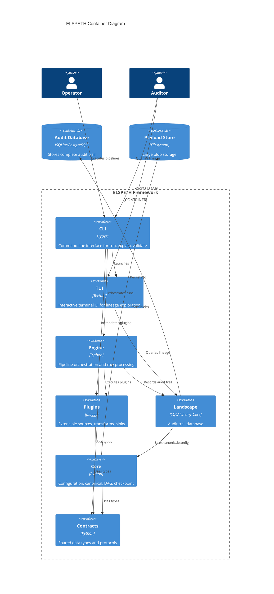
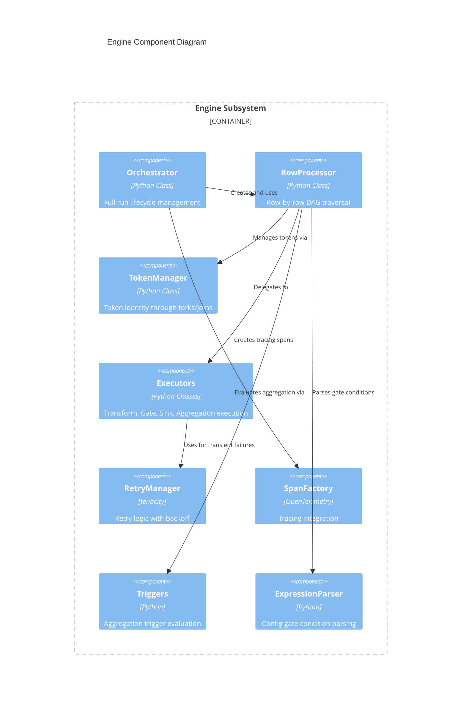
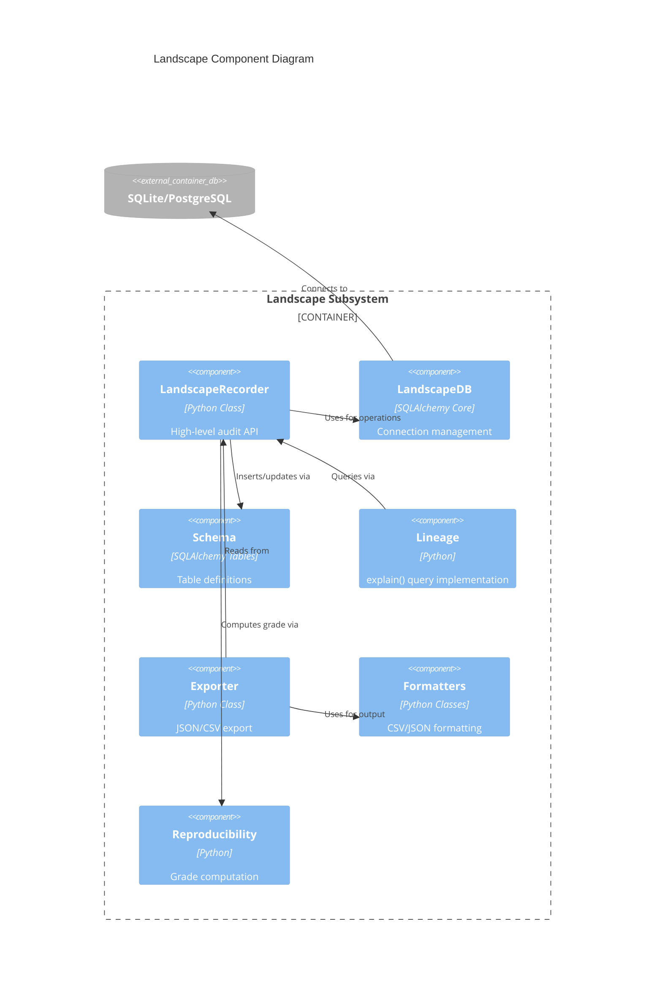
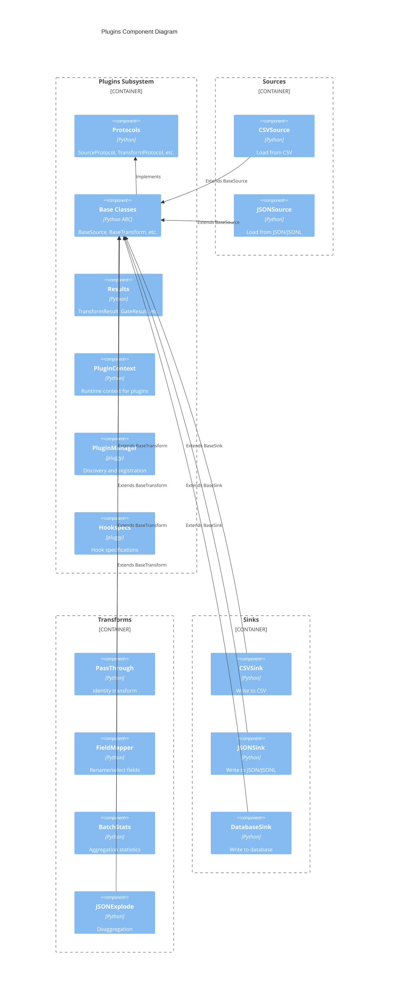
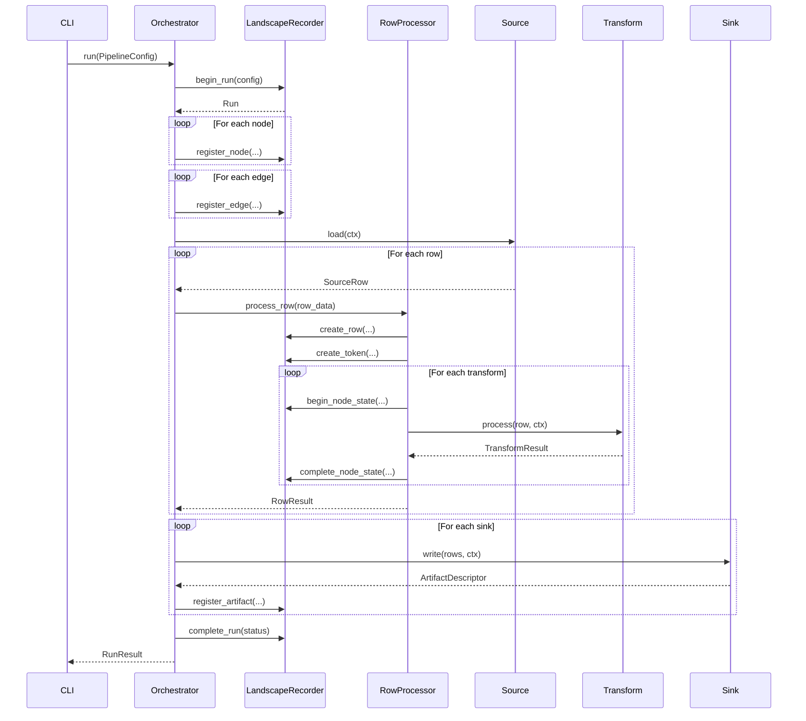
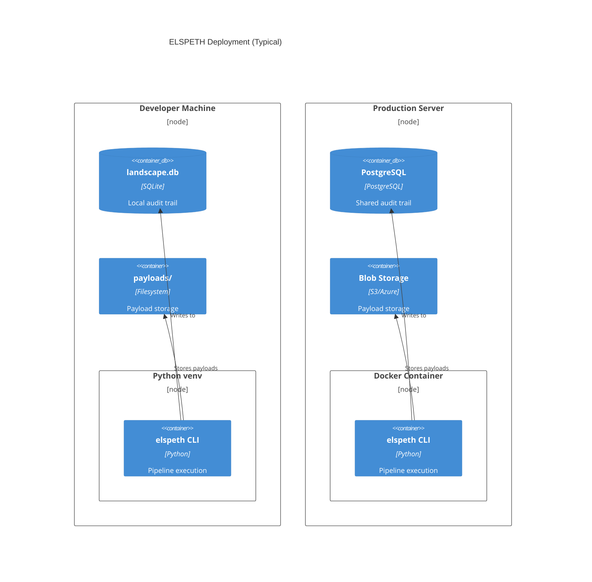
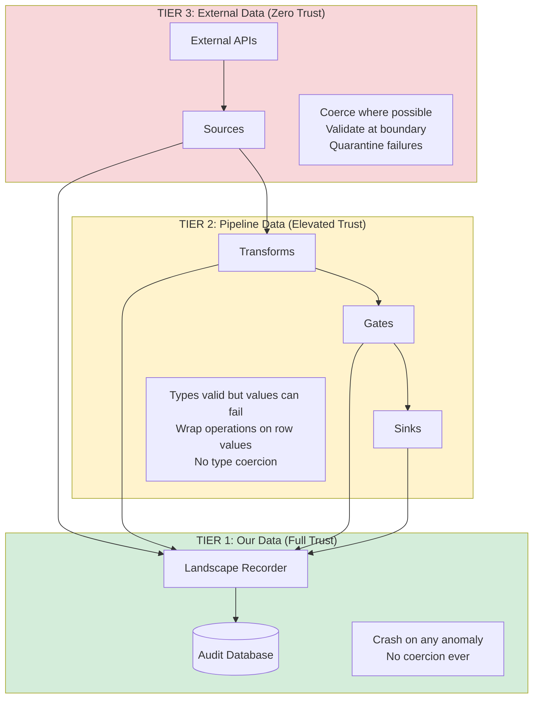

# C4 Architecture Diagrams: ELSPETH

This document presents the ELSPETH architecture using the C4 model:
- **Level 1**: System Context
- **Level 2**: Container (Subsystem)
- **Level 3**: Component (Module)

All diagrams use Mermaid syntax for version-control-friendly rendering.

---

## Level 1: System Context Diagram

Shows ELSPETH in relation to external actors and systems.



**Narrative:**
- **Pipeline Operators** configure pipelines via YAML and execute them via CLI
- **Auditors** use the CLI/TUI to query lineage and verify decisions
- ELSPETH reads from various **data sources** (CSV, JSON, APIs)
- ELSPETH writes to **destinations** (files, databases)
- **LLM integration** is planned for Phase 6

---

## Level 2: Container Diagram

Shows the major subsystems within ELSPETH.



**Container Descriptions:**

| Container | Technology | Responsibility |
|-----------|------------|----------------|
| CLI | Typer | User commands: run, explain, validate, purge, resume |
| TUI | Textual | Interactive lineage exploration |
| Engine | Python | Run lifecycle, row processing, DAG execution |
| Plugins | pluggy | Extensible sources, transforms, gates, sinks |
| Landscape | SQLAlchemy Core | Audit recording and querying |
| Core | Python | Config, canonical JSON, DAG, checkpoint, rate limit |
| Contracts | Python | Shared dataclasses, enums, protocols |
| Audit DB | SQLite/PostgreSQL | Complete audit trail storage |
| Payload Store | Filesystem | Large blob storage with retention |

---

## Level 3: Component Diagrams

### 3.1 Engine Components



**Component Responsibilities:**

| Component | Responsibility |
|-----------|----------------|
| Orchestrator | Begin run → register nodes/edges → process rows → complete run |
| RowProcessor | Work queue-based DAG traversal, fork/join handling |
| TokenManager | Create, fork, coalesce, expand tokens |
| Executors | Execute transforms, gates, sinks, aggregations |
| RetryManager | Retry transient failures with exponential backoff |
| SpanFactory | Create OpenTelemetry spans for observability |
| Triggers | Evaluate count/timeout triggers for aggregation |
| ExpressionParser | Parse and evaluate gate condition expressions |

### 3.2 Landscape Components



**Tables Managed:**

```
runs → nodes → edges
  ↓
rows → tokens → token_parents
         ↓
    node_states → routing_events
         ↓           ↓
      calls     batches → batch_members
                   ↓
              batch_outputs
                   ↓
               artifacts

validation_errors, transform_errors (error tracking)
```

### 3.3 Plugins Components



---

## Data Flow Diagrams

### Pipeline Execution Flow



### Token Lifecycle

```mermaid
stateDiagram-v2
    [*] --> Created: Source yields row
    Created --> Processing: Enter transform chain

    state Processing {
        [*] --> Transform
        Transform --> Transform: Continue
        Transform --> Gate: Route decision

        Gate --> Forked: fork_to_paths
        Gate --> Routed: route_to_sink
        Gate --> Transform: continue

        state Forked {
            [*] --> Child1
            [*] --> Child2
            Child1 --> Processing
            Child2 --> Processing
        }
    }

    Processing --> Completed: Reach output sink
    Processing --> Routed: Gate routes to sink
    Processing --> Quarantined: Validation failure
    Processing --> Failed: Processing error
    Processing --> ConsumedInBatch: Aggregated
    Forked --> Coalesced: Merge point

    Completed --> [*]
    Routed --> [*]
    Quarantined --> [*]
    Failed --> [*]
    ConsumedInBatch --> [*]
    Coalesced --> [*]
```

---

## Deployment View



---

## Trust Boundary Diagram



---

## Summary

This C4 documentation provides:

1. **Context**: How ELSPETH fits in the broader system landscape
2. **Containers**: The 7 major subsystems and their relationships
3. **Components**: Internal structure of Engine, Landscape, and Plugins
4. **Data Flow**: How rows flow through the pipeline with audit recording
5. **Token Lifecycle**: State transitions for row processing
6. **Deployment**: Typical development and production configurations
7. **Trust Boundaries**: The three-tier data trust model

All diagrams are in Mermaid format for easy maintenance and version control.
