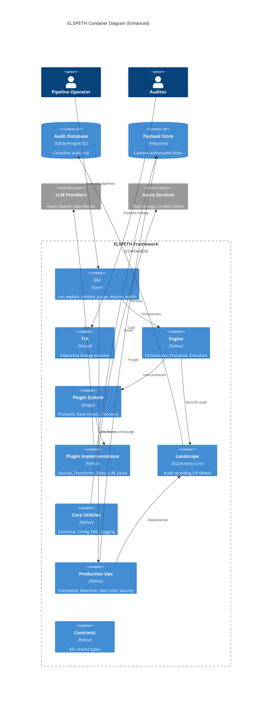
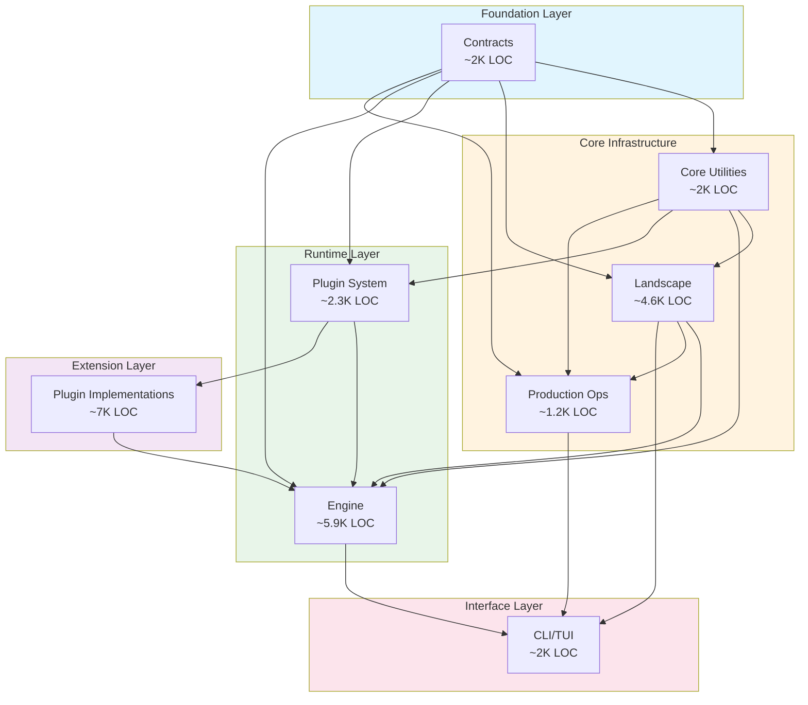
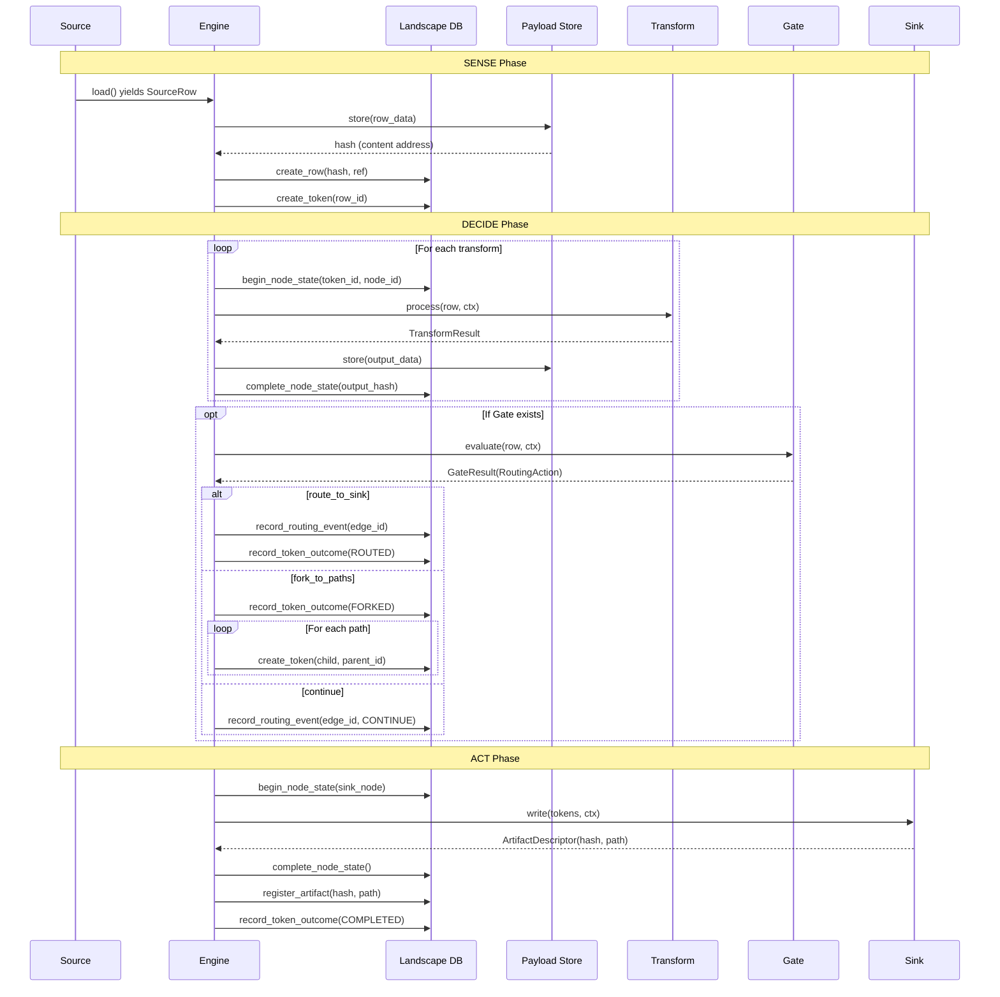
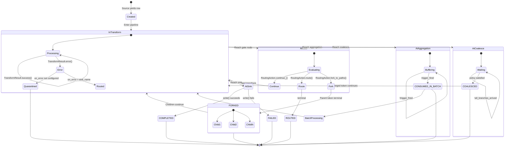
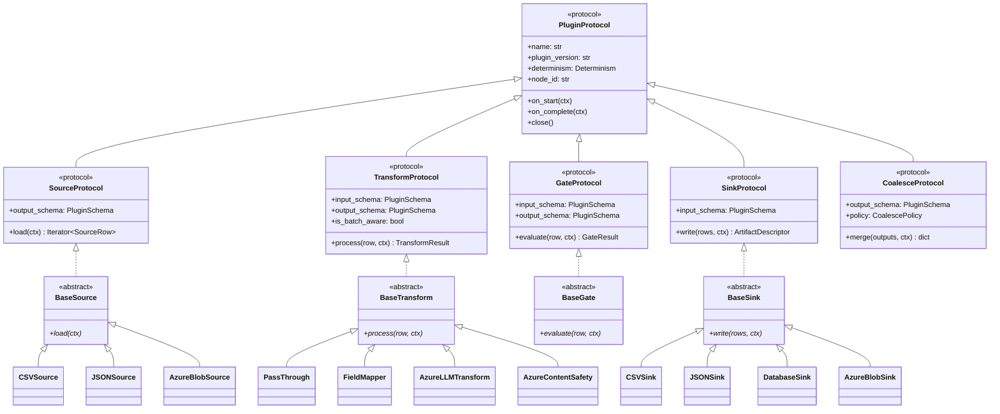
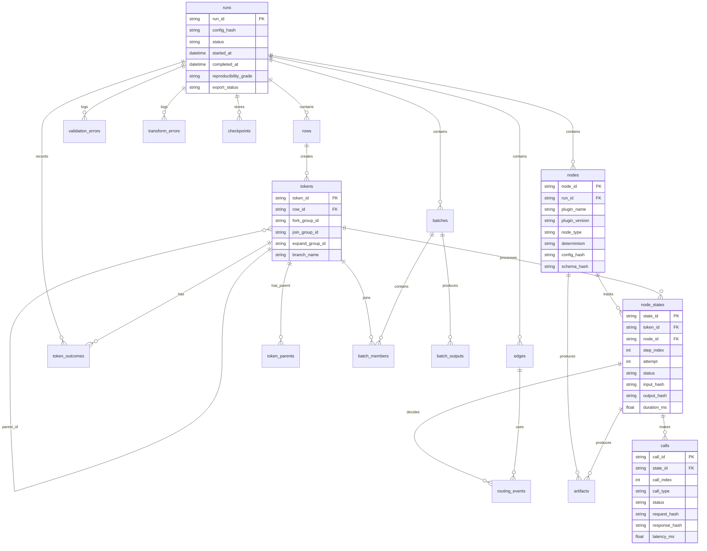
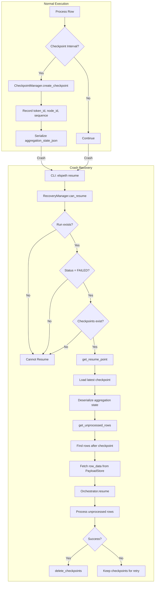
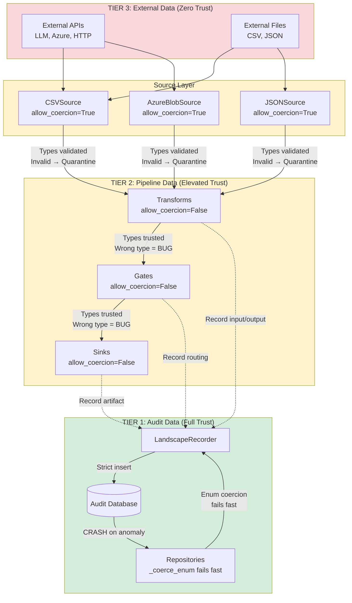

# Architecture Diagrams

**Analysis Date:** 2026-01-21
**Analyst:** Claude Code (Opus 4.5)

This document extends the existing ARCHITECTURE.md with additional diagrams derived from the deep analysis.

---

## 1. Enhanced Container Diagram

The existing ARCHITECTURE.md container diagram is accurate. This enhanced version adds the Production Operations subsystem and shows more specific data flows.



---

## 2. Dependency Flow Diagram

Shows the direction of dependencies between subsystems.



---

## 3. Data Flow Through Pipeline

Shows how data moves through the SDA pipeline with audit recording.



---

## 4. Token State Machine (Detailed)

Enhanced state diagram showing all transitions and conditions.



---

## 5. Plugin Protocol Hierarchy

Shows the relationship between protocols, base classes, and implementations.



---

## 6. Landscape Database ER Diagram

Shows the 16 tables and their relationships.



---

## 7. Checkpoint/Recovery Flow

Shows the checkpoint creation and resume process.



---

## 8. Three-Tier Trust Model Detail

Shows where each tier is enforced in the codebase.



---

## 9. LLM Transform Execution Patterns

Shows the three execution modes for LLM transforms.

```mermaid
flowchart TD
    subgraph Sequential["Sequential (pool_size=1)"]
        S1[Receive row] --> S2[Create LLM request]
        S2 --> S3[Call API]
        S3 --> S4[Record call to audit]
        S4 --> S5[Return TransformResult]
    end

    subgraph Pooled["Pooled (pool_size>1)"]
        P1[Receive row] --> P2[PooledExecutor.submit]
        P2 --> P3[Semaphore acquire]
        P3 --> P4[ThreadPool execute]
        P4 --> P5[AIMDThrottle delay]
        P5 --> P6[Call API]
        P6 --> P7{429/503/529?}
        P7 -->|Yes| P8[CapacityError<br/>Backoff retry]
        P7 -->|No| P9[Record call]
        P8 --> P5
        P9 --> P10[ReorderBuffer]
        P10 --> P11[Return in order]
    end

    subgraph Batch["Azure Batch API"]
        B1[Collect rows] --> B2{Trigger fired?}
        B2 -->|No| B1
        B2 -->|Yes| B3[Submit batch job]
        B3 --> B4[update_checkpoint<br/>job_id]
        B4 --> B5[Raise BatchPendingError]
        B5 --> B6[Engine schedules poll]
        B6 --> B7{Job complete?}
        B7 -->|No| B6
        B7 -->|Yes| B8[Retrieve results]
        B8 --> B9[clear_checkpoint]
        B9 --> B10[Return TransformResult]
    end
```



---

## 10. Configuration Loading Flow

Shows how YAML configuration becomes validated settings.

```mermaid
flowchart TD
    subgraph Input["Configuration Sources"]
        YAML[settings.yaml]
        ENV[Environment<br/>ELSPETH_*]
        DOT[.env file<br/>optional]
    end

    subgraph Loading["Dynaconf Loading"]
        DC[Dynaconf] --> |settings_files| YAML
        DC --> |envvar_prefix| ENV
        DC --> |merge_enabled| M[Deep merge]
    end

    subgraph Processing["Config Processing"]
        M --> RAW[raw_config dict]
        RAW --> EXP[_expand_env_vars<br/>\${VAR:-default}]
        EXP --> TMPL[_expand_config_templates<br/>template_file, lookup_file]
        TMPL --> FP[_fingerprint_secrets<br/>for audit copy only]
    end

    subgraph Validation["Pydantic Validation"]
        TMPL --> PYD[ElspethSettings\nmodel_config=frozen]
        PYD --> |ValidationError| ERR[Config Error]
        PYD --> |Success| VALID[Validated Settings]
    end

    subgraph Runtime["Runtime Use"]
        VALID --> CLI[CLI execution<br/>secrets available]
        FP --> AUDIT[resolve_config\nfor audit storage]
    end

    DOT -.-> |python-dotenv| ENV
```

---

## Summary

These diagrams complement the existing ARCHITECTURE.md by providing:

1. **Enhanced Container Diagram** - Includes Production Ops, LLM/Azure connections
2. **Dependency Flow** - Shows layered architecture with LOC estimates
3. **Data Flow** - Detailed sequence of audit recording
4. **Token State Machine** - All states and transitions
5. **Plugin Hierarchy** - Protocols → Base classes → Implementations
6. **Landscape ER Diagram** - 16 tables with relationships
7. **Checkpoint/Recovery** - Normal execution and crash recovery
8. **Trust Model Detail** - Enforcement points in code
9. **LLM Execution Patterns** - Sequential, pooled, batch modes
10. **Configuration Flow** - YAML → Dynaconf → Pydantic → Runtime

All diagrams use Mermaid syntax for version control compatibility.
