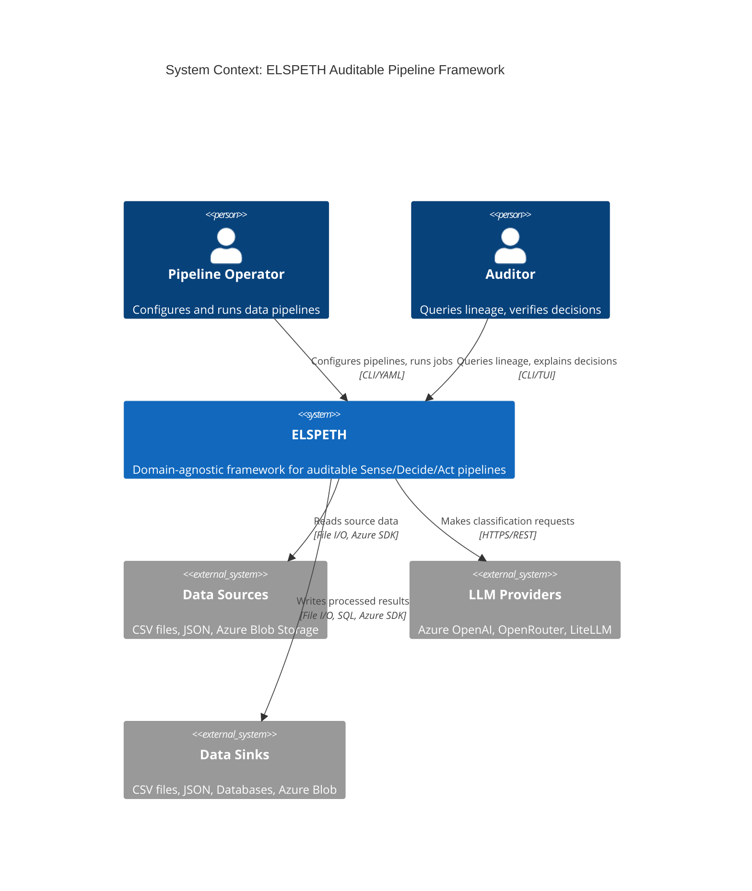
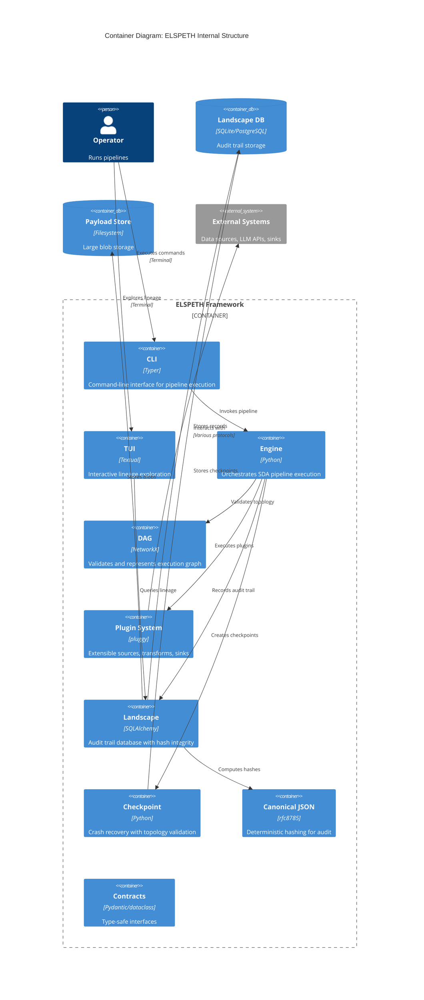
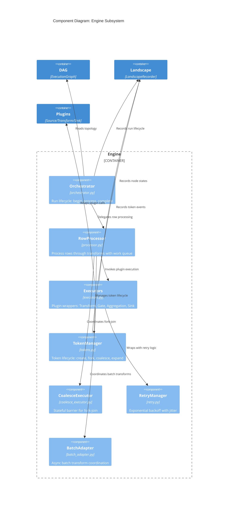
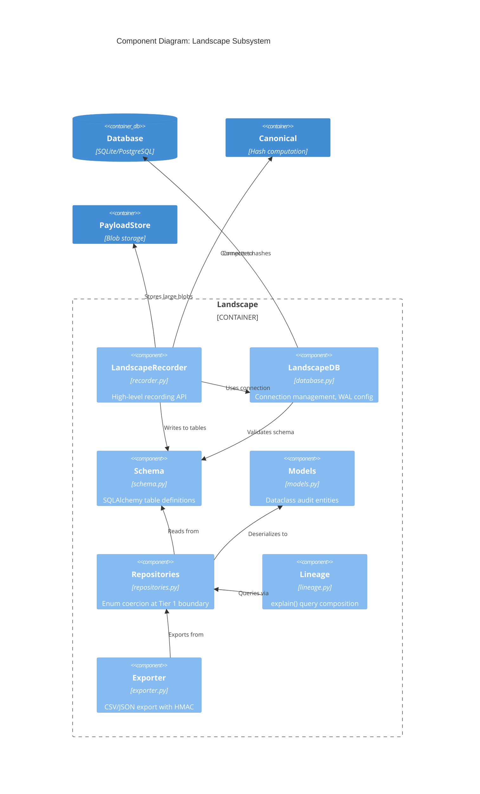
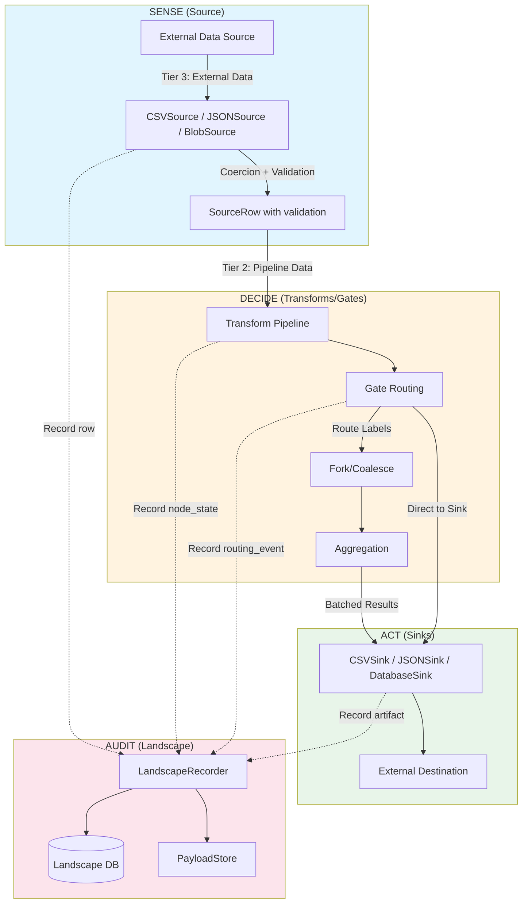
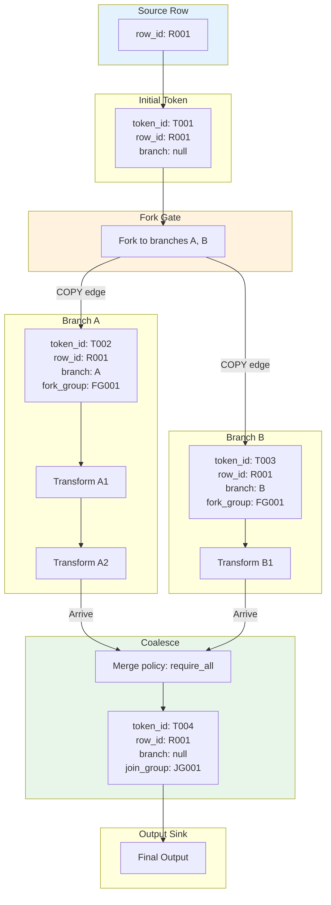
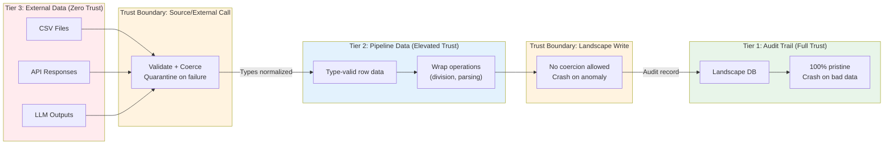
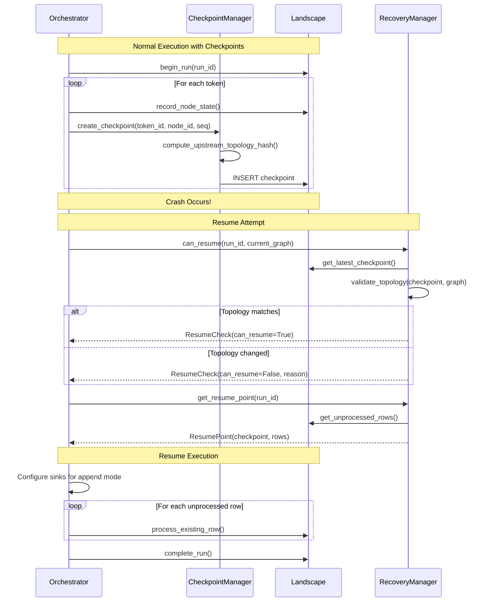
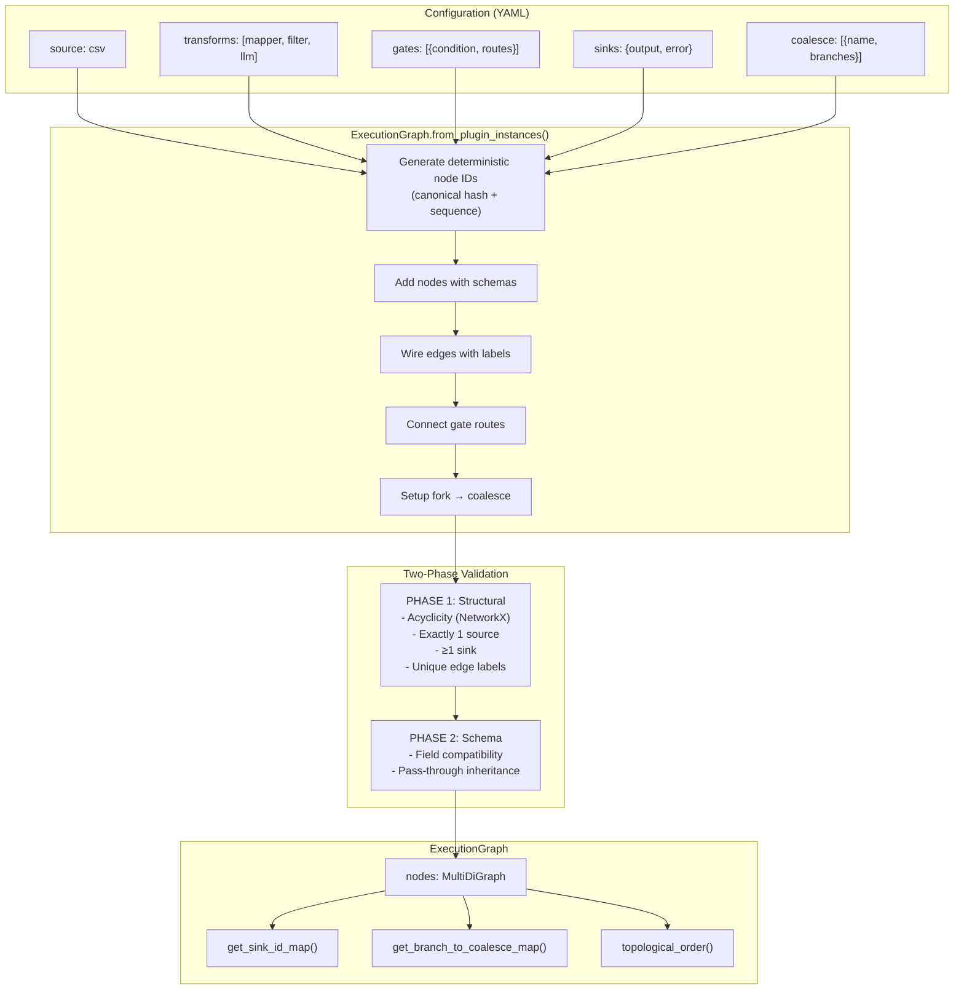
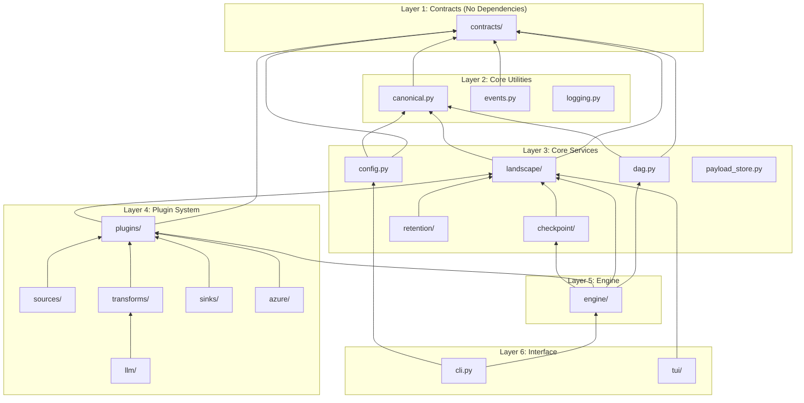

# Architecture Diagrams

This document contains C4 architecture diagrams for ELSPETH at multiple abstraction levels.

---

## Level 1: System Context Diagram

Shows ELSPETH in its operating environment with external actors.



---

## Level 2: Container Diagram

Shows the major components within ELSPETH.



---

## Level 3: Component Diagram - Engine

Detailed view of the Engine subsystem.



---

## Level 3: Component Diagram - Landscape

Detailed view of the Landscape (Audit Trail) subsystem.



---

## Level 3: Component Diagram - Plugin System

Detailed view of the Plugin subsystem.

```mermaid
C4Component
    title Component Diagram: Plugin System

    Container_Boundary(plugins, "Plugin System") {
        Component(manager, "PluginManager", "manager.py", "Registration, lookup, validation")
        Component(discovery, "Discovery", "discovery.py", "Dynamic plugin discovery")
        Component(context, "PluginContext", "context.py", "Run metadata, call recording")
        Component(protocols, "Protocols", "protocols.py", "Runtime-checkable interfaces")
        Component(base, "Base Classes", "base.py", "BaseSource, BaseTransform, BaseSink")
    }

    Container_Boundary(sources, "Sources") {
        Component(csv_src, "CSVSource", "csv_source.py")
        Component(json_src, "JSONSource", "json_source.py")
        Component(blob_src, "AzureBlobSource", "blob_source.py")
    }

    Container_Boundary(transforms, "Transforms") {
        Component(mapper, "FieldMapper", "field_mapper.py")
        Component(filter, "KeywordFilter", "keyword_filter.py")
        Component(llm, "LLM Transforms", "llm/*.py")
    }

    Container_Boundary(sinks, "Sinks") {
        Component(csv_sink, "CSVSink", "csv_sink.py")
        Component(json_sink, "JSONSink", "json_sink.py")
        Component(db_sink, "DatabaseSink", "database_sink.py")
    }

    Rel(manager, discovery, "Discovers plugins")
    Rel(manager, protocols, "Validates against")

    Rel(sources, base, "Extends")
    Rel(transforms, base, "Extends")
    Rel(sinks, base, "Extends")

    Rel(sources, context, "Uses")
    Rel(transforms, context, "Uses")
    Rel(sinks, context, "Uses")

    UpdateLayoutConfig($c4ShapeInRow="4", $c4BoundaryInRow="2")
```

---

## Data Flow Diagram

Shows how data flows through the SDA pipeline.



---

## Token Lifecycle Diagram

Shows how tokens track row identity through fork/coalesce operations.



---

## Three-Tier Trust Model Diagram

Visualizes the trust boundaries in data handling.



---

## Checkpoint Recovery Diagram

Shows the checkpoint and resume flow.



---

## DAG Construction Diagram

Shows how the execution graph is built from configuration.



---

## Module Dependency Diagram

Shows inter-module dependencies.



---

## Glossary

| Term | Definition |
|------|------------|
| **SDA** | Sense/Decide/Act - the three phases of pipeline execution |
| **Landscape** | The audit trail database |
| **Token** | An instance of a row at a specific point in the DAG |
| **row_id** | Stable source row identifier (never changes) |
| **token_id** | Instance identifier (changes on fork/coalesce) |
| **Fork** | Split one token into multiple parallel tokens |
| **Coalesce** | Merge multiple tokens back into one |
| **Gate** | Routing decision point that may fork or route to sinks |
| **Tier 1/2/3** | Trust levels for data (audit/pipeline/external) |
| **Canonical JSON** | RFC 8785 deterministic JSON for consistent hashing |
