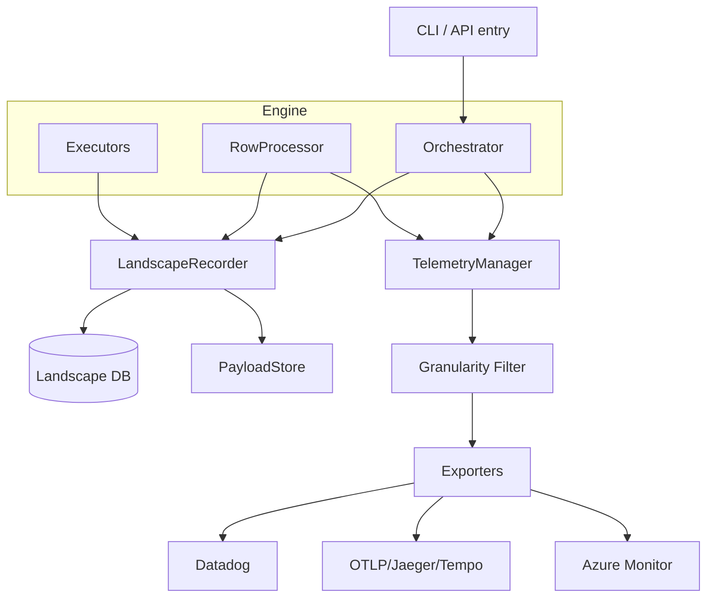
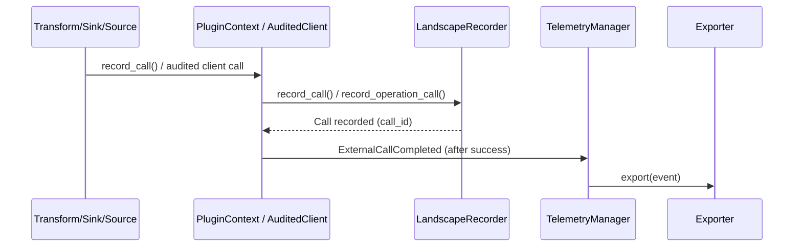

## Diagrams (Audit + Telemetry Focus)

### 1) Top‑Level Audit + Telemetry Flow (Ideal Wiring)

**Note:** Current CLI wiring does not instantiate or pass `TelemetryManager` to `Orchestrator`/`RowProcessor`, so the telemetry branch is effectively a no‑op unless wired elsewhere.

### 2) Source → Row/Token → Transform/Sink (Audit Spine)
```mermaid
flowchart TD
    SRC[Source.load()] --> OP[track_operation: source_load]
    OP --> ROW[Recorder.create_row]
    ROW --> TOK[Recorder.create_token]
    TOK --> NS_T[Recorder.begin_node_state (transform)]
    NS_T --> NS_TC[Recorder.complete_node_state]
    NS_TC --> NS_S[Recorder.begin_node_state (sink)]
    NS_S --> ART[Recorder.register_artifact]
    ART --> OUT[Recorder.record_token_outcome]
```

### 3) External Call Recording + Telemetry (LLM/HTTP)

**Note:** If `telemetry_emit` is left as default no‑op in PluginContext, the ExternalCallCompleted branch is silent.
