# ELSPETH Architecture Diagrams

This document contains C4 architecture diagrams at multiple abstraction levels.

---

## C4 Level 1: System Context

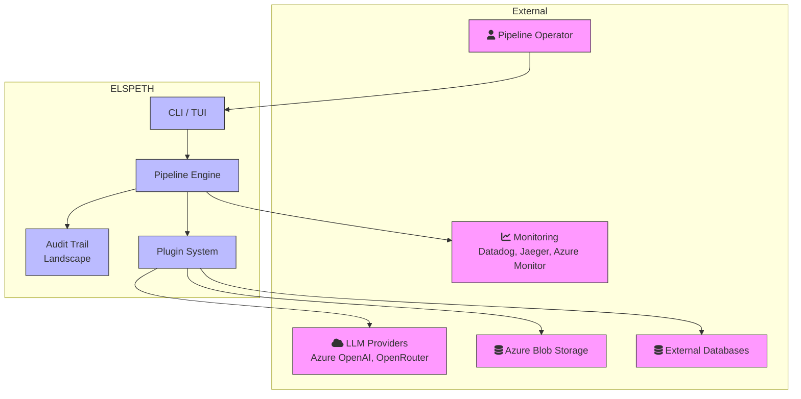

**System Context Description:**
- **Pipeline Operator**: Configures and runs SDA pipelines via CLI or TUI
- **ELSPETH**: Auditable pipeline framework with complete traceability
- **LLM Providers**: External AI services for classification/analysis
- **Azure Blob Storage**: Cloud storage for source/sink operations
- **External Databases**: SQL databases for source/sink
- **Monitoring**: Operational visibility via telemetry exporters

---

## C4 Level 2: Container Diagram

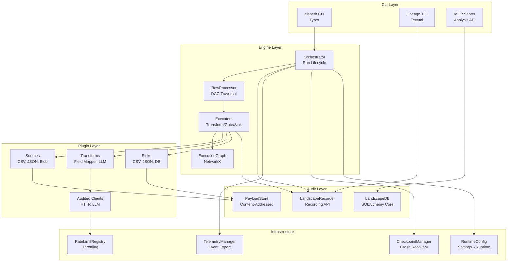

---

## C4 Level 3: Component Diagram - Engine

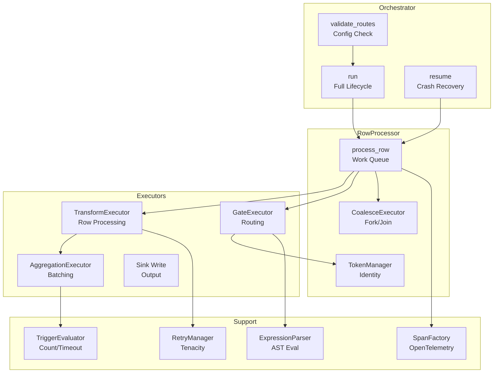

---

## C4 Level 3: Component Diagram - Landscape

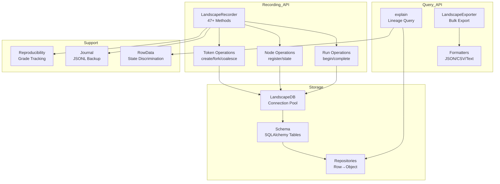

---

## C4 Level 3: Component Diagram - Plugin System

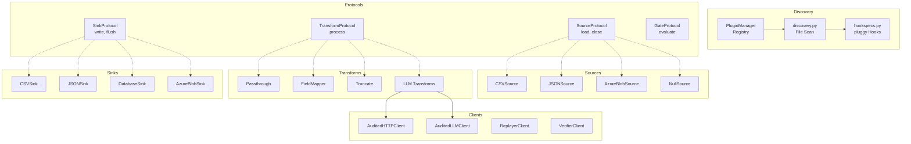

---

## Data Flow Diagram: Pipeline Execution

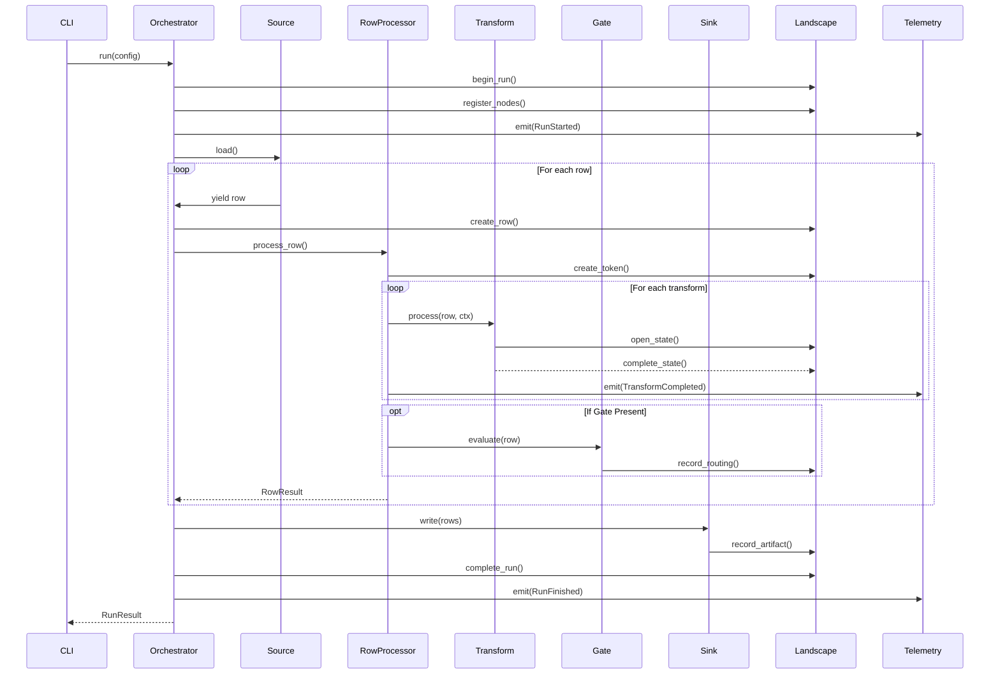

---

## Data Flow Diagram: Fork/Join Processing

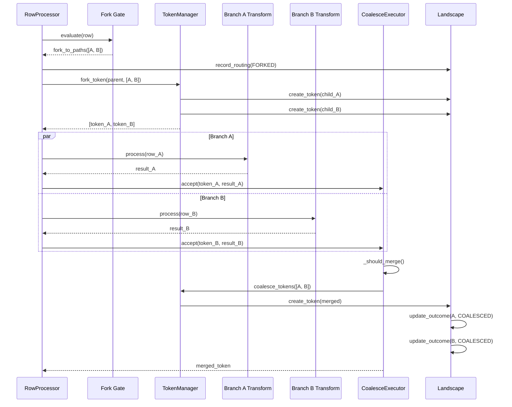

---

## Dependency Graph: Major Subsystems

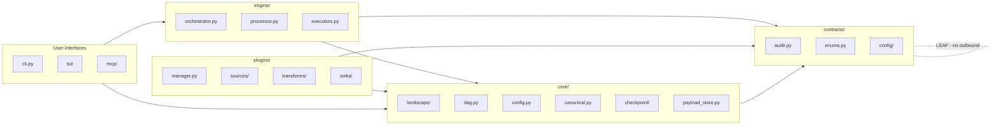

---

## Trust Boundary Diagram

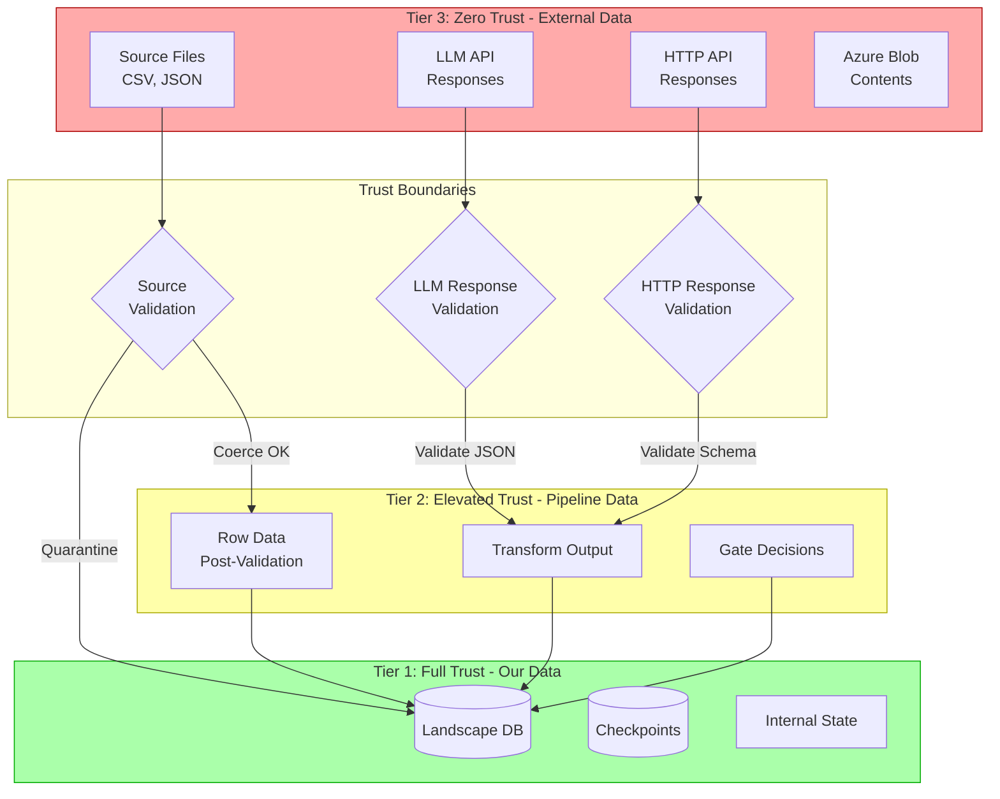

---

## Telemetry Flow Diagram

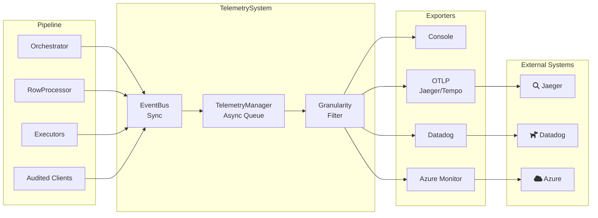

---

## Schema Contract Validation Flow

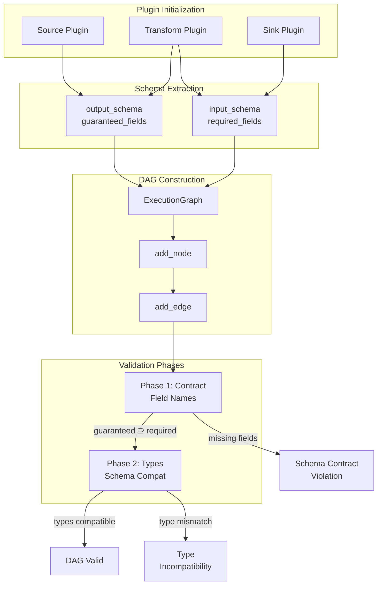

---

## Summary

These diagrams illustrate:

1. **System Context**: ELSPETH's place in the broader ecosystem
2. **Container View**: Major subsystem organization
3. **Component View**: Internal structure of Engine, Landscape, and Plugins
4. **Data Flow**: Pipeline execution and fork/join processing
5. **Dependencies**: Subsystem relationships and leaf module principle
6. **Trust Boundaries**: Three-tier trust model visualization
7. **Telemetry Flow**: Event routing to exporters
8. **Schema Validation**: Contract enforcement at DAG construction
