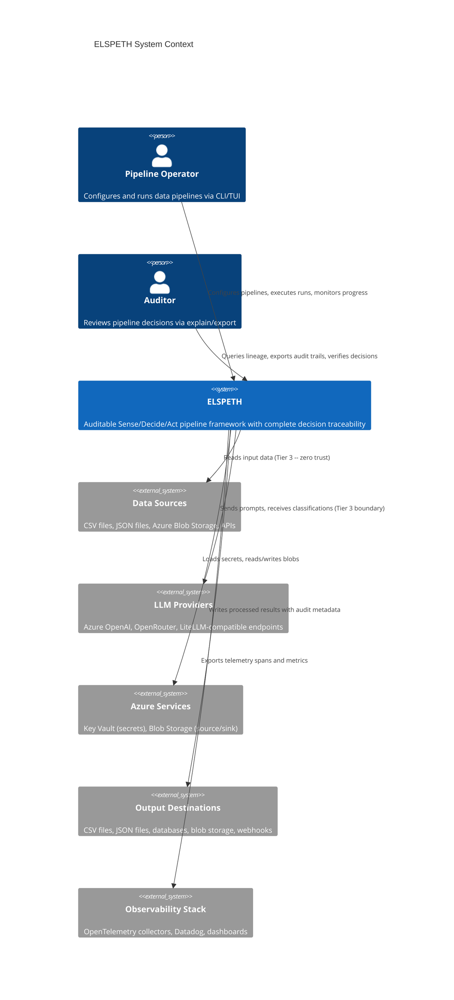
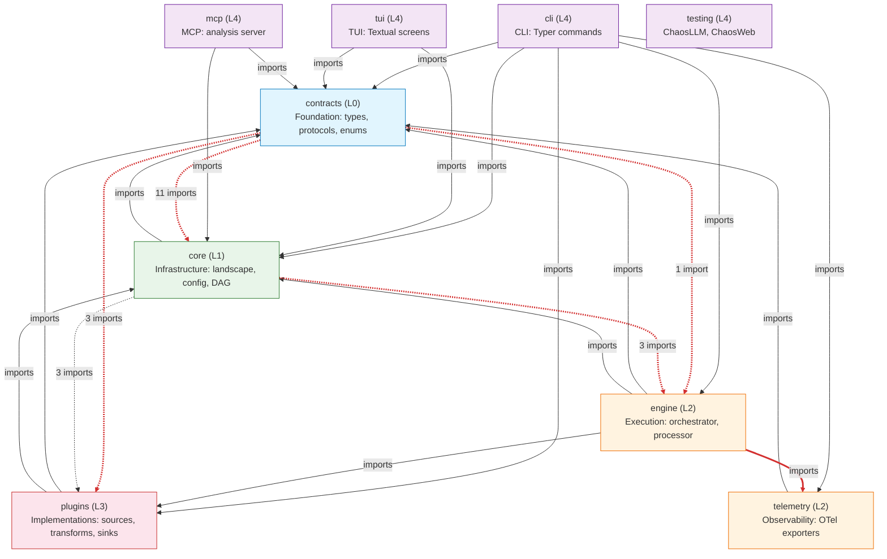
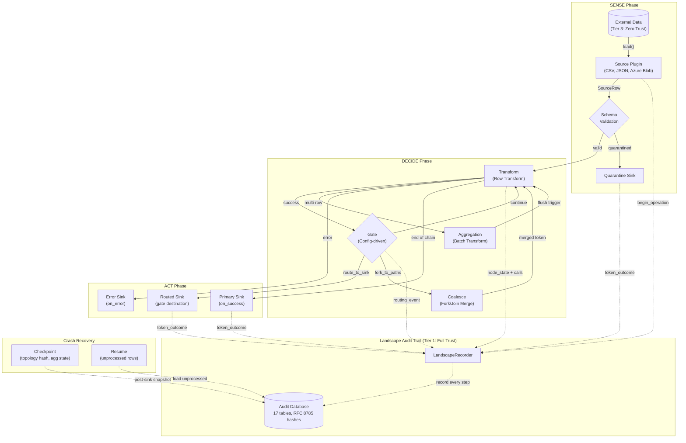
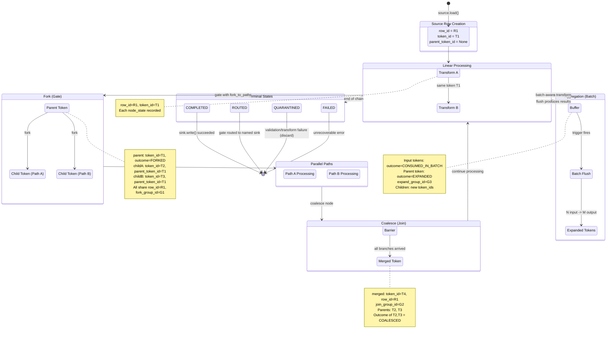

# ELSPETH Architecture Diagrams

**Date:** 2026-02-22
**Branch:** RC3.3-architectural-remediation
**Generated by:** Claude Opus 4.6

---

## 1. C4 Context Diagram (Level 1)

**What it shows:** ELSPETH as a system boundary and its interactions with external actors and systems. This establishes the scope of what ELSPETH is responsible for versus what it delegates to external systems.

**Key observations:** ELSPETH sits at the center of a data processing flow with clear trust boundaries. All external data (sources, LLM responses, Azure responses) enters at Tier 3 (zero trust). The audit trail (Landscape) is the system of record, not the observability stack.

---

## 2. C4 Container Diagram (Level 2)

**What it shows:** Major subsystems within ELSPETH and the data flows between them. This reveals the internal architecture at a level suitable for understanding component responsibilities and communication patterns.

```mermaid
C4Container
    title ELSPETH Container Diagram

    Person(operator, "Operator")
    Person(auditor, "Auditor")

    System_Boundary(elspeth, "ELSPETH Framework") {
        Container(cli, "CLI", "Typer", "Command-line interface: run, resume, validate, explain, purge, plugins")
        Container(tui, "TUI", "Textual", "Interactive terminal UI for lineage exploration")
        Container(mcp, "MCP Server", "FastMCP", "Read-only Landscape analysis for debugging")

        Container(engine, "Engine", "Python", "Orchestrator, RowProcessor, RetryManager, Executors, TokenManager")
        Container(plugins, "Plugins", "pluggy", "Sources, Transforms, Sinks, LLM clients, HTTP clients")

        Container(core_landscape, "Landscape", "SQLAlchemy Core", "Audit backbone: 17 tables, recorder, exporter, lineage")
        Container(core_dag, "DAG", "NetworkX", "Graph construction, validation, schema contracts, traversal")
        Container(core_config, "Config", "Dynaconf + Pydantic", "Settings loading, validation, secret fingerprinting")
        Container(core_checkpoint, "Checkpoint", "Python", "Crash recovery: create, validate, resume")

        Container(contracts, "Contracts", "Python dataclasses", "Type definitions, protocols, enums, schemas, results")
        Container(telemetry, "Telemetry", "OpenTelemetry", "Span export, metrics, backpressure management")
    }

    System_Ext(audit_db, "Audit Database", "SQLite / PostgreSQL / SQLCipher")
    System_Ext(ext_data, "External Data Sources")
    System_Ext(ext_sinks, "Output Destinations")
    System_Ext(ext_llm, "LLM Providers")

    Rel(operator, cli, "elspeth run/resume/validate")
    Rel(auditor, tui, "elspeth explain --run --row")
    Rel(auditor, mcp, "MCP tool calls: diagnose, explain_token")

    Rel(cli, engine, "Triggers pipeline execution")
    Rel(engine, plugins, "Invokes source.load(), transform.process(), sink.write()")
    Rel(engine, core_landscape, "Records every operation via LandscapeRecorder")
    Rel(engine, core_dag, "Reads DAG topology for traversal")
    Rel(engine, core_checkpoint, "Creates/loads checkpoints for crash recovery")
    Rel(engine, contracts, "Uses type definitions, results, protocols")
    Rel(engine, telemetry, "Emits operational telemetry events")

    Rel(plugins, ext_data, "Reads external data")
    Rel(plugins, ext_sinks, "Writes processed results")
    Rel(plugins, ext_llm, "Sends prompts, receives responses")

    Rel(core_landscape, audit_db, "Persists audit trail")
    Rel(core_config, contracts, "Settings -> Runtime*Config via from_settings()")
    Rel(core_dag, contracts, "Uses NodeType, EdgeInfo, SchemaConfig")

    Rel(mcp, core_landscape, "Read-only queries against audit database")
    Rel(tui, core_landscape, "Read-only queries for lineage display")
```

**Key observations:** The Engine is the central coordinator, depending on nearly every subsystem. Contracts is the foundation layer consumed by all others. Landscape is the most widely imported subsystem (the "audit backbone"). The CLI/TUI/MCP layer is purely user-facing with no inbound dependencies.

---

## 3. Subsystem Dependency Graph

**What it shows:** All actual import dependencies between subsystems, derived from the cross-cutting dependency analysis. Layer violations (upward dependencies) are highlighted in red. These violations are the primary remediation targets for RC3.3.

**Key observations:** There are 5 distinct upward dependency paths totaling 21 imports that violate the expected layering. The most severe is contracts (L0) importing 11 symbols from core (L1), driven primarily by PluginContext (a god object) and the Settings-to-Runtime*Config conversion. The core-to-engine violation (3 imports of ExpressionParser) and core-to-plugins violation (3 imports of plugin protocols) are structurally fixable by relocating the imported types.

---

## 4. Data Flow Diagram

**What it shows:** How data flows through a pipeline execution, from source ingestion through transform processing and gate routing to sink output. Shows the Landscape recording at each step and the checkpoint/recovery mechanism.

**Key observations:** The Landscape records at every processing step (dotted lines), ensuring complete lineage. Checkpoints are created after sink writes (not before), ensuring outcome durability. The three-tier trust model is visible: external data enters as Tier 3, becomes Tier 2 after source validation, and the audit trail is always Tier 1.

---

## 5. Layer Violation Diagram

**What it shows:** The expected five-layer architecture and every upward dependency that violates the layering. This is the primary diagram for remediation planning. Each red arrow represents imports that must be moved, inverted, or eliminated.

```mermaid
graph BT
    classDef violation stroke:#d32f2f,stroke-width:3px,stroke-dasharray: 5 5
    classDef layer fill:#f5f5f5,stroke:#333

    subgraph L4["Layer 4: User-Facing"]
        cli["cli.py<br/>cli_helpers.py"]
        tui["tui/"]
        mcp["mcp/"]
        testing["testing/"]
    end

    subgraph L3["Layer 3: Plugin Implementations"]
        plugins_src["plugins/sources/"]
        plugins_tx["plugins/transforms/"]
        plugins_sink["plugins/sinks/"]
        plugins_llm["plugins/llm/"]
        plugins_clients["plugins/clients/"]
        plugins_proto["plugins/protocols.py"]
        plugins_pool["plugins/pooling/"]
    end

    subgraph L2["Layer 2: Execution"]
        orch["engine/orchestrator/"]
        proc["engine/processor.py"]
        retry["engine/retry.py"]
        exec["engine/executors/"]
        tokens["engine/tokens.py"]
        expr["engine/expression_parser.py"]
        coal["engine/coalesce_executor.py"]
        telemetry["telemetry/"]
    end

    subgraph L1["Layer 1: Infrastructure"]
        landscape["core/landscape/"]
        dag["core/dag/"]
        config["core/config.py"]
        checkpoint["core/checkpoint/"]
        canonical["core/canonical.py"]
        security["core/security/"]
        events["core/events.py"]
    end

    subgraph L0["Layer 0: Foundation"]
        contracts_audit["contracts/audit.py"]
        contracts_results["contracts/results.py"]
        contracts_ctx["contracts/plugin_context.py"]
        contracts_url["contracts/url.py"]
        contracts_runtime["contracts/config/runtime.py"]
        contracts_records["contracts/contract_records.py"]
        contracts_schema["contracts/schema_contract.py"]
        contracts_nsc["contracts/node_state_context.py"]
        contracts_enums["contracts/enums.py"]
        contracts_errors["contracts/errors.py"]
    end

    %% VIOLATION 1: contracts -> core (11 imports) -- MOST SEVERE
    contracts_ctx -->|"LandscapeRecorder<br/>RateLimitRegistry<br/>stable_hash, repr_hash"| landscape
    contracts_ctx -->|"canonical"| canonical
    contracts_runtime -->|"6 Settings classes"| config
    contracts_records -->|"canonical_json"| canonical
    contracts_schema -->|"canonical_json"| canonical
    contracts_url -->|"_sanitize_dsn<br/>fingerprint"| config
    contracts_url -->|"get_fingerprint_key<br/>secret_fingerprint"| security

    %% VIOLATION 2: contracts -> engine (1 import)
    contracts_errors -->|"MaxRetriesExceeded"| retry

    %% VIOLATION 3: contracts -> plugins (3 imports)
    contracts_ctx -->|"AuditedHTTPClient<br/>AuditedLLMClient"| plugins_clients
    contracts_nsc -->|"BufferEntry"| plugins_pool

    %% VIOLATION 4: core -> engine (3 imports)
    config -->|"ExpressionParser<br/>ExpressionSecurityError<br/>ExpressionSyntaxError"| expr

    %% VIOLATION 5: core -> plugins (3 imports)
    dag -->|"SourceProtocol<br/>TransformProtocol<br/>SinkProtocol"| plugins_proto

    linkStyle 0,1,2,3,4,5,6,7,8,9,10,11 stroke:#d32f2f,stroke-width:2px
```

**Key observations and remediation priorities:**

1. **contracts/plugin_context.py is the #1 coupling vector** (6 of the 21 violation imports). PluginContext is a god object that imports from core/landscape, core/canonical, and plugins/clients. Refactoring PluginContext via protocol-based dependency injection would eliminate nearly a third of all violations.

2. **contracts/config/runtime.py imports 6 Settings classes** from core/config.py for the `from_settings()` factory methods. This could be inverted: Settings classes could provide `to_runtime()` methods, or a co-located converter module could be introduced.

3. **contracts -> core/canonical** (3 imports across 3 files) for hashing utilities. Moving `canonical_json`, `stable_hash`, and `repr_hash` to contracts/ (or a shared contracts/serialization.py) would eliminate these.

4. **core/config.py -> engine/expression_parser.py** (3 imports) is the most structurally clear violation. Moving ExpressionParser to core/ would fix this immediately.

5. **core/dag/ -> plugins/protocols.py** (3 imports for plugin protocols) is fixable by moving plugin protocols from plugins/ to contracts/ where they conceptually belong.

6. **Quick wins:** Moving `MaxRetriesExceeded` to contracts/errors.py (1 import) and `BufferEntry` to contracts/ (1 import) would eliminate 2 violations trivially.

---

## 6. Token Lifecycle Diagram

**What it shows:** How `row_id`, `token_id`, and `parent_token_id` relate through the DAG processing lifecycle, including forks, joins (coalesce), aggregation, and expansion. This is essential for understanding the lineage model that underpins ELSPETH's auditability guarantee.

**Key observations:**

- **row_id** is stable across the entire lifecycle -- it identifies the source row regardless of forking, joining, or expansion. Every token derived from a source row shares the same row_id.

- **token_id** is a unique instance in a specific DAG path. Forks create new tokens (T2, T3) from a parent (T1). Coalesces create a merged token (T4) from multiple parents. Expansions create child tokens from a batch parent.

- **parent_token_id** provides lineage for forks and expansions. The token_parents table supports multi-parent relationships for coalesce/join operations.

- **Group IDs** (fork_group_id, join_group_id, expand_group_id) link related tokens for batch operations and enable the Landscape to reconstruct the full lineage tree.

- **Every terminal state is recorded exactly once** per token in the token_outcomes table. The `is_terminal` flag and partial unique index ensure no silent drops -- a token that "disappears" without a terminal outcome would be detected by the audit integrity checks.

- **Delegation markers** (FORKED, EXPANDED, CONSUMED_IN_BATCH, COALESCED) are terminal for the *parent* token but not terminal for the *row* -- the row is complete only when all leaf tokens in its lineage tree have terminal outcomes. This distinction is critical for checkpoint/recovery: the `get_unprocessed_rows()` query must exclude delegation markers from the "complete" check.
