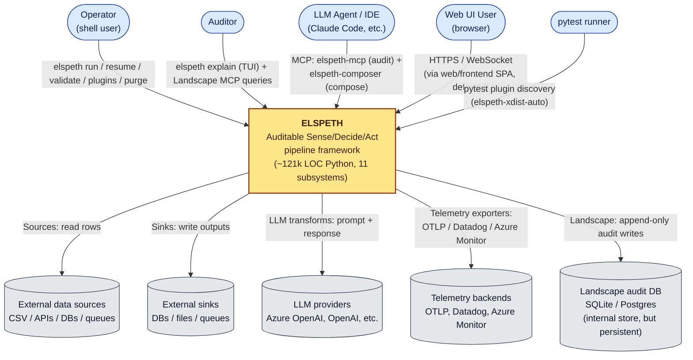
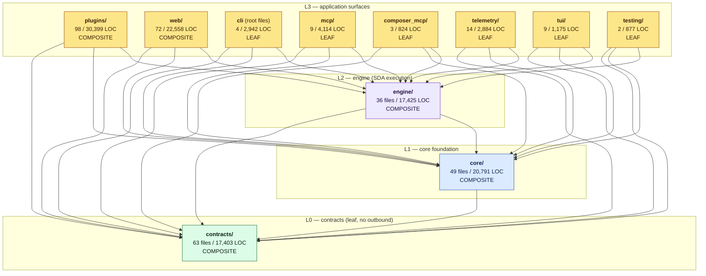

# 03 — L1 Context Diagram (C4 Level-1)

This document contains two views, both at L1 depth:

1. **System Context** (strict C4 Level-1) — ELSPETH as a black box with external actors and external systems.
2. **Subsystem (Container) decomposition** — the 11 verified subsystems grouped by layer, with **layer-enforced cross-layer edges only**. L3↔L3 edges are not drawn (deferred to L2 dispatch per Δ5 grep ban + Δ2 depth cap).

Edge truth-source: layer schema in `temp/tier-model-oracle.txt` (extracted from `scripts/cicd/enforce_tier_model.py:237–248` — `LAYER_HIERARCHY` 237–241 + `LAYER_NAMES` 243–248) plus the clean enforcer status — the codebase is layer-conformant at scan time.

## 1. System Context (C4 Level-1)

Notes:

- The Landscape audit DB is shown as an external store rather than a subsystem because its physical location is configurable (file, Postgres) and its lifecycle outlives any single ELSPETH process. The *code* that owns it lives in `core/landscape/` (see Container view).
- The browser actor connects through `web/`'s FastAPI surface; the `frontend/` SPA itself is **deferred** per Δ6 and is not analysed here.
- Two distinct MCP surfaces are visible to LLM agents: `mcp/` (read-only post-hoc audit analyser) and `composer_mcp/` (interactive pipeline construction). They share transport but nothing else known at L1 depth — see catalog entries 6 and 7.

## 2. Subsystem (Container) decomposition by layer

This view is strictly C4 Level-2 ("Container") in classical terminology, but in the hierarchical-pass vocabulary it is the **L1 architectural shape** — the artefact a future L2 deep-dive would zoom into. All 11 verified subsystems appear; only layer-enforced edges are drawn.

### Edge accounting (validator-friendly)

| Edge family | Truth-source | Count |
|-------------|--------------|------:|
| L1 → L0 | enforce_tier_model.py:238 (core layer = 1, allows targets ≤ 0) | 1 (`core → contracts`) |
| L2 → L1, L2 → L0 | enforce_tier_model.py:239 (engine layer = 2, allows targets ≤ 1) | 2 |
| L3 → L2, L3 → L1, L3 → L0 | enforce_tier_model.py:241–242 (everything else implicitly L3 — see comment "Everything else (plugins, mcp, tui, telemetry, testing, cli*) is implicitly L3") | 8 × 3 = 24 |
| **Total layer-enforced edges drawn** | | **27** |
| L3 ↔ L3 edges | Layer-permitted, unconstrained, unknown at L1 | **deferred** |

The 24 L3-outbound edges are shown explicitly to avoid hand-waving: any of the 8 L3 subsystems may import from `{contracts, core, engine}`, and the catalog's per-subsystem outbound entries claim each one does so concretely (or "likely does so" for `testing/` and `composer_mcp/` where outbound was deferred).

### Edges intentionally omitted

- **L3 ↔ L3** (e.g., `cli → tui`, `cli → plugins`, `web → plugins`, `web → composer_mcp`, `plugins → telemetry`, `mcp → ?`). These are evidenced in the catalog as "likely" but are not drawn here because Δ5 forbids grep-derivation and the enforcer does not enumerate them. They are the **primary work item for the L2 dispatch wave**.
- **External-system edges** (e.g., `plugins → external sources`, `telemetry/exporters → OTLP`). Already shown in the System Context view; not duplicated here.
- **The `frontend/` SPA** — out of scope per Δ6.

## 3. L1 visible architectural shape (annotations)

These are observations the diagram makes legible but does not draw arrows for. Each is referenced in the catalog or summary.

- **Plugin ecosystem is L3, not L2.** The intuition that "plugins are core to ELSPETH's purpose" might suggest L2, but the layer model assigns them to L3 (`enforce_tier_model.py:237–248` `LAYER_HIERARCHY` + `LAYER_NAMES`; `plugins/` is not in the hierarchy dict, so it is implicitly L3 per the comment at line 241). This means *everything `plugins/` imports flows downward into `engine/` or below*, which preserves the engine's leaf-of-execution role.
- **Two siblings at L3 with overlapping names — `mcp/` and `composer_mcp/`.** Both expose MCP transports but to different audiences (post-hoc auditor vs. interactive pipeline composer). The diagram keeps them as siblings; the catalog's entries 6/7 explain why they should not be merged.
- **`web/composer/` is the second-largest single LOC concentration in the tree** (3,804 + 1,710 LOC across `tools.py` + `state.py`). Its relationship to `composer_mcp/` is the highest-priority structural question for the L2 wave (Q3 in `01-discovery-findings.md`).
- **`engine/orchestrator/core.py` (3,281 LOC) is the run-lifecycle hot spot**. Combined with `engine/processor.py` (2,700 LOC) and `engine/coalesce_executor.py` (1,603 LOC), nearly half of `engine/` (~7,500 of 17,425 LOC) is concentrated in three files — KNOW-A70 already flags this as a quality risk.

## Confidence

| Aspect | Confidence | Reason |
|--------|------------|--------|
| External-actor enumeration (Context view) | High | Confirmed against pyproject `[project.scripts]` + KNOW-G* + KNOW-A14/A12 |
| Layer-enforced edges (Container view) | High | Deterministic from `enforce_tier_model.py:237–247` plus clean enforcer run |
| Subsystem layer assignments | High | Path-based, unambiguous per the script's table |
| L3 ↔ L3 edge structure | **N/A** | Deferred — the L1 pass cannot honestly draw these |
| Frontend, tests, examples, scripts (other than the layer enforcer) | **N/A** | Out of scope per Δ6 |
