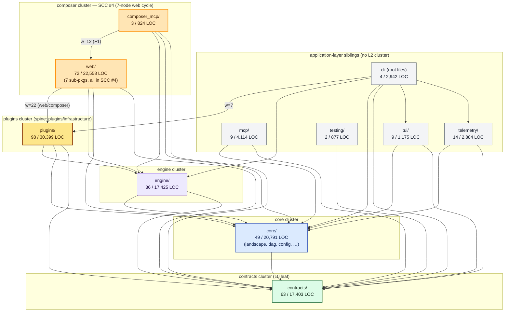
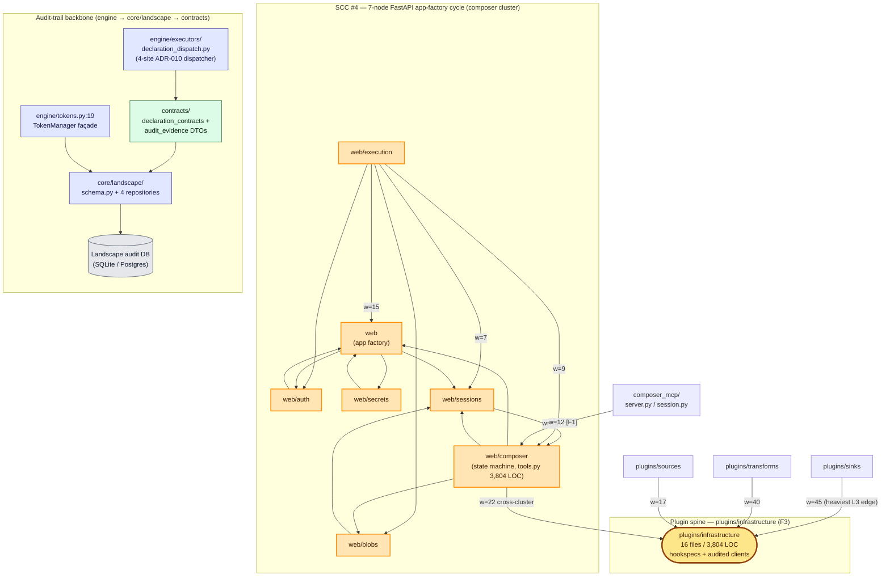

# ELSPETH Architecture — Cross-Cluster Diagrams

Two C4-style views synthesise the L1 11-subsystem map and the five L2 cluster diagrams into a single system-level picture: a **Container** view showing all 11 L1 subsystems grouped by L2 cluster, and a **Component** view drilling into the structurally interesting zones (the 7-node web SCC, the plugin spine, the audit-trail backbone).

Edge truth-source for L3-application surfaces is the L3 oracle (`temp/l3-import-graph.json`, schema v1.0; 33 nodes, 77 edges, 5 SCCs, `stats.type_checking_edges = 0`). Layer-enforced edges into `core` and `contracts` are sourced from the L1 layer model (`enforce_tier_model.py:237–248`) and the per-cluster catalogs.

## Container view (C4 Container, system-level)

This view shows all 11 L1 subsystems verified in `02-l1-subsystem-map.md`, grouped into five L2 clusters plus a sixth grouping for the application-layer siblings that were not promoted to clusters. Edge weights are shown only for load-bearing edges (≥10) and key cross-cluster handshakes confirmed in `temp/reconciliation-log.md`.

**Reading guide.** The composer cluster is highlighted (orange) because its `web/*` sub-packages form **SCC #4**, the largest strongly-connected component in the codebase (`[ORACLE: stats.largest_scc_size = 7; strongly_connected_components[4]]`); the cluster cannot be acyclically decomposed and was scoped as a unit per `[PHASE-0.5 §7.5 F4]`. The plugins container is shaded to flag the F3 spine: `plugins/infrastructure/` is the centre of mass, with `plugins/sinks → plugins/infrastructure` weight 45 the heaviest single edge anywhere in the L3 graph (`[ORACLE: edges[11]]`); see Component view for the spine itself. The composer→plugins handshake (`web/composer → plugins/infrastructure` weight 22, `[ORACLE: edges[54]]`) is the heaviest cross-cluster inbound edge to the plugins cluster, confirmed by `[CLUSTER:composer §5 item 1]` and `[CLUSTER:plugins cross-cluster bullet 1]` in `temp/reconciliation-log.md`. The four other SCCs (mcp 2-node, plugins/transforms/llm 2-node, telemetry 2-node, tui 3-node) live inside individual containers and are not redrawn here; they are the L2 cluster passes' concern.

## Component view (drilling into SCC #4, the plugin spine, and the audit backbone)

This view zooms into the three structurally interesting zones: the 7-node SCC #4 inside the composer cluster, the plugin spine inside the plugins cluster, and the audit-trail backbone that threads engine → core/landscape → contracts.

**Reading guide.** SCC #4 is the load-bearing structural finding of the analysis: seven `web/*` sub-packages form a single runtime cycle that no static decomposition can break (`[CLUSTER:composer §5 item 2]`; decomposition explicitly deferred to architecture pack). The two heaviest intra-SCC edges (`web/sessions → web/composer` w=15, `web/execution → web` w=15, both from `clusters/composer/temp/intra-cluster-edges.json`) carry the composer state machine and request-routing fan-in. `composer_mcp/` enters the SCC at `web/composer` with weight 12 (`[ORACLE: edges[6]]`), which is the structural finding that closed L1 open question Q2 (`[PHASE-0.5 §7.5 F1]`). The plugin spine is highlighted as a hexagon: three intra-cluster spokes (sinks 45, transforms 40, sources 17 — `[ORACLE: edges[11], [16], [14]]`) plus the heaviest cross-cluster inbound (`web/composer → plugins/infrastructure` weight 22, `[ORACLE: edges[54]]`) all terminate here. The audit backbone shows the three layered citations that thread the audit-complete posture through the layers: `engine/tokens.py:19 → core/landscape/data_flow_repository` (engine cross-cluster bullet 1, confirmed by `[CLUSTER:core confidence 2]`); `engine/executors/declaration_dispatch.py` → `contracts/declaration_contracts` (the 4-site ADR-010 dispatcher, `[CLUSTER:engine §5 item 2]`, confirmed by `[CLUSTER:contracts cross-cluster bullet 2]`); `contracts` audit DTOs → `core/landscape/schema.py` (L0 audit DTO ownership, `[CLUSTER:contracts cross-cluster bullet 3]`).

## Provenance

**Container nodes (11 L1 subsystems).** All from `02-l1-subsystem-map.md §1–11`: `contracts` §1, `core` §2, `engine` §3, `plugins` §4, `web` §5, `mcp/` §6, `composer_mcp/` §7, `telemetry` §8, `tui` §9, `testing` §10, `cli` §11. Cluster grouping per `[PHASE-0.5 §7.5]` revised dispatch queue.

**Component nodes (oracle sub-packages).** The 7 SCC #4 nodes — `web`, `web/auth`, `web/blobs`, `web/composer`, `web/execution`, `web/secrets`, `web/sessions` — from `[ORACLE: nodes; strongly_connected_components[4]]`, confirmed at symbol-level by `[CLUSTER:composer §C5]`. `composer_mcp/` from `[ORACLE: node composer_mcp]` and `[CLUSTER:composer §C-composer_mcp]`. `plugins/infrastructure`, `plugins/sinks`, `plugins/sources`, `plugins/transforms` from `[ORACLE: nodes]` and `[CLUSTER:plugins §C1–C4]`. Engine, core, contracts audit-backbone nodes per `[CLUSTER:engine §C-tokens, §C-declaration_dispatch]`, `[CLUSTER:core §C-landscape]`, `[CLUSTER:contracts §C-declaration_contracts, §C-audit_evidence]`.

**Container load-bearing edges.** `web/composer → plugins/infrastructure` w=22 `[ORACLE: edges[54]]`; `composer_mcp → web/composer` w=12 `[ORACLE: edges[6]; PHASE-0.5 §7.5 F1]`; `cli → plugins/infrastructure` w=7 `[ORACLE: edges[0]]`; layer-enforced `engine → {core, contracts}`, `core → contracts`, all L3 → {core, contracts} edges from `enforce_tier_model.py:237–248` and `03-l1-context-diagram.md §2 edge accounting`.

**Component edges (intra-SCC #4).** All from `clusters/composer/temp/intra-cluster-edges.json` (oracle-derived; `byte_equality_assertion` not asserted, but extraction methodology cited). 16 edges drawn match the entries with weight ≥4 reported in `intra_cluster_edges` array. `composer_mcp → web/composer` w=12 `[ORACLE: edges[6]]`.

**Component edges (plugin spine).** `plugins/sinks → plugins/infrastructure` w=45 `[ORACLE: edges[11]]`; `plugins/transforms → plugins/infrastructure` w=40 `[ORACLE: edges[16]]`; `plugins/sources → plugins/infrastructure` w=17 `[ORACLE: edges[14]]`; `web/composer → plugins/infrastructure` w=22 `[ORACLE: edges[54]]`. F3 framing per `[PHASE-0.5 §7.5 F3]`.

**Component edges (audit backbone).** `engine/tokens.py:19 → DataFlowRepository` per `[CLUSTER:engine §5 cross-cluster bullet 1]` (also drawn in `clusters/engine/03-cluster-diagrams.md` line 116); `engine/declaration_dispatch.py → contracts.declaration_contracts` per `[CLUSTER:engine §5 cross-cluster bullet 2]` and `[CLUSTER:contracts cross-cluster bullet 2]`; `contracts/audit_evidence → core/landscape/schema.py` per `[CLUSTER:contracts cross-cluster bullet 3]`. None of these edges appear in the L3 oracle because the oracle's `scope.layers_included = ['L3/application']` excludes engine/core/contracts; this is by design — the oracle's job is L3 cycle detection, the layer-enforcer is the truth-source for cross-layer edges.

**Standing constraints honoured.** No TYPE_CHECKING-only edges drawn (`[ORACLE: stats.type_checking_edges = 0]`, `[PHASE-0.5 §7.5 F5]`; the contracts cluster's `plugin_context.py:31` TYPE_CHECKING smell is intra-cluster and below this view's resolution per `temp/reconciliation-log.md` R2). All 33 oracle nodes either drawn or contained inside an L1 container (`mcp/analyzers` inside mcp; `tui/screens`, `tui/widgets` inside tui; `telemetry/exporters` inside telemetry; `plugins/transforms/{azure,llm,llm/providers,rag}`, `plugins/infrastructure/{batching,clients,clients/retrieval,pooling}` inside plugins; `web/catalog`, `web/middleware`, `web/composer/skills` inside web; the `.` cli-root node mapped to the `cli` container). No nodes added that aren't in `[ORACLE: nodes]` plus the engine/core/contracts containers from the L1 layer schema.
