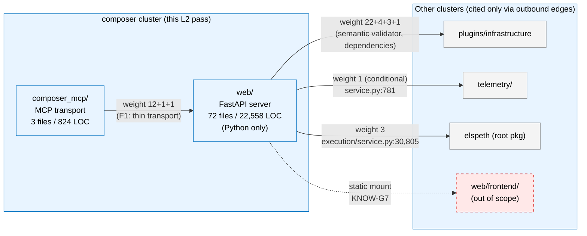
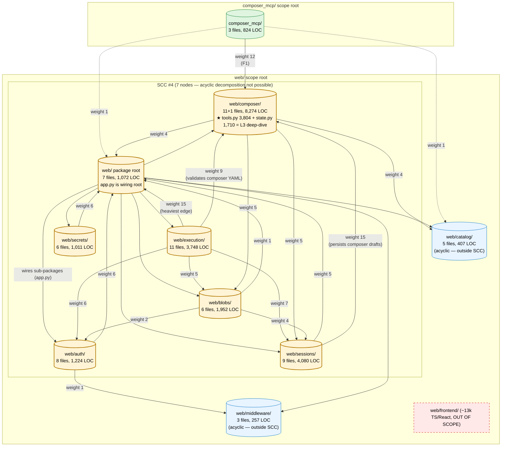

# 03 — Cluster Diagrams (composer cluster: web/ + composer_mcp/)

C4 Container and Component diagrams scoped to this cluster only. Diagrams are observational; arrow weights cite the L3 import graph (`temp/intra-cluster-edges.json` and `docs/arch-analysis-2026-04-29-1500/temp/l3-import-graph.json`). Per Δ L2-4, no cross-cluster claims beyond the 6 outbound edges enumerated in `01-cluster-discovery.md` §4.

## D1. C4 Container view (this cluster within ELSPETH)

Shows the cluster's two containers and their cross-cluster boundaries. The cluster has 0 inbound and 6 outbound cluster-external edges; this is rendered as edge weights, not as arrows from outside.



**Notes:**
- Edge weights are *aggregated* across the cluster's 6 outbound edges enumerated in `01-cluster-discovery.md` §4 (1+3+22+3+4+1=34, not all to one target — see source for breakdown).
- The dashed edge to `web/frontend/` is a *static-file mount*, not an import — it is included for completeness per [CITES KNOW-G7] but is not an oracle edge.
- 0 inbound arrows from other clusters: confirmed by `temp/intra-cluster-edges.json:cross_cluster_inbound_edges = []`.

## D2. C4 Component view (within `web/` + `composer_mcp/`)

Shows the cluster's 11 sub-package nodes (10 in-scope Python sub-packages + composer_mcp/), the SCC #4 membership, and the heaviest intra-cluster edges. Per Δ L2-7, the SCC is rendered as a contained group; non-SCC siblings (catalog/, middleware/) sit alongside.



**Reading guide:**
- **Yellow (SCC #4):** the 7 nodes that form the strongly-connected component. Bidirectional arrows between `web/` package root and each sub-package signal the FastAPI app-factory cycle.
- **Blue (acyclic):** `web/catalog/` and `web/middleware/` — in cluster scope but not in the cycle.
- **Green:** `composer_mcp/` — the cluster's second scope root; thin transport to `web/composer/`.
- **Red dashed:** `web/frontend/` — out of scope, recorded only.
- **Heaviest edges:** `web/execution → web` (15), `web/sessions → web/composer` (15), `composer_mcp → web/composer` (12), `web/execution → web/composer` (9), `web/execution → web/sessions` (7).
- **The two weight-15 edges have semantically different causes:** the execution → web edge is *cycle-driven* (sub-package reaching back for shared types via the app-factory pattern); the sessions → composer edge is *data-flow-driven* (sessions persists composer drafts). Both are equally heavy, neither is reducible without restructuring.

## D3. SCC reference (oracle paste-through)

Direct citation of the L1 oracle entry that this cluster's analysis treats as a unit:

```
[ORACLE: strongly_connected_components[4]]
  members: ['web', 'web/auth', 'web/blobs', 'web/composer',
            'web/execution', 'web/secrets', 'web/sessions']
  size: 7
  all_in_cluster: true
  oracle_path: temp/l3-import-graph.json:strongly_connected_components[4]
```

Per Δ L2-7, the cluster does not propose an acyclic decomposition. The cycle's load-bearing nature is analysed in `04-cluster-report.md` §SCC analysis.
