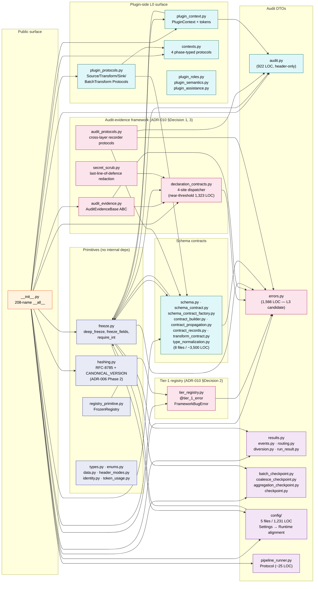
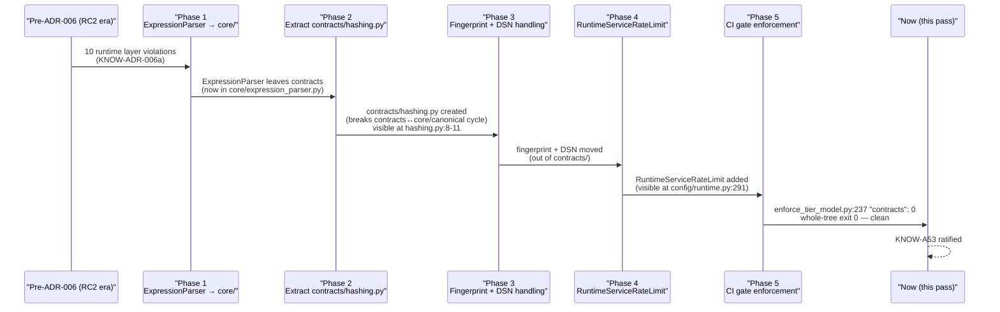
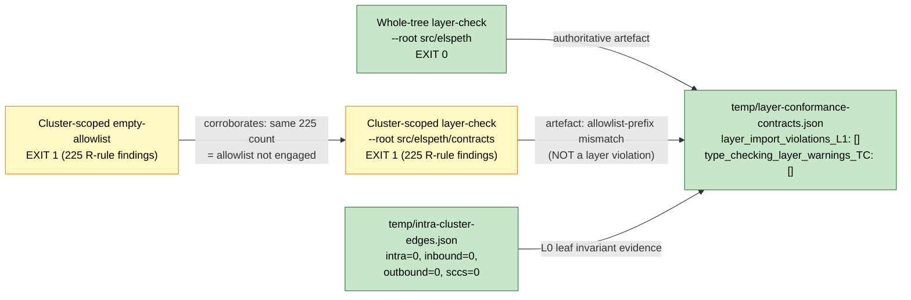

# L2 #5 — `contracts/` cluster diagrams

These diagrams are **cluster-internal only**. Cross-cluster relationships are summarised at the boundary level (one node per neighbouring cluster, not per neighbouring file). The 4-layer model from CLAUDE.md is preserved without modification.

## 1. C4 Container — `contracts/` cluster boundary

The cluster sits at L0 with **inbound edges from every L1+ subsystem and zero outbound edges**. The diagram is intentionally fan-shaped: a single sink node (contracts) with many feeders.

```mermaid
flowchart TB
    classDef l0 fill:#e8f5e9,stroke:#2e7d32,color:#000
    classDef l1 fill:#fff8e1,stroke:#f57c00,color:#000
    classDef l2 fill:#e3f2fd,stroke:#1976d2,color:#000
    classDef l3 fill:#fce4ec,stroke:#c2185b,color:#000
    classDef typecheck stroke-dasharray: 5 5

    subgraph L0["L0 — leaf (this cluster)"]
        contracts["contracts/<br/>63 files / 17,403 LOC<br/>208 re-exported names<br/>0 outbound deps"]:::l0
    end

    subgraph L1["L1 — core/"]
        core["core/<br/>config, landscape,<br/>canonical, expression_parser"]:::l1
    end

    subgraph L2["L2 — engine/"]
        engine["engine/<br/>orchestrator, executors,<br/>processor, dispatcher"]:::l2
    end

    subgraph L3["L3 — application surfaces"]
        plugins["plugins/<br/>infrastructure, sources,<br/>transforms, sinks"]:::l3
        web["web/ + composer_mcp/"]:::l3
        mcp["mcp/"]:::l3
        cli_etc["cli, tui, telemetry,<br/>testing"]:::l3
    end

    core -- runtime imports --> contracts
    engine -- runtime imports --> contracts
    plugins -- runtime imports --> contracts
    web -- runtime imports --> contracts
    mcp -- runtime imports --> contracts
    cli_etc -- runtime imports --> contracts

    contracts -. TYPE_CHECKING only<br/>plugin_context.py:31<br/>config/runtime.py:30-37 .-> core

    note["L0 leaf invariant<br/>contracts/ → {core,engine,L3} = ∅<br/>at runtime<br/>Verified: enforce_tier_model.py exit 0"]
    note --- contracts
```

**Reading notes:**

- All solid arrows are *runtime imports into contracts*. There are no outbound runtime arrows from contracts.
- The single dotted arrow (TYPE_CHECKING) exits contracts towards core for two annotation-only sites: `plugin_context.py:31` (`RateLimitRegistry`) and `config/runtime.py:30-37` (the five Settings classes from `core.config`). The dotted style mirrors the convention in `00b-existing-knowledge-map.md` and the L1 diagram.
- The L1 oracle (`temp/l3-import-graph.json`) builds an L3↔L3 graph and therefore shows zero `contracts/` participation by design; the L0 leaf invariant is asserted *outside* that graph (via the layer-check oracle) and is the authoritative artefact for this diagram.

## 2. C4 Component — `contracts/` internal grouping

Internal grouping mirrors the catalog's 14-entry partition. **No edge in this diagram is an upward outbound** — every edge stays within L0.



**Reading notes:**

- **The `__init__.py` hub fans out to every module** because it is the re-export contract; this is not an architectural concern (the hub doesn't *do* anything beyond importing).
- **Three internal cycles exist by design and are explicitly broken by extraction**:
  1. `errors.py ↔ tier_registry.py` — broken by defining `FrameworkBugError` in `tier_registry.py` and re-exporting from `errors.py` after `@tier_1_error` decoration. (`errors.py:21-27`).
  2. `errors.py ↔ declaration_contracts.py` — broken by `errors.py` importing only the `DeclarationContractViolation` type at the module top (which `declaration_contracts.py` provides early); the dispatcher itself doesn't need to back-reference `errors.py` runtime types.
  3. `core.canonical.py ↔ contracts.hashing.py` — broken by extracting `contracts.hashing.py` per ADR-006 Phase 2; `core.canonical.py` imports from `contracts.hashing.py` (one-way), not the reverse.
- **No edge in this diagram is upward**. The diagram is acyclic at the L0 boundary by construction; the three "explicit-cycle-breaking-by-extraction" comments above are about *intra-cluster* circularity, not layer violations.
- **No SCC participation.** `[ORACLE: temp/intra-cluster-edges.json stats.sccs_touching_cluster = 0]`. The component graph above is acyclic with the cycle-breaking extractions in place.

## 3. ADR-006 Phase trace — relocations visible in `contracts/`

Per [CITES KNOW-ADR-006b], ADR-006 had five phases. The contracts cluster shows the artefacts of three of them:



**Reading notes:**

- Phases 1 and 3 produce artefacts *outside* contracts (their effect is reduction of contracts/'s outbound edges to zero). Phase 2 produces a visible artefact *inside* contracts (`hashing.py` itself). Phase 4 produces a visible new dataclass *inside* contracts (`RuntimeServiceRateLimit`). Phase 5 produces the CI gate.
- The "Violation #11 Protocol" (KNOW-ADR-006d: "move down → extract primitive → restructure caller → never lazy-import") is the resolution heuristic for any future tension between contracts and core. The single TYPE_CHECKING smell in this cluster (`plugin_context.py:31`, see Catalog Entry 9) is a candidate test of whether Protocol #11 will need re-application.

## 4. Layer-conformance corroboration



**Reading notes:**

- **Whole-tree exit 0 is the authoritative artefact.** The cluster-scoped exit 1 is an allowlist-prefix-mismatch artefact identified and corroborated by the engine cluster pass (validator V6).
- **Empty-allowlist run produces the same count** — proof that the allowlist isn't engaged at cluster-scope, so the 225 findings are not cluster-specific debt.
- **The filtered oracle is empty by design** — contracts/ is L0; the L3 graph doesn't contain L0 nodes. The empty result is the architectural evidence the L0 leaf invariant holds at the L3 boundary.

## What's intentionally NOT in these diagrams

- **Per-class internals** of `audit.py`, `declaration_contracts.py`, `errors.py`, `schema_contract.py` — these are L3 deep-dive territory.
- **Cross-cluster runtime arrows from L1+ into specific contracts modules** — at the C4 Component level this would multiply edges by ~10 with no analytical gain.
- **The 33 `freeze_fields(self, ...)` invocation sites** — flagged in catalog Entry 3 by census; per-site visualisation would not add architectural information.
- **An L1 dependency-arrow into the SCC list** — there are no contracts/ nodes in the SCC list (`[ORACLE: temp/intra-cluster-edges.json stats.sccs_touching_cluster = 0]`).
