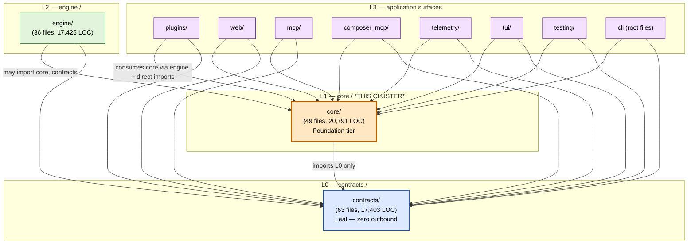

# 03 — core/ cluster diagrams (C4 Container + Component, scoped to core/)

Per Δ L2 scope, these diagrams cover **only** the `core/` cluster. The Container view positions `core/` against its layer-permitted neighbours; the Component view decomposes `core/` into the 9 sub-subsystems from `02-cluster-catalog.md`. Diagrams use **Mermaid** for renderability.

## C4 Level 2 — Container view (core/'s position in the layer model)

This view reproduces, at cluster-pass scope, the layer-model relationships for `core/`. **Authoritative source:** `scripts/cicd/enforce_tier_model.py:237–248` (`LAYER_HIERARCHY` + `LAYER_NAMES`). Edge directions = import direction (caller → callee). Per CLAUDE.md "Imports must flow downward only".



**Key facts captured by this view:**

- `core/` is **L1**; it imports **only** from `contracts/` (L0). Verified by `enforce_tier_model.py check --root src/elspeth/core` → 0 L1 violations, 0 TC warnings (see `temp/layer-check-core.txt` and the empty-allowlist sibling).
- Every L2+ surface depends on `core/` (per the layer model + `KNOW-A53`/`KNOW-A54`/`KNOW-C47`). Inbound concentration is heaviest from `engine/` (every executor + the orchestrator), `plugins/` (every plugin that emits hashed payloads or uses rate limits), and `web/` (the composer + execution surfaces).
- `core/` is **NOT** present in the L3↔L3 oracle (`temp/l3-import-graph.json`), as the oracle is L3-only by design. The empty `temp/intra-cluster-edges.json` is the audit evidence.
- The diagram intentionally elides L3↔L3 edges (those belong to the per-L3-cluster diagrams). Only `→ core/` and `→ contracts/` edges from L3 are drawn here, and only at the subsystem-name level (no sub-package boxes).

---

## C4 Level 3 — Component view (core/'s 9 sub-subsystems)

This view shows the 9 catalog entries from `02-cluster-catalog.md` with their **observed inter-sub-subsystem couplings**. Per Δ L2-2, the L3 oracle gives no edges here (oracle is L3-only); the couplings shown are derived from per-file imports observed during catalog reading, not from a graph oracle. Edge labels indicate the imported symbol class.

```mermaid
flowchart LR
    classDef ssa fill:#fff8e0,stroke:#b85c00,stroke-width:2px,color:#000
    classDef ssb fill:#fff,stroke:#666,stroke-width:1px,color:#000
    classDef flag fill:#ffd6d6,stroke:#a01f1f,stroke-width:2px,color:#000
    classDef external fill:#dde9ff,stroke:#1f4e9c,stroke-width:1px,color:#000

    subgraph CORE["core/ (L1, 49 files, 20,791 LOC)"]

        subgraph SUBP[Sub-packages]
            landscape["landscape/<br/>(18f, 9,384 LOC)<br/>Audit backbone, 4 repos"]
            dag["dag/<br/>(5f, 3,549 LOC)<br/>Graph + validation"]
            checkpoint["checkpoint/<br/>(5f, 1,237 LOC)<br/>Resume state"]
            rate_limit["rate_limit/<br/>(3f, 470 LOC)<br/>pyrate-limiter wrap"]
            retention["retention/<br/>(2f, 445 LOC)<br/>Purge w/ Tier-1 guards"]
            security["security/<br/>(4f, 940 LOC)<br/>SSRF + secret loaders"]
        end

        subgraph STAND[Standalone modules]
            config_family["configuration_family<br/>config.py (2,227 LOC, FLAG)<br/>+ dependency_config + secrets"]
            canonical_grp["canonicalisation_and_templating<br/>canonical + templates + expression_parser"]
            primitives["cross_cutting_primitives<br/>events + identifiers + logging<br/>+ operations + payload_store + __init__"]
        end
    end

    subgraph EXT[L0 contracts/ — only outbound surface]
        contracts_security["contracts.security<br/>(secret_fingerprint)"]
        contracts_freeze["contracts.freeze<br/>(deep_freeze, freeze_fields)"]
        contracts_hashing["contracts.hashing<br/>(CANONICAL_VERSION)"]
        contracts_schema["contracts.schema*<br/>(SchemaConfig, FieldDefinition,<br/>PipelineRow, SchemaContract)"]
        contracts_dto["contracts (DTOs)<br/>(Run, Token, Checkpoint,<br/>RoutingEvent, ResumeCheck, ...)"]
        contracts_errors["contracts.errors<br/>(AuditIntegrityError,<br/>TIER_1_ERRORS)"]
    end

    landscape -->|imports schema, models| contracts_dto
    landscape --> contracts_errors

    dag -->|FieldDefinition,SchemaConfig| contracts_schema
    dag -->|NODE_ID_COLUMN_LENGTH| landscape
    dag -->|NodeType, freeze_fields| contracts_freeze

    checkpoint -->|Checkpoint, ResumeCheck DTOs| contracts_dto
    checkpoint -->|AuditIntegrityError| contracts_errors
    checkpoint -->|compute_full_topology_hash, stable_hash| canonical_grp
    checkpoint -->|LandscapeDB, schema tables| landscape
    checkpoint -->|ExecutionGraph| dag

    rate_limit -->|RuntimeRateLimitProtocol| contracts_dto

    retention -->|RunStatus, AuditIntegrityError, TIER_1_ERRORS, PayloadStore| contracts_dto
    retention -->|update_grade_after_purge, schema tables| landscape

    security -->|secret_fingerprint, get_fingerprint_key| contracts_security

    config_family -->|deep_freeze, deep_thaw, freeze_fields| contracts_freeze
    config_family -->|SecretResolutionInput, secrets DTOs| contracts_dto
    config_family -.->|lazy import:<br/>ExpressionParser at config-time| canonical_grp

    canonical_grp -->|CANONICAL_VERSION| contracts_hashing
    canonical_grp -->|PipelineRow, SchemaContract| contracts_schema
    canonical_grp -.->|TYPE_CHECKING:<br/>ExecutionGraph| dag

    primitives -->|Operation, BatchPendingError, TIER_1_ERRORS, plugin_context, payload_store| contracts_dto
    primitives -.->|TYPE_CHECKING:<br/>ExecutionRepository| landscape
    primitives -->|public surface re-exports<br/>(__init__.py)| canonical_grp
    primitives -->|public surface re-exports| checkpoint
    primitives -->|public surface re-exports| config_family
    primitives -->|public surface re-exports| dag
    primitives -->|public surface re-exports| security

    class landscape ssa
    class dag,checkpoint,rate_limit,retention,security ssa
    class canonical_grp,primitives ssa
    class config_family flag

    class contracts_security,contracts_freeze,contracts_hashing,contracts_schema,contracts_dto,contracts_errors external
```

**Diagram conventions:**

- **Solid arrow:** runtime import (the symbol named on the label is imported at module-import time).
- **Dotted arrow:** `TYPE_CHECKING`-only or lazy-runtime import (annotation-only or deferred until first call).
- **Red border (config_family):** harbours an L3 deep-dive candidate (`config.py` 2,227 LOC).
- **External (light blue, right side):** the `contracts/` outbound surfaces grouped by `contracts/` sub-module — concrete identifiers cited in `02-cluster-catalog.md` per entry's `[CITES]` line.

**Topology observations:**

- **landscape/ is a hub:** 3 of the other sub-subsystems (`dag/`, `checkpoint/`, `retention/`, `primitives/operations.py`) reach into landscape — `dag/models.py` for the single `NODE_ID_COLUMN_LENGTH` constant, `checkpoint/manager.py` for `LandscapeDB` and the `checkpoints_table`/`tokens_table`, `retention/purge.py` for the schema tables and `update_grade_after_purge`, `operations.py` (cross_cutting_primitives) for the `ExecutionRepository` (TYPE_CHECKING only).
- **canonical/checkpoint/dag triangle:** `checkpoint/` imports both `canonical/` (for `compute_full_topology_hash` and `stable_hash`) and `dag/` (for `ExecutionGraph`); `canonical/compute_full_topology_hash` itself accepts an `ExecutionGraph` as a TYPE_CHECKING parameter. This triangle is the locus of the "one_run_id = one configuration" invariant — checkpoints depend on hashing depending on graph structure.
- **No back-edges from landscape:** `landscape/` does not import from `dag/`, `checkpoint/`, `retention/`, `rate_limit/`, `security/`, `config_family`, `canonical_grp`, or `primitives/`. It is the cluster's **sink** — everything else may depend on it; it depends only on `contracts/`.
- **`primitives/__init__.py` is the cluster's public re-export point** (separate from each sub-package's own `__init__.py`). It does not re-export from `landscape/` — callers reach landscape via `elspeth.core.landscape.*` directly per the encapsulation discipline noted in entry 1.
- **`config_family` has the only lazy-runtime intra-cluster edge** (`dependency_config.py:63` imports `ExpressionParser` lazily). All other intra-cluster runtime edges are unconditional at module-import time.

**Out of scope for this view:**

- Component-level decomposition of `landscape/` itself (18 files, 4 repositories) — that's L3 deep-dive territory.
- Component-level decomposition of `dag/graph.py` and `dag/builder.py` internals — L3 deep-dive territory; `graph.py` is flagged.
- Component-level decomposition of `config.py` — L3 deep-dive territory; flagged.
- L3↔L3 edges visible in the L3 oracle. Those belong to the per-L3-cluster diagrams.
- Per-class or per-function relationships. Per Δ L2-3, this view stops at the sub-subsystem level.
