# 03 — engine/ cluster diagrams (L2)

Two views, both at L2 depth (one level deeper than the L1 Container view in `03-l1-context-diagram.md`):

1. **Container-into-engine** — the 15 sub-subsystems within `engine/`, grouped by role, with internal coupling drawn from catalog citations (file:line evidence) only.
2. **Component view of the ADR-010 dispatch surface** — the four dispatch sites and their adopters, since this is the highest-density architectural commitment in the cluster.

Edge truth-source: the catalog (`02-cluster-catalog.md`) — every internal-coupling edge in these diagrams traces back to a citation in a catalog entry's "Internal coupling" or "Patterns observed" field. **Cross-cluster edges to `core/` and `contracts/` are shown as boundary nodes only**; they are not enumerated past the layer boundary because that's the consuming-cluster's job (per Δ L2-4).

## 1. Container-into-engine (sub-subsystem decomposition)

```mermaid
flowchart TB
    subgraph PUBLIC["Public-API surface"]
        init["<b>engine/__init__.py</b><br/>91 LOC<br/>25-name __all__"]
    end

    subgraph LIFECYCLE["Run lifecycle (orchestrator/, 5,173 LOC)"]
        orchestrator["<b>orchestrator/</b><br/>7 files / 5,173 LOC<br/><i>core.py = 3,281 LOC<br/>L3 deep-dive flag</i><br/>4-site dispatch locus<br/>(ADR-010)"]
    end

    subgraph PERROW["Per-row processing"]
        processor["<b>processor.py</b><br/>2,700 LOC<br/><i>L3 deep-dive flag</i><br/>RowProcessor + ADR-009b<br/>cross-check (2nd site)"]
        dag_nav["<b>dag_navigator.py</b><br/>316 LOC<br/>Pure topology queries<br/>(extracted from RowProcessor)"]
    end

    subgraph EXECUTORS_GROUP["DECIDE mechanics (executors/, 5,550 LOC)"]
        executors["<b>executors/</b><br/>16 files / 5,550 LOC<br/>4 classical executors<br/>+ ADR-010 dispatcher<br/>+ 7 contract adopters<br/>+ NodeStateGuard"]
    end

    subgraph FORKJOIN["Fork/join"]
        coalesce["<b>coalesce_executor.py</b><br/>1,603 LOC<br/><i>L3 deep-dive flag</i><br/>4 policies × 3 strategies<br/>(essential complexity)"]
    end

    subgraph IDENTITY["Identity & retry"]
        tokens["<b>tokens.py</b><br/>399 LOC<br/>TokenManager façade<br/>over DataFlowRepository"]
        retry["<b>retry.py</b><br/>137 LOC<br/>RetryManager<br/>(tenacity)"]
        spans["<b>spans.py</b><br/>279 LOC<br/>SpanFactory<br/>(OpenTelemetry)"]
    end

    subgraph BATCH["Batch + triggers"]
        batch_adapter["<b>batch_adapter.py</b><br/>284 LOC<br/>SharedBatchAdapter<br/>(retry-safe waiter keying)"]
        triggers["<b>triggers.py</b><br/>324 LOC<br/>TriggerEvaluator<br/>(count/timeout/condition)"]
        clock["<b>clock.py</b><br/>121 LOC<br/>Clock protocol<br/>(DI for time-dependent code)"]
    end

    subgraph PREFLIGHT["Pre-flight"]
        bootstrap["<b>bootstrap.py</b><br/>138 LOC<br/>resolve_preflight()"]
        commencement["<b>commencement.py</b><br/>137 LOC<br/>commencement gates<br/>(operator expressions)"]
        depres["<b>dependency_resolver.py</b><br/>173 LOC<br/>depends_on cycle/depth<br/>+ Tier-3 YAML load"]
    end

    %% External boundary nodes (cross-cluster — shown for orientation only)
    contracts_ext[("contracts/<br/>(L0)")]:::ext
    core_ext[("core/<br/>(L1)")]:::ext

    %% Public API surface re-exports
    init -.->|re-exports| orchestrator
    init -.->|re-exports| processor
    init -.->|re-exports| executors
    init -.->|re-exports| coalesce
    init -.->|re-exports| tokens
    init -.->|re-exports| retry
    init -.->|re-exports| spans

    %% Run lifecycle owns dispatch
    orchestrator -->|drives| processor
    orchestrator -->|drives| executors
    orchestrator -->|drives| coalesce
    orchestrator -->|preflight| bootstrap
    bootstrap --> depres
    bootstrap --> commencement

    %% Per-row processing
    processor -->|topology queries| dag_nav
    processor -->|"_cross_check_flush_output<br/>(ADR-009b)"| executors
    processor -->|terminal state| tokens
    processor -->|retry loop| retry

    %% Identity persistence
    tokens -->|persistence| core_ext

    %% Batch + triggers
    executors -->|batch port| batch_adapter
    triggers --> clock
    coalesce -->|timeout policy| clock

    %% Expression eval
    triggers -->|expression| core_ext
    commencement -->|expression| core_ext
    depres -->|YAML + canonical| core_ext

    %% Cross-layer downward
    orchestrator --> contracts_ext
    orchestrator --> core_ext
    processor --> contracts_ext
    executors --> contracts_ext
    executors --> core_ext
    coalesce --> contracts_ext

    classDef ext fill:#e5e7eb,stroke:#374151,color:#0f172a
    classDef flag fill:#fef3c7,stroke:#92400e,color:#3b1d04
    class orchestrator,processor,coalesce flag
```



### Edge accounting

| Edge family | Catalog evidence | Count drawn |
|-------------|------------------|------------:|
| `__init__.py` re-exports | `engine/__init__.py:65–91` `__all__` (entry 15 catalog) | 7 (selected façade classes only — full set is 25 names) |
| Run-lifecycle drives | orchestrator/__init__.py:24-32 + entry 1 catalog | 4 (orchestrator → processor/executors/coalesce/bootstrap) |
| Per-row → DAG-nav | `processor.py:27` (entry 3 internal coupling) | 1 |
| ADR-009b cross-check (RowProcessor → pass_through) | `processor.py` 2nd-site claim, KNOW-ADR-009b | 1 (drawn as processor → executors) |
| Terminal state assignment | entry 11 + entry 5 (two-locus split: tokens.py + processor.py) | 1 (processor → tokens) |
| Retry loop | `retry.py:9-15` audit hook contract (entry 11) | 1 |
| Identity persistence (engine → core.landscape) | `tokens.py:19` `from core.landscape.data_flow_repository import DataFlowRepository` (entry 5) | 1 (drawn as tokens → core/) |
| Batch port | entry 8 SharedBatchAdapter docstring (`batch_adapter.py:6-19`) | 1 (executors → batch_adapter) |
| Clock DI | entry 6 (triggers→clock); entry 4 docstring (coalesce→clock) | 2 |
| Expression evaluator (engine → core.expression_parser) | `triggers.py:24`, `commencement.py:12`, `dependency_resolver.py:14` (entries 6/12/10) | 3 (all drawn as → core/) |
| Cross-layer downward edges (engine → contracts/, engine → core/) | layer model + per-entry external coupling | 6 (selected; full set is broader) |
| **Total drawn** | | **28** |

The diagram intentionally **omits** L3↔L3 edges (engine has none — it's L2) and the full set of external coupling edges to keep the view legible at L2 depth. Per-entry external coupling is enumerated in `02-cluster-catalog.md`.

### Visible architectural shape (annotations)

- **Three deep-dive flags cluster in the run-lifecycle/per-row spine**: `orchestrator/core.py` (3,281), `processor.py` (2,700), `coalesce_executor.py` (1,603). The diagram's three yellow-flagged nodes are the L2-deferred concentration that drove §7 Priority 1.
- **The orchestrator decomposition is visible at this scale** — the orchestrator's 7 files include `core.py` plus six focused helpers (`types.py`, `validation.py`, `export.py`, `aggregation.py`, `outcomes.py`, `__init__.py`); the diagram does not enumerate them past the sub-package boundary, but the catalog (entry 1) names each one and cites the `__init__.py:14-22` docstring as remediation evidence.
- **Identity is multi-locus by design.** The diagram shows `tokens.py` as the engine-side façade with persistence delegated to `core/landscape/`; the actual fork/join call sites live in `processor.py` and `orchestrator/core.py` (both deep-dive flagged). The TokenManager is the orchestration interface, not the sole owner.
- **Pre-flight is a small triplet (`bootstrap` + `commencement` + `dependency_resolver`)** with a single entry point (`bootstrap.resolve_preflight`) shared by CLI and programmatic callers (entry 13 docstring evidence). This is one of the cleanest seams in the cluster.

## 2. Component view — ADR-010 dispatch surface

The single highest-density architectural commitment in the cluster is the ADR-010 declaration-trust framework: 4 dispatch sites, 7 adopters, 1 dispatcher, 1 closed-set bootstrap manifest, 1 structural state guard.

```mermaid
flowchart LR
    subgraph CALLERS["Dispatch callers"]
        rp["<b>processor.py</b><br/>RowProcessor<br/>(per-row dispatch)"]
        oe["<b>executors/transform.py</b><br/>(post-emission dispatch)"]
        ag["<b>orchestrator/aggregation.py</b><br/>(batch-flush dispatch)"]
    end

    subgraph DISPATCHER["Single dispatcher"]
        dd["<b>declaration_dispatch.py</b><br/>4-site dispatcher<br/>+ audit-complete posture"]
        bootstrap_mod["<b>declaration_contract_bootstrap.py</b><br/>closed-set manifest<br/>(drift-resistant)"]
    end

    subgraph SITES["4 dispatch sites (ADR-010)"]
        s_pre["<b>pre_emission_check</b>"]
        s_post["<b>post_emission_check</b>"]
        s_batch["<b>batch_flush_check</b>"]
        s_bound["<b>boundary_check</b>"]
    end

    subgraph ADOPTERS["7 contract adopters"]
        pt["<b>pass_through.py</b><br/>(ADR-007/008)"]
        dof["<b>declared_output_fields.py</b><br/>(ADR-011)"]
        cdr["<b>can_drop_rows.py</b><br/>(ADR-012)"]
        drf["<b>declared_required_fields.py</b><br/>(ADR-013)"]
        scm["<b>schema_config_mode.py</b><br/>(ADR-014)"]
        sgf["<b>source_guaranteed_fields.py</b><br/>(ADR-016)"]
        srf["<b>sink_required_fields.py</b><br/>(ADR-017)"]
    end

    subgraph GUARD["Structural invariant"]
        sg["<b>state_guard.py</b><br/>NodeStateGuard<br/>(context-manager-as-invariant)"]
    end

    %% Callers → dispatcher
    rp -->|run_post_emission_checks<br/>+ run_pre_emission_checks| dd
    oe -->|run_post_emission_checks<br/>+ run_pre_emission_checks| dd
    ag -->|run_batch_flush_checks| dd

    %% Bootstrap manifest constrains dispatcher
    bootstrap_mod -. closed-set import surface .-> dd

    %% Dispatcher → sites
    dd --> s_pre
    dd --> s_post
    dd --> s_batch
    dd --> s_bound

    %% Sites → adopters (per catalog entry 2 mapping)
    s_pre --> drf
    s_post --> pt
    s_post --> dof
    s_post --> cdr
    s_post --> scm
    s_batch --> pt
    s_batch --> dof
    s_batch --> cdr
    s_batch --> scm
    s_bound --> sgf
    s_bound --> srf

    %% Pass-through is the ADR-009b cross-check site
    rp -. ADR-009b cross-check<br/>2nd site .-> pt

    %% State guard wraps node execution
    sg -. structural invariant<br/>"every row reaches<br/>exactly one terminal state" .-> rp

    classDef caller fill:#dbeafe,stroke:#1e40af,color:#0c1f4d
    classDef dispatcher fill:#fde68a,stroke:#92400e,color:#3b1d04,stroke-width:2px
    classDef site fill:#dcfce7,stroke:#166534,color:#0c1f12
    classDef adopter fill:#ede9fe,stroke:#6d28d9,color:#1e0e3e
    classDef guard fill:#fee2e2,stroke:#991b1b,color:#3b0a0a

    class rp,oe,ag caller
    class dd,bootstrap_mod dispatcher
    class s_pre,s_post,s_batch,s_bound site
    class pt,dof,cdr,drf,scm,sgf,srf adopter
    class sg guard
```

### ADR-010 dispatch evidence (catalog citations)

| Element | File | Catalog citation |
|---------|------|------------------|
| Single dispatcher | `executors/declaration_dispatch.py` | Entry 2 (`declaration_dispatch.py:1-26` docstring; `:137,142` R6 silent-except in tension with audit-complete claim — flagged test-debt #3) |
| Closed-set manifest | `executors/declaration_contract_bootstrap.py` | Entry 2 (`:1-11`); drift-resistant test at `tests/unit/engine/test_declaration_contract_bootstrap_drift.py` |
| `pre_emission_check` site | adopter: `declared_required_fields.py` | Entry 2 (`declared_required_fields.py:3-5`); ADR-013 |
| `post_emission_check` + `batch_flush_check` sites | adopters: `pass_through.py`, `declared_output_fields.py`, `can_drop_rows.py`, `schema_config_mode.py` | Entry 2 (each `:3-6` registration); ADR-007/008/011/012/014 |
| `boundary_check` site | adopters: `source_guaranteed_fields.py`, `sink_required_fields.py` | Entry 2 (each `:3-5`); ADR-016/017 |
| ADR-009b cross-check (2nd site for pass_through) | RowProcessor → `pass_through.py` | Entry 3 (`processor.py` `_cross_check_flush_output`); KNOW-ADR-009b |
| Structural state guard | `executors/state_guard.py` | Entry 2 + closing §answer-3 (NodeStateGuard context-manager-as-invariant) |

### Open architectural question (deferred to L3 / synthesis)

The dispatcher's `declaration_dispatch.py:137,142` R6 silent-except findings are in tension with the file's own `:23-26` audit-complete claim. The intent appears to be aggregation (collecting violations across all adopters before raising) rather than swallowing, but verifying that **every** violation actually reaches the audit trail requires (a) reading the dispatcher body (deep-dive flag region) and (b) confirming via `tests/unit/engine/test_declaration_dispatch.py` that both `DeclarationContractViolation` and `PluginContractViolation` raised from registered contracts arrive in the dispatcher's aggregation list. This is the headline test-debt-#3 candidate.

## Confidence

| Aspect | Confidence | Reason |
|--------|------------|--------|
| Sub-subsystem node set (Container view) | High | All 15 nodes correspond to verified directory/file inventory; sub-package internals deliberately not enumerated |
| Internal-coupling edges in Container view | High | Every drawn edge has a catalog file:line citation |
| ADR-010 site/adopter mapping | High | Each adopter's registration line cited (`:3-6`); dispatcher inline docstring cited; bootstrap manifest cited |
| `state_guard.py` structural-invariant claim | Medium | Catalog cites the existence and the audit-evidence-discriminator test, but the "every row → exactly one terminal state" enforcement story would be sharpened by an L3 deep-dive into NodeStateGuard's contract |
| Cross-cluster external edges | Boundary-nodes-only (intentional) | engine → core/contracts edges enumerated in catalog at sub-subsystem granularity; this diagram shows them as a single boundary node by design (Δ L2-4) |
