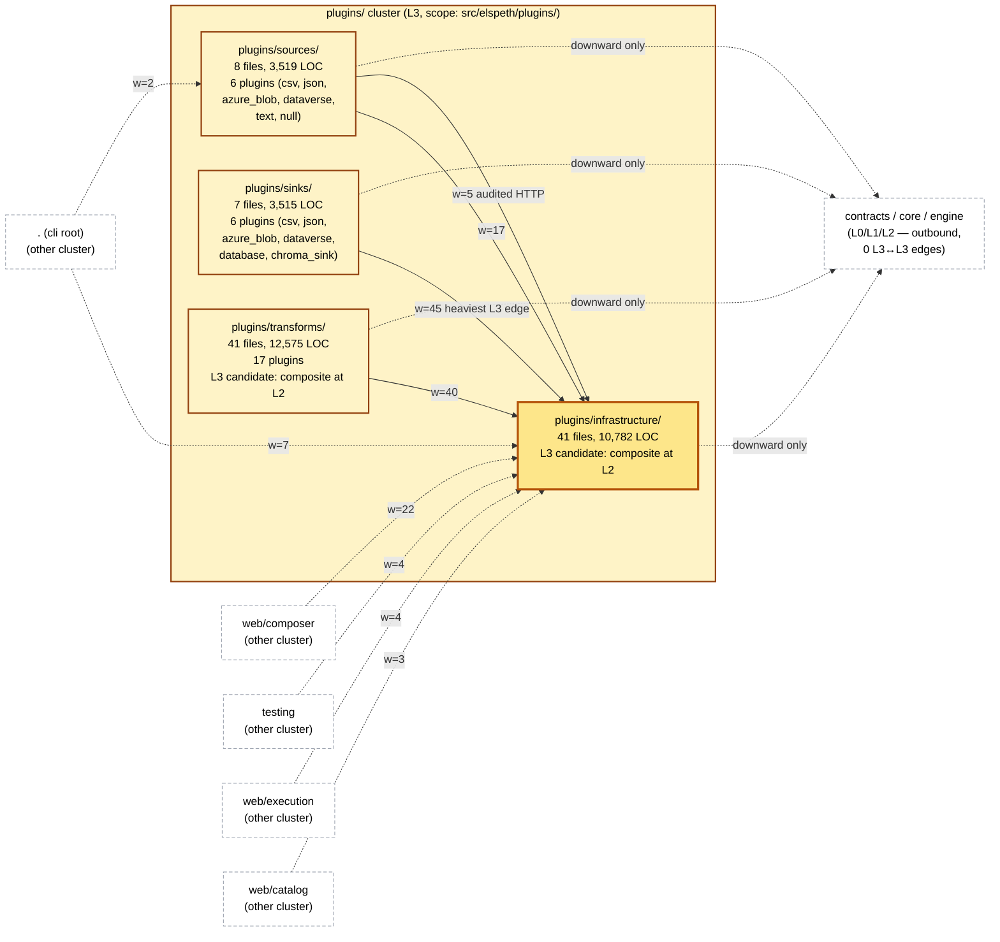
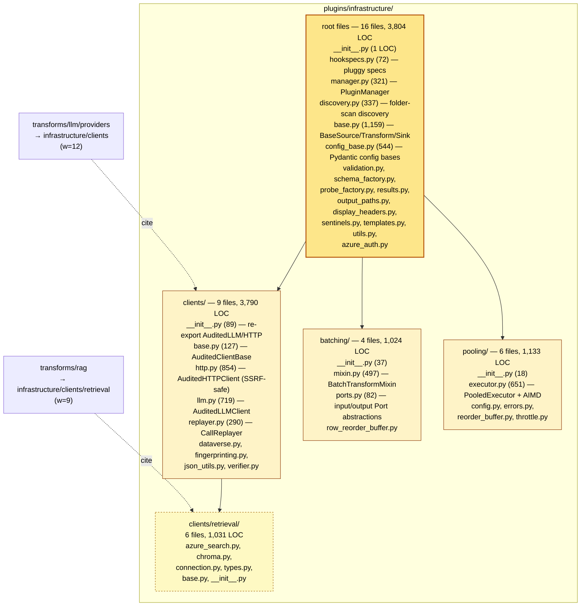
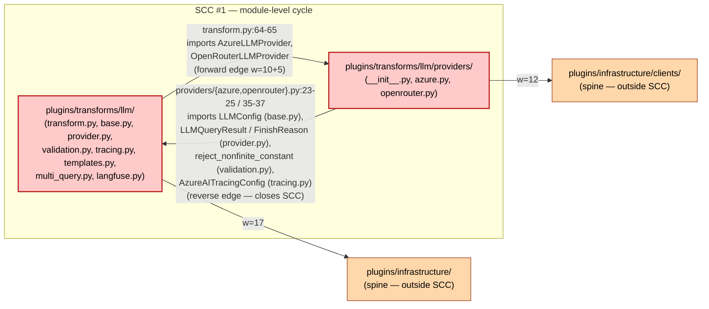
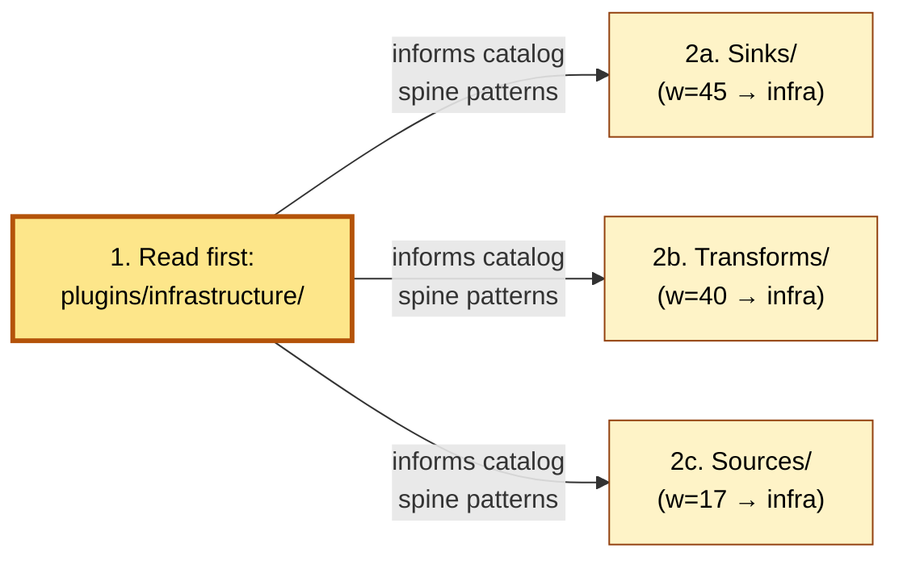

# L2 #4 — `plugins/` cluster diagrams

These diagrams describe **only** the plugins/ cluster's internal structure and its directly-cited cross-cluster boundary. Per Δ L2-4, no claims are made about other clusters' internals.

---

## §1. C4 Container view — plugins/ cluster

Edge weights cite `temp/intra-cluster-edges.json`. Inbound cross-cluster edges cite the L3 oracle.

**Key observations from this view:**

- All three client sub-packages (sources, sinks, transforms) terminate on `infrastructure/`. The F3 reading-order rule is structural, not preferential: edge weights 45 / 40 / 17 confirm `infrastructure/` is the only common dependency.
- Inbound L3↔L3 traffic to plugins/ all targets `infrastructure/` (or sources/ in the cli case). No external cluster reaches into transforms/ or sinks/ at L3↔L3 granularity.
- Outbound L3↔L3 from plugins/ is **zero**. plugins/ is a sink in the L3 graph; downward dependencies (contracts/core/engine) are out-of-graph.

---

## §2. Component view — `plugins/infrastructure/`

The spine, expanded one level. Per Δ L2-3 this is **flag-and-stop** depth — the diagram reproduces the sub-package layout but does not enumerate per-class component coupling (that requires opening file bodies past the L2 depth cap).

**Key observations:**

- Three structural sub-packages (`clients/`, `batching/`, `pooling/`) plus a nested `clients/retrieval/`. Each has a clear single-responsibility framing visible in its `__init__.py` docstring.
- `clients/retrieval/` is the **only** nested sub-sub-package in the cluster; it exists because retrieval clients (Azure Cognitive Search, Chroma) share enough surface to factor into a sub-package, distinct from the LLM and HTTP clients above it.
- Root-level files are heterogeneous (16 files spanning hookspecs, manager, discovery, base classes, config, validation, factories, sentinels, utilities). `base.py` (1,159 LOC) is the largest single file — under the 1,500 L3-deep-dive threshold but a candidate for the architecture-pack pass to consider splitting.

---

## §3. SCC #1 callout — `transforms/llm` ↔ `transforms/llm/providers`

Per Δ L2-7, surfacing the cycle structure without prescribing decomposition.

**Key observations from this view:**

- The cycle is **module-level** (import-time), not class-level. Neither side reaches into the other's class hierarchy via attribute access at runtime.
- `transforms/llm/transform.py` documents that "Provider instantiation is deferred to `on_start()`" — runtime coupling is decoupled from import-time coupling.
- Outbound edges from both SCC nodes terminate on the `infrastructure/` spine (consistent with F3); the cycle does not pull in any other cluster.

**Cycle composition (file:line citations):**

| Direction | Site | Imported names |
|---|---|---|
| `llm` → `llm/providers` | `transforms/llm/transform.py:64` | `AzureLLMProvider`, `AzureOpenAIConfig`, `_configure_azure_monitor` |
| `llm` → `llm/providers` | `transforms/llm/transform.py:65` | `OpenRouterConfig`, `OpenRouterLLMProvider` |
| `llm/providers` → `llm` | `transforms/llm/providers/azure.py:23` | `LLMConfig` |
| `llm/providers` → `llm` | `transforms/llm/providers/azure.py:24` | `FinishReason`, `LLMQueryResult`, `parse_finish_reason` |
| `llm/providers` → `llm` | `transforms/llm/providers/azure.py:25` | `AzureAITracingConfig`, `TracingConfig` |
| `llm/providers` → `llm` | `transforms/llm/providers/openrouter.py:35` | `LLMConfig` |
| `llm/providers` → `llm` | `transforms/llm/providers/openrouter.py:36` | `LLMQueryResult`, `parse_finish_reason` |
| `llm/providers` → `llm` | `transforms/llm/providers/openrouter.py:37` | `reject_nonfinite_constant` |

---

## §4. Reading-order graph (F3 confirmation)

A simple dependency-flow diagram showing F3's structural justification at a glance.

This pass executed in this order; the catalog reflects the order; client-side entries cite spine patterns without re-deriving them.
