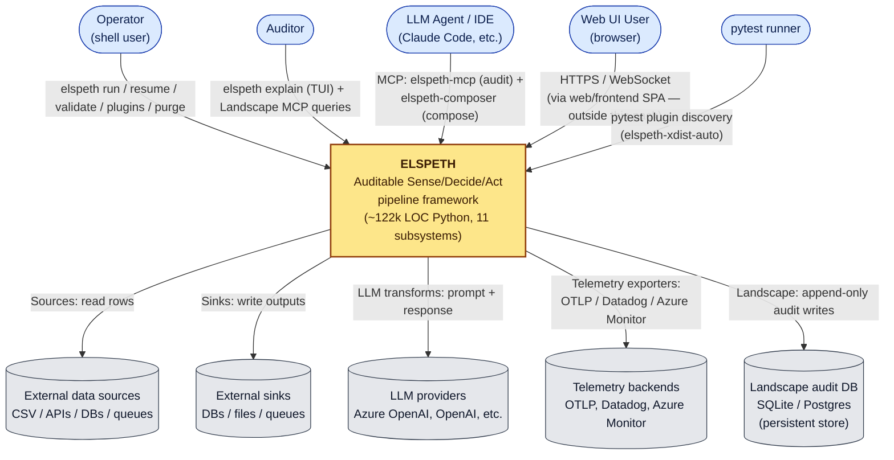

# System Context

A C4 Level-1 view of ELSPETH as a black box, showing the actors who
interact with it and the external systems it integrates with.

---

## ELSPETH in one sentence

ELSPETH is a domain-agnostic framework for **auditable Sense / Decide /
Act (SDA) pipelines**: data flows from one source through ordered
transforms (which may include gates and aggregations) to one or more
named sinks, with every operation recorded in an audit database that
can be queried row-by-row to prove complete lineage.

---

## Actors

| Actor | Interaction |
|-------|-------------|
| **Operator** (shell user) | Runs pipelines: `elspeth run`, `elspeth resume`, `elspeth validate`, `elspeth plugins list`, `elspeth purge`. |
| **Auditor** | Investigates outputs: `elspeth explain --run <run_id> --row <row_id>` (TUI), plus Landscape-MCP queries. |
| **LLM Agent / IDE** (Claude Code, etc.) | Connects via two MCP transports: `elspeth-mcp` (read-only audit analysis) and `elspeth-composer` (interactive pipeline construction). |
| **Web UI User** (browser) | Connects via HTTPS / WebSocket to the FastAPI backend; interacts with the SPA composer (the SPA itself is outside this pack — see [`08-known-gaps.md`](08-known-gaps.md) §1). |
| **pytest runner** | Discovers `elspeth-xdist-auto` as a pytest plugin via entry-point registration. |

---

## External systems

| System | Direction | Purpose |
|--------|-----------|---------|
| External data sources (CSV, APIs, databases, message queues) | Inbound (read) | Source plugins ingest rows. |
| External sinks (databases, files, queues) | Outbound (write) | Sink plugins emit results. |
| LLM providers (Azure OpenAI, OpenAI, others via LiteLLM) | Bidirectional (request/response) | LLM transforms call providers per row or per batch. |
| Telemetry backends (OTLP, Datadog, Azure Monitor) | Outbound | Telemetry exporters emit operational signals after Landscape recording (audit primacy). |
| Landscape audit DB (SQLite or Postgres) | Outbound (append-only writes) | The legal record. Persistent; outlives any single ELSPETH process. Configurable backend. |

The Landscape audit DB is shown as an external store because its
physical location is configurable and its lifecycle outlives any single
ELSPETH process. The **code** that owns it lives in `core/landscape/`
(see [`03-container-view.md`](03-container-view.md)).

---

## Diagram

---

## Two MCP surfaces — and why they are not siblings

LLM agents see two distinct MCP surfaces:

- **`elspeth-mcp`** — read-only, post-hoc audit analyser (`mcp/`,
  9 files, 4,114 LOC). Tools include `diagnose()`,
  `get_failure_context(run_id)`, `explain_token(run_id, token_id)`.
- **`elspeth-composer`** — interactive, stateful pipeline construction
  (`composer_mcp/`, 3 files, 824 LOC). Tools include `set_source`,
  `upsert_node`, `upsert_edge`, `set_output`, `generate_yaml`.

They share the MCP transport but **nothing else**. Separate console
scripts, separate runtime concerns (read-only vs stateful), separate
dependency surfaces (Landscape DB vs. composer state machine). The
prior architecture analysis flagged that despite their adjacent names,
`composer_mcp/` is structurally a sibling of `web/composer/`, not of
`mcp/` — see [`06-quality-assessment.md`](06-quality-assessment.md)
finding W4.

---

## Console-script entry points

Verified from `pyproject.toml` `[project.scripts]` and
`[project.entry-points.pytest11]`:

| Script | Module | Purpose |
|--------|--------|---------|
| `elspeth` | `elspeth.cli:app` | Primary CLI (Typer) |
| `elspeth-mcp` | `elspeth.mcp:main` | Read-only Landscape MCP server |
| `elspeth-composer` | `elspeth.composer_mcp:main` | Interactive composer MCP server |
| `elspeth-xdist-auto` | `elspeth.testing.pytest_xdist_auto` | pytest plugin (via entry-points) |
| `check-contracts` | `scripts.check_contracts:main` | Contracts verification (lives under `scripts/`, not `src/`) |

The web server has no `[project.scripts]` entry — it is launched via
`uvicorn` against the FastAPI app factory at `elspeth.web.app:create_app`.
The web extra (`pip install elspeth[webui]`) gates its dependencies.
