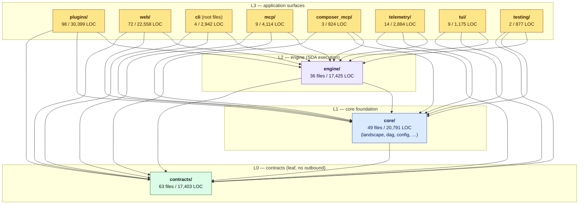
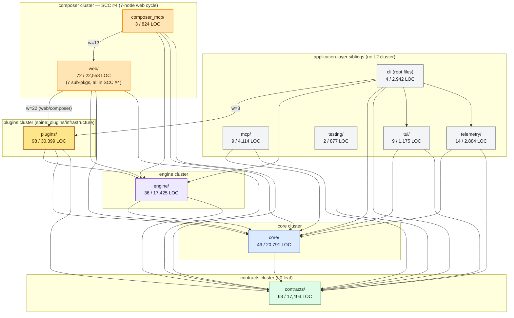

# Container View

A C4 Level-2 view of ELSPETH's 11 top-level subsystems, grouped by
layer, with the cross-layer dependency edges drawn explicitly.

The container view exists to answer two questions:

- **What are the top-level moving parts?**
- **Which moving parts depend on which others?**

For the deeper structural dive (the 7-node web SCC, the plugin spine,
the audit-trail backbone), see [`04-component-view.md`](04-component-view.md).
For per-subsystem detail, see [`subsystems/`](subsystems/).

---

## §1 The 11 subsystems at a glance

Sorted by LOC. Composite subsystems (≥4 sub-pkgs OR ≥10k LOC OR ≥20
files) are five; the rest are leaves.

| # | Subsystem | Layer | Files | LOC | Composite? |
|---|-----------|:----:|:----:|----:|:----------:|
| 1 | `plugins/` | L3 | 98 | 30,399 | ✅ |
| 2 | `web/` (Python only; `frontend/` excluded) | L3 | 72 | 22,558 | ✅ |
| 3 | `core/` | L1 | 49 | 20,791 | ✅ |
| 4 | `engine/` | L2 | 36 | 17,425 | ✅ |
| 5 | `contracts/` | L0 | 63 | 17,403 | ✅ |
| 6 | `mcp/` | L3 | 9 | 4,114 | leaf |
| 7 | `cli` (root files: `cli.py`, `cli_helpers.py`, `cli_formatters.py`, `__init__.py`) | L3 | 4 | 2,942 | leaf |
| 8 | `telemetry/` | L3 | 14 | 2,884 | leaf |
| 9 | `tui/` | L3 | 9 | 1,175 | leaf |
| 10 | `testing/` (the in-tree pytest plugin, not the `tests/` directory) | L3 | 2 | 877 | leaf |
| 11 | `composer_mcp/` | L3 | 3 | 824 | leaf |

The five composite subsystems hold ~89% of production Python LOC; the
six leaves account for the remaining ~11%.

---

## §2 L1 container view (subsystems by layer, with cross-layer edges)

This is the canonical view. Layer boundaries are the most important
structural constraint in the codebase, so they get the diagram. L3↔L3
edges are drawn at component depth, not here, because they would clutter
the picture without adding architectural insight at this level — see
[`04-component-view.md`](04-component-view.md).

### Edge accounting

| Edge family | Source of truth | Count |
|-------------|-----------------|------:|
| L1 → L0 | `enforce_tier_model.py:238` (`core` layer = 1, allows targets ≤ 0) | 1 |
| L2 → L1, L2 → L0 | `enforce_tier_model.py:239` (`engine` layer = 2, allows targets ≤ 1) | 2 |
| L3 → {L0, L1, L2} | `enforce_tier_model.py:241–242` (everything else implicitly L3) | 8 × 3 = 24 |
| **Cross-layer total** | | **27** |
| L3 ↔ L3 | Layer-permitted, unconstrained | drawn in [`04-component-view.md`](04-component-view.md) |

---

## §3 Cross-cluster view (with the load-bearing handshakes)

A second view that groups the 11 subsystems by **L2 cluster** rather
than by layer. This view shows the load-bearing cross-cluster edges
that the per-cluster analyses surfaced — most notably the
`web/composer → plugins/infrastructure` edge (weight 22) and the
`composer_mcp → web/composer` edge (weight 13).

**Reading guide.**

- The composer cluster is highlighted (orange) because its `web/*`
  sub-packages form **SCC #4**, the largest strongly-connected
  component in the codebase. The cluster cannot be acyclically
  decomposed without architectural work — see
  [`04-component-view.md`](04-component-view.md) for the cycle and
  [`07-improvement-roadmap.md#r2`](07-improvement-roadmap.md#r2) for
  the decomposition recommendation.
- The plugins container is shaded to flag the **plugin spine**:
  `plugins/infrastructure/` is the centre of mass.
- The composer-to-plugins handshake (weight 22) is the heaviest
  cross-cluster inbound edge to the plugins cluster.
- The four other strongly-connected components (mcp 2-node, plugins
  llm-providers 2-node, telemetry 2-node, tui 3-node) live inside
  individual containers and are described in their respective subsystem
  pages under [`subsystems/`](subsystems/).

---

## §4 Five composite subsystems and their internal sub-areas

For each composite subsystem, the internal sub-area decomposition. Per-subsystem
detail (responsibility, dependencies, findings, strengths) is in
[`subsystems/`](subsystems/).

### `contracts/` (L0)

Top-level modules (`audit_evidence`, `declaration_contracts`,
`plugin_context`, `plugin_protocols`, `errors`, `freeze`, `hashing`,
`schema_contract`, `security`, …) plus the `config/` sub-package
(alignment, defaults, protocols, runtime).

### `core/` (L1)

Six sub-packages: `landscape/`, `dag/`, `checkpoint/`, `rate_limit/`,
`retention/`, `security/`. Plus top-level modules (`config.py`,
`expression_parser.py`, canonical JSON, payload store, templates).

### `engine/` (L2)

Two sub-packages (`orchestrator/`, `executors/`) plus top-level
modules (`processor.py`, `coalesce_executor.py`, retry manager, artefact
pipeline, span factory, triggers).

### `plugins/` (L3)

Four sub-packages: `infrastructure/` (hookspecs, audited clients, base
classes), `sources/`, `transforms/`, `sinks/`. The `infrastructure/`
sub-package is the structural spine that the others depend on — see
[`04-component-view.md`](04-component-view.md) §2.

### `web/` (L3, Python only)

Eight backend sub-packages: `auth/`, `blobs/`, `catalog/`, `composer/`,
`execution/`, `middleware/`, `secrets/`, `sessions/`. Plus the deferred
`frontend/` (~13k LOC TS/React) — out of scope; see
[`08-known-gaps.md#1`](08-known-gaps.md).

---

## §5 Subsystem reference

For each subsystem's responsibility, dependencies, findings, and
strengths, see the per-subsystem files:

- [`subsystems/contracts.md`](subsystems/contracts.md) — L0 leaf
- [`subsystems/core.md`](subsystems/core.md) — L1 foundation
- [`subsystems/engine.md`](subsystems/engine.md) — L2 SDA execution
- [`subsystems/plugins.md`](subsystems/plugins.md) — L3 plugin ecosystem
- [`subsystems/web-composer.md`](subsystems/web-composer.md) — L3 composer cluster (`web/` + `composer_mcp/`)
- [`subsystems/leaf-subsystems.md`](subsystems/leaf-subsystems.md) — `mcp/`, `telemetry/`, `tui/`, `testing/`, `cli`
