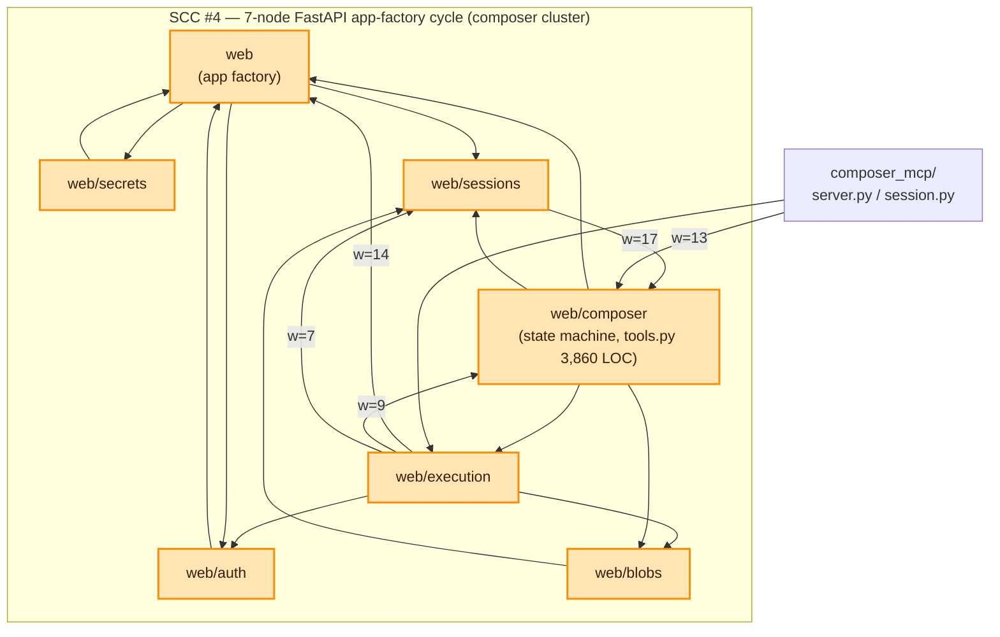
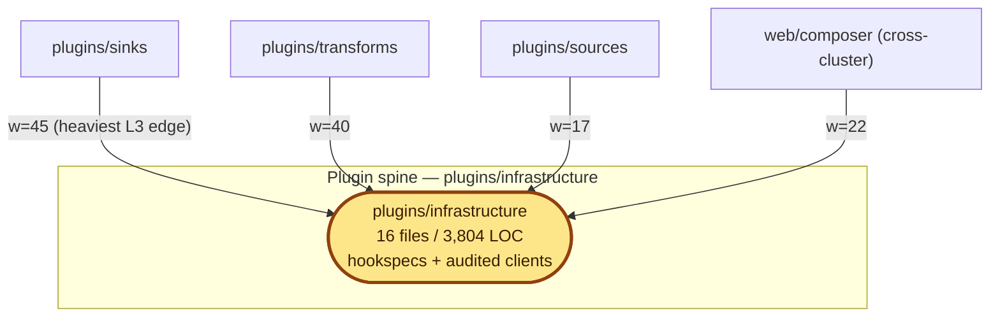
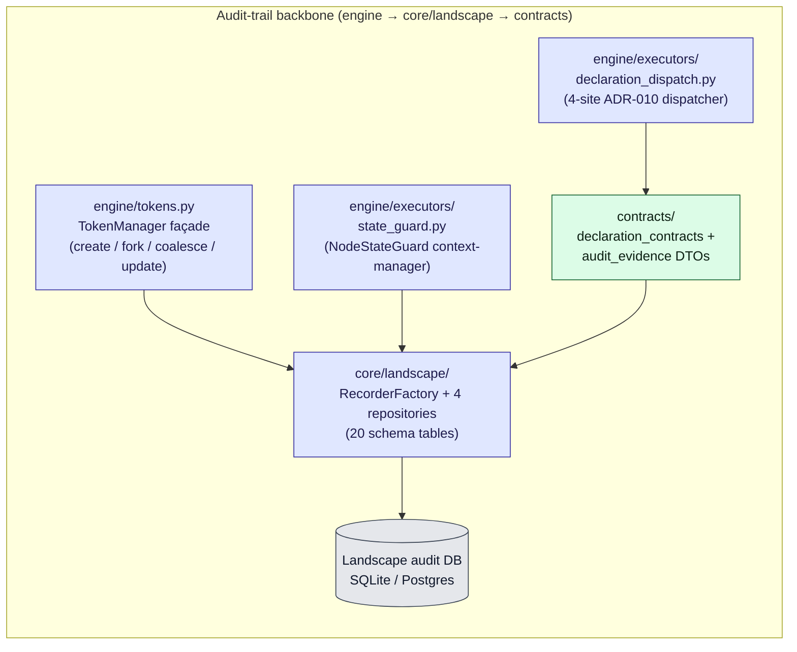

# Component View

A C4 Level-3 view that drills into the three structurally interesting
zones surfaced by the L3 import-graph oracle:

1. **SCC #4** — the 7-node FastAPI app-factory cycle inside the
   composer cluster.
2. **The plugin spine** — `plugins/infrastructure/` and the heavy
   inbound edges that terminate there.
3. **The audit-trail backbone** — the `engine → core/landscape → contracts` chain
   that implements the "every output traceable to source" guarantee.

Edge truth-source: the deterministic L3 import oracle at
[`reference/l3-import-graph.json`](reference/l3-import-graph.json)
(33 nodes, 79 edges, 5 SCCs at this pack's HEAD).

---

## §1 The 7-node web SCC and the heavy intra-cycle edges

### Why it cycles

The cycle is **the FastAPI app-factory pattern made structural**.
Both directions are intentional:

- **Wiring leg.** `web/app.py:create_app(...)` outwardly imports every
  sub-package's router to mount it on the app instance.
- **Shared-infrastructure leg.** Sub-packages reach back via
  `from elspeth.web.config import WebSettings` and shared utilities
  like `run_sync_in_worker`.

### Why it matters

Any architectural change in `web/` must reason about all seven
sub-packages simultaneously. Adding a new sub-package extends the SCC
by default. The recommended decomposition (extract `web/_core/` for
`WebSettings` + `run_sync_in_worker`; make `web/app.py` the only place
that imports sub-package routers) is captured in
[`07-improvement-roadmap.md#r2`](07-improvement-roadmap.md#r2). Until
the decision lands, **freeze new sub-package additions to `web/`
unless explicitly architecture-reviewed**.

`composer_mcp/` enters the SCC at `web/composer` with weight 13
(plus a new weight-4 edge to `web/execution` at this pack's HEAD).
This is finding W4 / R9 territory — `composer_mcp/` is structurally a
sibling of `web/composer/`, not of `mcp/`.

---

## §2 The plugin spine

### Why it is the spine

`plugins/infrastructure/` carries the heaviest single L3 edge in the
codebase (`plugins/sinks → plugins/infrastructure`, weight 45) plus
three of the next four heaviest. All 23 intra-cluster plugin edges flow
toward `infrastructure/`; no other plugin sub-package serves as a
hub.

The dependency shape matches the documented design: sources, transforms,
and sinks are **clients of the infrastructure**, not peers of one
another. New plugin authors look up the existing pattern in
`infrastructure/` (audited HTTP/LLM clients, hookspecs, base classes)
and depend downward.

### Cross-cluster inbound

The spine is also the dominant cross-cluster inbound destination. The
heaviest cross-cluster inbound edge in the codebase —
`web/composer → plugins/infrastructure` weight 22 — terminates here.
Other inbound: `cli → plugins/infrastructure` (weight 8),
`web → plugins/infrastructure`, `web/catalog → plugins/infrastructure`
(weight 3), `web/execution → plugins/infrastructure` (weight 4),
`testing → plugins/infrastructure` (weight 4).

---

## §3 The audit-trail backbone

This is the chain that implements the **attributability test**: for
any output, the operation `explain(recorder, run_id, token_id)` must
prove complete lineage back to source data, configuration, and code
version.

### How the three layers cooperate

| Layer | Component | Role |
|-------|-----------|------|
| **L0** | `contracts/declaration_contracts` | Owns the L0 audit DTO vocabulary: `AuditEvidenceBase` ABC, the `@tier_1_error` decorator with frozen registry, the `DeclarationContract` 4-site framework, secret-scrub last-line-of-defence. |
| **L0** | `contracts/audit_evidence` (922 LOC) | Owns the row-level audit DTOs that the Landscape persists. |
| **L1** | `core/landscape/RecorderFactory` + 4 repositories (`DataFlowRepository`, `ExecutionRepository`, `QueryRepository`, `RunLifecycleRepository`) | Persists the audit trail. Repositories are **not** re-exported through `core/__init__.py` — callers can only reach the audit DB via `RecorderFactory`. |
| **L2** | `engine/tokens.py:TokenManager` | The engine-side façade for token lifecycle (create / fork / coalesce / update). The docstring (`tokens.py:1-5`) describes it as "a simplified interface over `DataFlowRepository`." Persistence delegated to core. |
| **L2** | `engine/executors/state_guard.py:NodeStateGuard` | Implements the terminal-state-per-token invariant as a context-manager pattern. Locked by `tests/unit/engine/test_state_guard_audit_evidence_discriminator.py` and `tests/unit/engine/test_row_outcome.py`. |
| **L2** | `engine/executors/declaration_dispatch.py` | The 4-site ADR-010 dispatcher (`pre_emission_check`, `post_emission_check`, `batch_flush_check`, `boundary_check`). Drives 7 contract adopters mapped 1:1 to ADRs 007 / 008 / 011 / 012 / 013 / 014 / 016 / 017. Locked against drift by an AST-scanning unit test. |

### The four cross-layer audit edges

These are the load-bearing audit-trail edges. None of them appears in
the L3 import oracle because the oracle scope excludes the cross-layer
backbone; the cross-layer truth-source is the layer-enforcer schema
plus the per-cluster catalogues.

| Edge | Citation |
|------|----------|
| `engine/tokens.py:19` → `core/landscape/data_flow_repository` | TokenManager façade pattern; persistence delegated to core |
| `engine/executors/declaration_dispatch.py` → `contracts/declaration_contracts` | Engine consumes the ADR-010 payload TypedDicts; 4 sites × 7 adopters |
| `engine/executors/state_guard.py` → `core/landscape` | Terminal-state recording at context-manager exit |
| `contracts/audit_evidence` → `core/landscape/schema.py` | L0 audit DTOs persisted by the L1 schema |

---

## §4 The other four strongly-connected components

For completeness — none rises to architectural concern at this pack's
depth. Each has a known cause and a documented intent.

| SCC | Nodes | Cause |
|-----|-------|-------|
| #0 | `mcp` ↔ `mcp/analyzers` | Analyser sub-package re-uses parent-namespace types via a weight-29 inverted edge. Provider-registry pattern. |
| #1 | `plugins/transforms/llm` ↔ `plugins/transforms/llm/providers` | Provider-registry pattern with deferred runtime instantiation; runtime decoupling cited at `transform.py:9-13`. Finding P4 / R-future. |
| #2 | `telemetry` ↔ `telemetry/exporters` | Exporter sub-package re-uses parent-namespace types via a weight-18 inverted edge. |
| #3 | `tui` ↔ `tui/screens` ↔ `tui/widgets` | Screens and widgets reach back into the `tui` root for shared types. |

---

## §5 The full L3 import topology (machine-readable)

The deterministic oracle is at
[`reference/l3-import-graph.json`](reference/l3-import-graph.json)
(33 nodes, 79 edges, 5 SCCs). Mermaid and Graphviz renderings are also
provided:

- [`reference/l3-import-graph.mmd`](reference/l3-import-graph.mmd) — full Mermaid graph (sub-package detail)
- [`reference/l3-import-graph.dot`](reference/l3-import-graph.dot) — Graphviz DOT format

To regenerate at any HEAD, follow [`reference/re-derive.md`](reference/re-derive.md).
The output is byte-identical across runs given the same source tree
(when invoked with `--no-timestamp`), so `diff` against the snapshot
shows only true import-graph drift.
