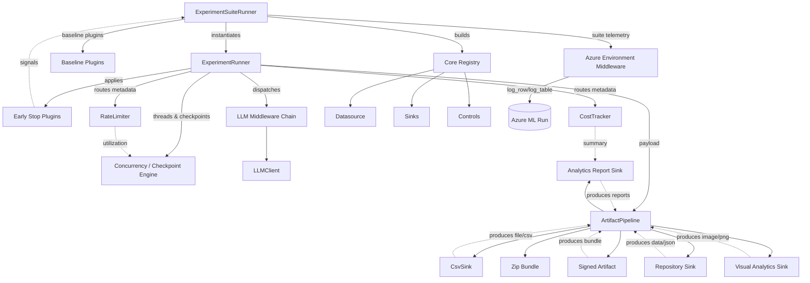

# Component Relationships

```mermaid
graph TD
    subgraph Operator Workstation
        CLI[CLI (`python -m elspeth.cli`)]
    end

    subgraph Core Runtime
        ConfigLoader[Settings Loader]
        Orchestrator[ExperimentOrchestrator]
        Runner[ExperimentRunner]
        Pipeline[ArtifactPipeline]
    end

    subgraph Plugin Layer
        Datasource[Datasource Plugin]
        Controls[Rate/Cost Controls]
        Middleware[LLM Middleware Stack]
        LLMClient[LLM Client Plugin]
        Sinks[Result Sink Plugins]
    end

    subgraph External Services
        AzureBlob[(Azure Blob Storage)]
        AzureOpenAI[(Azure OpenAI / HTTP LLM)]
        RepoTargets[(GitHub / Azure DevOps / Local Bundle)]
    end

    CLI --> ConfigLoader
    ConfigLoader --> Datasource
    ConfigLoader --> LLMClient
    ConfigLoader --> Sinks
    ConfigLoader --> Controls
    ConfigLoader --> Middleware

    Datasource --> Orchestrator
    LLMClient --> Orchestrator
    Sinks --> Orchestrator
    Controls --> Orchestrator
    Middleware --> Orchestrator

    Orchestrator --> Runner
    Runner --> Pipeline
    Pipeline --> Sinks

    Datasource -.reads .-> AzureBlob
    LLMClient -.invokes .-> AzureOpenAI
    Sinks -.persist .-> RepoTargets

    classDef boundary stroke-dasharray: 5 5,stroke-width:2px,stroke:#888;
    class Operator\ Workstation,External\ Services boundary;
```

<!-- UPDATED DIAGRAM 2025-10-12: Added suite orchestration, middleware lifecycle, analytics sinks, and artifact chaining -->


## Diagram Notes
- **Configuration flow** – The CLI validates settings, merges prompt packs, and instantiates plugins before handing them to the orchestrator (`src/elspeth/cli.py:65`, `src/elspeth/config.py:52`, `src/elspeth/core/validation.py:271`).
- **Orchestration core** – The orchestrator wires datasource, LLM, sinks, middleware, and optional controls into a single runner instance (`src/elspeth/core/orchestrator.py:46`, `src/elspeth/core/orchestrator.py:80`).
- **Execution pipeline** – `ExperimentRunner` processes each row, invoking middleware, rate/cost controls, retries, and validation before handing artifacts to the dependency-aware pipeline (`src/elspeth/core/experiments/runner.py:126`, `src/elspeth/core/experiments/runner.py:464`, `src/elspeth/core/artifact_pipeline.py:201`).
- **Plugin boundaries** – Plugin registries enforce schema validation for datasources, sinks, LLM clients, and experiment plugins, encapsulating external credentials and behaviours (`src/elspeth/core/registry.py:91`, `src/elspeth/core/experiments/plugin_registry.py:93`, `src/elspeth/core/controls/registry.py:36`).
- **External integrations** – Datasources and sinks interact with Azure storage, repository APIs, or local file systems, while LLM clients communicate with Azure OpenAI or other HTTP-compatible endpoints (`src/elspeth/plugins/datasources/blob.py:35`, `src/elspeth/plugins/llms/azure_openai.py:77`, `src/elspeth/plugins/outputs/repository.py:137`).
- **Security overlays** – Middleware applies audit logging, prompt shielding, and Azure Content Safety scanning, while security levels propagate into the artifact pipeline to gate downstream consumption (`src/elspeth/plugins/llms/middleware.py:70`, `src/elspeth/core/experiments/runner.py:208`, `src/elspeth/core/artifact_pipeline.py:192`).
<!-- UPDATE 2025-10-12: Concurrency, early-stop, analytics-reporting, visual sink, and Azure telemetry flows are captured in the extended diagram above (see `src/elspeth/core/experiments/runner.py:365`, `src/elspeth/plugins/outputs/analytics_report.py:11`, `src/elspeth/plugins/outputs/visual_report.py:11`, `src/elspeth/plugins/llms/middleware_azure.py:180`). -->

## Update History
- 2025-10-12 – Added extended component diagram highlighting suite orchestration, concurrency controls, analytics sinks, and Azure telemetry touchpoints.
