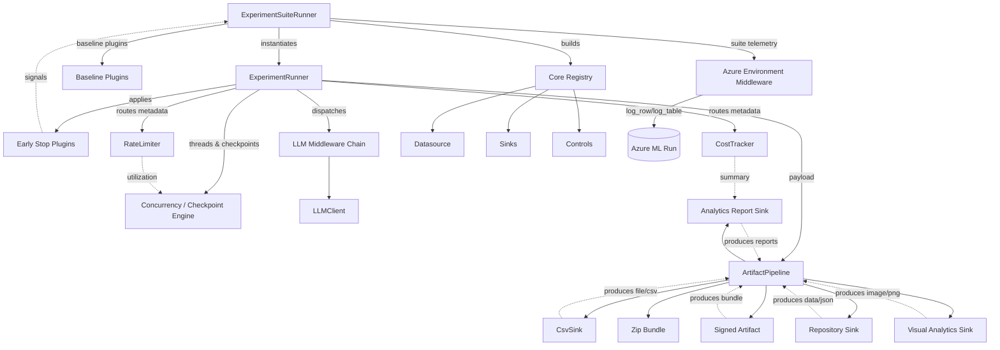
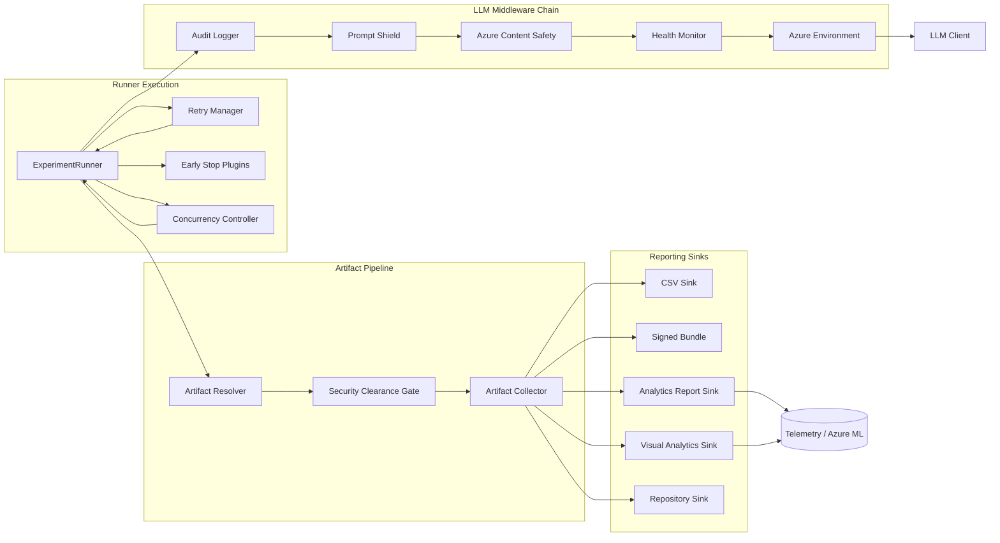

# Component Relationships

```mermaid
graph TD
    subgraph Operator Workstation
        CLI[CLI (`python -m elspeth.cli`)]
    end

    subgraph Core Runtime
        ConfigLoader[Settings Loader]
        Orchestrator[ExperimentOrchestrator]
        Runner[ExperimentRunner]
        Pipeline[ArtifactPipeline]
    end

    subgraph Plugin Layer
        Datasource[Datasource Plugin]
        Controls[Rate/Cost Controls]
        Middleware[LLM Middleware Stack]
        LLMClient[LLM Client Plugin]
        Sinks[Result Sink Plugins]
    end

    subgraph External Services
        AzureBlob[(Azure Blob Storage)]
        AzureOpenAI[(Azure OpenAI / HTTP LLM)]
        RepoTargets[(GitHub / Azure DevOps / Local Bundle)]
    end

    CLI --> ConfigLoader
    ConfigLoader --> Datasource
    ConfigLoader --> LLMClient
    ConfigLoader --> Sinks
    ConfigLoader --> Controls
    ConfigLoader --> Middleware

    Datasource --> Orchestrator
    LLMClient --> Orchestrator
    Sinks --> Orchestrator
    Controls --> Orchestrator
    Middleware --> Orchestrator

    Orchestrator --> Runner
    Runner --> Pipeline
    Pipeline --> Sinks

    Datasource -.reads .-> AzureBlob
    LLMClient -.invokes .-> AzureOpenAI
    Sinks -.persist .-> RepoTargets

    classDef boundary stroke-dasharray: 5 5,stroke-width:2px,stroke:#888;
    class Operator\ Workstation,External\ Services boundary;
```

<!-- Update 2025-10-12: Added suite orchestration, middleware lifecycle, analytics sinks, and artifact chaining -->


<!-- Update 2025-10-12: Middleware chain stages, artifact security gates, and reporting components -->


## Diagram Notes
- **Configuration flow** – The CLI validates settings, merges prompt packs, and instantiates plugins before handing them to the orchestrator (`src/elspeth/cli.py:65`, `src/elspeth/config.py:52`, `src/elspeth/core/validation.py:271`).[^diagram-config-2025-10-12]
- **Orchestration core** – The orchestrator wires datasource, LLM, sinks, middleware, and optional controls into a single runner instance (`src/elspeth/core/orchestrator.py:46`, `src/elspeth/core/orchestrator.py:80`).[^diagram-orchestrator-2025-10-12]
- **Execution pipeline** – `ExperimentRunner` processes each row, invoking middleware, rate/cost controls, retries, and validation before handing artifacts to the dependency-aware pipeline (`src/elspeth/core/experiments/runner.py:126`, `src/elspeth/core/experiments/runner.py:464`, `src/elspeth/core/artifact_pipeline.py:201`).[^diagram-runner-2025-10-12]
- **Plugin boundaries** – Plugin registries enforce schema validation for datasources, sinks, LLM clients, and experiment plugins, encapsulating external credentials and behaviours (`src/elspeth/core/registry.py:91`, `src/elspeth/core/experiments/plugin_registry.py:93`, `src/elspeth/core/controls/registry.py:36`).[^diagram-registry-2025-10-12]
- **External integrations** – Datasources and sinks interact with Azure storage, repository APIs, or local file systems, while LLM clients communicate with Azure OpenAI or other HTTP-compatible endpoints (`src/elspeth/plugins/datasources/blob.py:35`, `src/elspeth/plugins/llms/azure_openai.py:77`, `src/elspeth/plugins/outputs/repository.py:137`).[^diagram-integrations-2025-10-12]
- **Security overlays** – Middleware applies audit logging, prompt shielding, and Azure Content Safety scanning, while security levels propagate into the artifact pipeline to gate downstream consumption (`src/elspeth/plugins/llms/middleware.py:70`, `src/elspeth/core/experiments/runner.py:208`, `src/elspeth/core/artifact_pipeline.py:192`).[^diagram-security-2025-10-12]
<!-- Update 2025-10-12: Concurrency, early-stop, analytics-reporting, visual sink, and Azure telemetry flows are captured in the extended diagram above (see `src/elspeth/core/experiments/runner.py:365`, `src/elspeth/plugins/outputs/analytics_report.py:11`, `src/elspeth/plugins/outputs/visual_report.py:11`, `src/elspeth/plugins/llms/middleware_azure.py:180`). -->

### Update 2025-10-12: System Interfaces
- `DataSource`, `LLMClientProtocol`, and `ResultSink` protocols (`src/elspeth/core/interfaces.py:11`, `src/elspeth/core/interfaces.py:37`) remain the authoritative contracts, matching the module boundaries depicted in the diagrams. Cross-reference docs/architecture/architecture-overview.md Core Principles for rationale.

### Update 2025-10-12: Configuration Loader
- `load_settings` resolves prompt packs, middleware, and early-stop definitions while preserving security levels (`src/elspeth/config.py:52`, `src/elspeth/config.py:146`). Validation flow ties into docs/architecture/configuration-security.md.

### Update 2025-10-12: Orchestrator Core
- `ExperimentOrchestrator` composes plugins and propagates concurrency / early-stop configs into `ExperimentRunner` (`src/elspeth/core/orchestrator.py:46`, `src/elspeth/core/orchestrator.py:93`). Diagram nodes show dependency injection order.

### Update 2025-10-12: Middleware Chain
- Middleware sequence (audit logger → prompt shield → content safety → health monitor → Azure environment) is registered via `elspeth.plugins.llms.middleware` / `_azure` modules; see docs/architecture/audit-logging.md for telemetry coverage.

### Update 2025-10-12: Artifact Pipeline
- `ArtifactPipeline` enforces security gates and resolves sink dependencies via `SinkBinding` ordering (`src/elspeth/core/artifact_pipeline.py:137`, `src/elspeth/core/artifact_pipeline.py:218`). Artifact flow aligns with docs/architecture/data-flow-diagrams.md Update 2025-10-12: Artifact Rehydration.

### Update 2025-10-12: Control Registry
- Rate and cost control registries normalise security levels and schema validation before attaching to the runner (`src/elspeth/core/controls/registry.py:36`, `src/elspeth/core/controls/rate_limit.py:104`). See docs/architecture/plugin-security-model.md Update 2025-10-12: Control Registry.

### Update 2025-10-12: Artifact Tokens
- Sinks advertise artifacts via `ArtifactDescriptor` and runtime metadata (`src/elspeth/core/interfaces.py:83`, `src/elspeth/core/artifact_pipeline.py:153`), enabling analytics and signing sinks to consume upstream assets. Controls are catalogued in docs/architecture/CONTROL_INVENTORY.md.

## Update History
- 2025-10-12 – Added extended component diagram highlighting suite orchestration, concurrency controls, analytics sinks, and Azure telemetry touchpoints.
- 2025-10-12 – Update 2025-10-12: Introduced middleware/pipeline detail diagram, added cross-referenced section anchors, and verified plugin registry edges against `src/elspeth/core/experiments/plugin_registry.py`.

[^diagram-config-2025-10-12]: Update 2025-10-12: See docs/architecture/configuration-security.md (Update 2025-10-12: Profile Validation Chain) for validation details.
[^diagram-orchestrator-2025-10-12]: Update 2025-10-12: Cross-referenced with docs/architecture/architecture-overview.md Core Principles.
[^diagram-runner-2025-10-12]: Update 2025-10-12: Execution details synchronised with docs/architecture/data-flow-diagrams.md (Update 2025-10-12: Runner Pipeline).
[^diagram-registry-2025-10-12]: Update 2025-10-12: Registry boundaries elaborated in docs/architecture/plugin-security-model.md (Update 2025-10-12: Registry Enforcement).
[^diagram-integrations-2025-10-12]: Update 2025-10-12: External endpoints documented in docs/architecture/threat-surfaces.md (Update 2025-10-12: External Integrations).
[^diagram-security-2025-10-12]: Update 2025-10-12: Security overlay ties to docs/architecture/security-controls.md (Update 2025-10-12: Middleware Safeguards).
