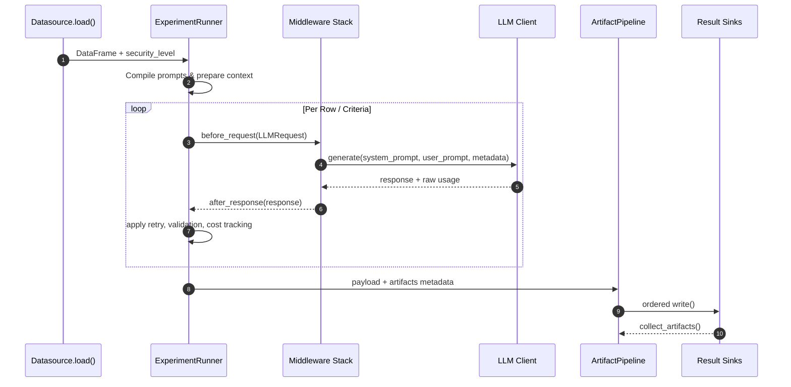
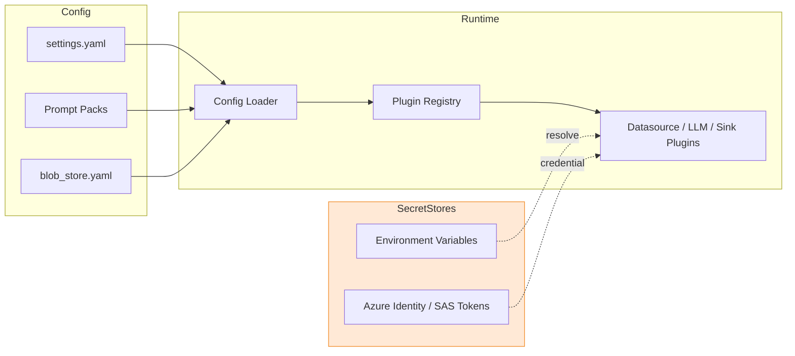
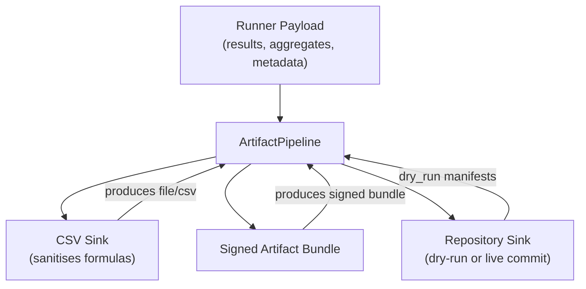

# Data Flow Diagrams

## Experiment Execution Flow


- Datasources attach classification metadata that is later folded into sink metadata (`src/elspeth/plugins/datasources/csv_local.py:35`, `src/elspeth/core/experiments/runner.py:208`).
- Middleware can veto, mask, or audit prompts before the LLM is contacted, forming the first trust boundary for untrusted input (`src/elspeth/plugins/llms/middleware.py:110`, `src/elspeth/plugins/llms/middleware.py:233`).
- Cost tracking and rate limiting wrap each LLM invocation with deterministic retry state (`src/elspeth/core/experiments/runner.py:498`, `src/elspeth/core/experiments/runner.py:520`, `src/elspeth/core/controls/rate_limit.py:74`).
- The artifact pipeline enforces dependency ordering and classification-aware access before sinks persist or aggregate results (`src/elspeth/core/artifact_pipeline.py:192`, `src/elspeth/core/artifact_pipeline.py:201`).
<!-- UPDATE 2025-10-12: When concurrency is enabled, rows enter a worker pool governed by `concurrency_config` thresholds, and early-stop plugins can halt submission once metrics breach criteria (`src/elspeth/core/experiments/runner.py:365`, `src/elspeth/core/experiments/runner.py:248`). -->

## Added 2025-10-12 – Retry, Early Stop, and Telemetry Flow
```mermaid
sequenceDiagram
    autonumber
    participant OR as ExperimentRunner
    participant MW as Middleware Chain
    participant RL as RateLimiter
    participant LLM as LLM Client
    participant ES as EarlyStop Plugins
    participant AP as ArtifactPipeline
    participant AR as Analytics Sink
    participant AZ as AzureEnvironmentMiddleware

    loop Attempt (max_attempts)
        OR->>RL: acquire(metadata)
        RL-->>OR: token context
        OR->>MW: before_request(LLMRequest)
        MW->>LLM: generate(...)
        LLM-->>MW: response / error
        MW-->>OR: after_response(response)
        OR->>OR: record retry metadata
        alt success
            OR->>ES: check(record.metrics)
            ES-->>OR: continue / trigger(reason)
            OR->>AP: execute(payload, metadata)
            AP->>AR: collect_artifacts()
            AZ->>AZ: log experiment_complete / retry_summary
            break
        else retriable error
            OR-->>OR: backoff & increment attempts
        end
    end
    OR-->>MW: notify_retry_exhausted (metadata)
    MW->>AZ: log llm_retry_exhausted(history)
```

## Credential and Secret Flow


- Loader merges profile and prompt pack settings, then invokes registry factories that validate plugin schemas before instantiation (`src/elspeth/config.py:48`, `src/elspeth/core/registry.py:91`).
- Blob datasources resolve SAS tokens or managed identity credentials at runtime, preventing raw secrets from living in code paths; the same pattern is used for GitHub/Azure DevOps tokens and signing keys (`config/blob_store.yaml:4`, `src/elspeth/plugins/outputs/repository.py:149`, `src/elspeth/plugins/outputs/signed.py:107`).
- Azure-specific clients rely on `azure-identity` if explicit credentials are absent, aligning with managed identity deployments while still supporting SAS tokens for desktops (`src/elspeth/datasources/blob_store.py:125`, `src/elspeth/plugins/llms/azure_openai.py:25`).
<!-- UPDATE 2025-10-12: Suite export/reporting commands inherit the same credential flow when emitting analytics or repository artifacts, so secure stores must cover `analytics_report` and repository PAT tokens (`src/elspeth/cli.py:205`, `src/elspeth/plugins/outputs/analytics_report.py:28`). -->

## Artifact Lifecycle


- CSV outputs escape spreadsheet metacharacters and record sanitisation metadata for downstream auditors (`src/elspeth/plugins/outputs/csv_file.py:49`, `src/elspeth/plugins/outputs/_sanitize.py:18`).
- Signed artifacts emit HMAC digests and manifests containing response metadata, enabling tamper detection when results are redistributed (`src/elspeth/plugins/outputs/signed.py:37`, `src/elspeth/plugins/outputs/signed.py:75`).
- Repository sinks support dry-run inspection by caching payload manifests, reducing blast radius during accreditation rehearsals (`src/elspeth/plugins/outputs/repository.py:70`, `src/elspeth/plugins/outputs/repository.py:124`).
<!-- UPDATE 2025-10-12: Analytics sinks and zip bundles now register `produces` descriptors so the pipeline can chain artifacts while enforcing classification gates (`src/elspeth/plugins/outputs/analytics_report.py:62`, `src/elspeth/plugins/outputs/zip_bundle.py:41`, `src/elspeth/core/artifact_pipeline.py:167`). -->
<!-- UPDATE 2025-10-12: Visual analytics sink converts score summaries into PNG/HTML charts with inline metadata, inheriting pipeline security levels (`src/elspeth/plugins/outputs/visual_report.py:63`, `src/elspeth/plugins/outputs/visual_report.py:180`). -->

## Update History
- 2025-10-12 – Added retry/early-stop telemetry sequence, documented concurrency impacts, and noted analytics artifact propagation.
