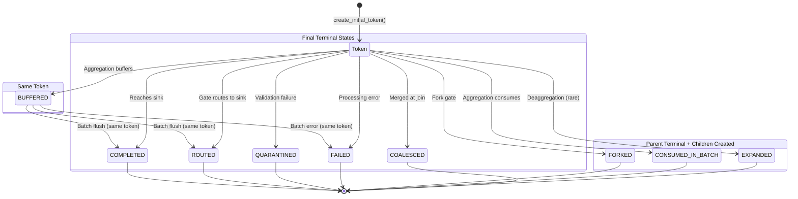

# Token Lifecycle Architecture

**Last verified:** 2026-01-29 (commit: 0d77552)
**Audience:** Developers working with ELSPETH's audit system

**Related Documentation:**
- [CLAUDE.md Audit Section](../../CLAUDE.md) - Trust model and audit principles
- [Landscape MCP Guide](../guides/landscape-mcp-analysis.md) - MCP server for audit queries
- [Token Outcome Contract](../contracts/token-outcomes/00-token-outcome-contract.md) - Formal outcome requirements

---

## Overview

Tokens represent **row instances flowing through the DAG**. Every source row generates at least one token. The token system enables complete audit trail reconstruction for any output.

**Key distinction:**
- `row_id` = Stable source row identity (never changes)
- `token_id` = Instance of a row traversing a specific DAG path (multiplies at forks, merges at joins)

```
Source Row (row_id: "r1")
     │
     ├─ Initial Token (token_id: "t1")
     │       │
     │       ├─ [FORK] ──► Child Token (token_id: "t2", branch: "path_a")
     │       │             Child Token (token_id: "t3", branch: "path_b")
     │       │                   │
     │       │             [COALESCE] ──► Merged Token (token_id: "t4")
     │       │
     │       └─ All tokens share row_id: "r1"
```

---

## Token Identity Fields

| Field | Type | Purpose | Set When |
|-------|------|---------|----------|
| `token_id` | String(64) | Unique instance identifier | Creation |
| `row_id` | String(64) | Stable source row identity | Inherited from source |
| `fork_group_id` | String(64) | Groups siblings from same fork | Fork operation |
| `join_group_id` | String(64) | Identifies merged token | Coalesce operation |
| `expand_group_id` | String(32) | Groups children from deaggregation | Expand operation |
| `branch_name` | String(64) | Which fork path ("path_a", "path_b") | Fork operation |
| `step_in_pipeline` | Integer | DAG step where token was created | Fork/coalesce/expand |

**Schema location:** `src/elspeth/core/landscape/schema.py:114-125`

---

## Token Outcomes

Every token reaches exactly one terminal state. This is the core audit invariant.

### All 9 Outcomes

| Outcome | Terminal | Required Field | Meaning |
|---------|----------|----------------|---------|
| `COMPLETED` | Yes | `sink_name` | Reached output sink successfully |
| `ROUTED` | Yes | `sink_name` | Gate directed to named sink |
| `FORKED` | Yes | `fork_group_id` | Split into parallel paths (parent) |
| `FAILED` | Yes | `error_hash` | Processing failed, not recoverable |
| `QUARANTINED` | Yes | `error_hash` | Validation failure, stored for investigation |
| `CONSUMED_IN_BATCH` | Yes | `batch_id` | Absorbed into aggregation batch |
| `COALESCED` | Yes | `join_group_id` | Merged from parallel paths |
| `EXPANDED` | Yes | `expand_group_id` | Deaggregated into children (parent) |
| `BUFFERED` | **No** | `batch_id` | Held for batch processing (will reappear) |

**Enum location:** `src/elspeth/contracts/enums.py:140-182`

### Terminal vs Non-Terminal

```python
@property
def is_terminal(self) -> bool:
    """Terminal = outcome won't change. Non-terminal = will be updated."""
    return self != RowOutcome.BUFFERED
```

**BUFFERED is special:** A token can have BUFFERED outcome, then later get a terminal outcome when the batch flushes. The partial unique index allows this pattern.

---

## State Transition Diagram

**CRITICAL DISTINCTION:** This diagram shows TWO different things:
1. **State transitions** (solid arrows) = same token changes outcome
2. **Lineage creation** (dashed arrows) = NEW tokens created from parent

Only BUFFERED→terminal is a true state transition on the same token. All other "transitions" create new tokens.



### Lineage Creation (Parent → Children)

When a token reaches FORKED, CONSUMED_IN_BATCH, or EXPANDED, **new child tokens** are created:

```
┌─────────────────────────────────────────────────────────────────────┐
│ PARENT TOKEN                          CHILD TOKENS                  │
│                                                                     │
│ tok-A ──[FORKED]──────────────────►  tok-B (branch: path_a)        │
│                                       tok-C (branch: path_b)        │
│                                       (linked via fork_group_id)    │
│                                                                     │
│ tok-D ──[CONSUMED_IN_BATCH]───────►  tok-E (expanded row 1)        │
│                                       tok-F (expanded row 2)        │
│                                       (linked via expand_group_id)  │
│                                                                     │
│ tok-G ──┐                                                           │
│ tok-H ──┼─[COALESCED]─────────────►  tok-J (merged result)         │
│ tok-I ──┘                             (linked via join_group_id)    │
└─────────────────────────────────────────────────────────────────────┘
```

**Key invariant:** Parent and children are DIFFERENT tokens. Each gets exactly ONE terminal outcome.

---

## Transition Matrix

| From State | Can Transition To | Via |
|------------|-------------------|-----|
| (new token) | FORKED, BUFFERED, CONSUMED_IN_BATCH, COMPLETED, ROUTED, QUARANTINED, FAILED | Various executors |
| BUFFERED | COMPLETED, ROUTED, FAILED, EXPANDED | Batch flush |
| FORKED | — (terminal) | Children continue |
| CONSUMED_IN_BATCH | — (terminal) | May trigger EXPANDED |
| EXPANDED | — (terminal) | Children continue |
| COALESCED | — (terminal) | Merged token continues |

---

## Token Creation

### 1. Initial Token (Source Row)

**Method:** `TokenManager.create_initial_token()`
**Location:** `src/elspeth/engine/tokens.py:56-93`

```python
def create_initial_token(
    self,
    run_id: str,
    source_node_id: str,
    row_index: int,
    row_data: dict[str, Any],
) -> TokenInfo:
```

**Creates:**
- `rows` table entry (with `source_data_hash`, `source_data_ref`)
- `tokens` table entry (initial token for this row)

**Called by:** `RowProcessor.process_row()` at `processor.py:1107`

### 2. Fork Children

**Method:** `TokenManager.fork_token()`
**Location:** `src/elspeth/engine/tokens.py:121-169`

```python
def fork_token(
    self,
    parent_token: TokenInfo,
    branches: list[str],  # branch names from gate fork_to (config uses dict[str, str] for branch→connection mapping)
    step_in_pipeline: int,
    run_id: str,
    row_data: dict[str, Any] | None = None,
) -> tuple[list[TokenInfo], str]:  # Returns (children, fork_group_id)
```

**Critical:**
- Uses `copy.deepcopy(row_data)` to prevent sibling mutation
- **ATOMIC:** Creates children AND records parent FORKED outcome in single transaction

**Creates (atomically):**
- N `tokens` entries (one per branch)
- N `token_parents` entries (linking children to parent)
- 1 `token_outcomes` entry (FORKED outcome for parent with `expected_branches_json`)
- All share same `fork_group_id`

**Called by:** `GateExecutor.execute()` at `executors.py:598`

### 3. Coalesced Token (Merge)

**Method:** `TokenManager.coalesce_tokens()`
**Location:** `src/elspeth/engine/tokens.py:165-198`

```python
def coalesce_tokens(
    self,
    parents: list[TokenInfo],
    merged_data: dict[str, Any],
    step_in_pipeline: int,
) -> TokenInfo:
```

**Creates:**
- 1 `tokens` entry (merged result)
- N `token_parents` entries (linking merged to all parents)
- Merged token gets `join_group_id`

**Called by:** `CoalesceExecutor._execute_merge()` at `coalesce_executor.py:309`

### 4. Expanded Children (Deaggregation)

**Method:** `TokenManager.expand_token()`
**Location:** `src/elspeth/engine/tokens.py:227-279`

```python
def expand_token(
    self,
    parent_token: TokenInfo,
    expanded_rows: list[dict[str, Any]],
    step_in_pipeline: int,
    run_id: str,
    record_parent_outcome: bool = True,
) -> tuple[list[TokenInfo], str]:  # Returns (children, expand_group_id)
```

**Critical:**
- Uses `copy.deepcopy()` for each expanded row
- **ATOMIC (default):** Creates children AND records parent EXPANDED outcome in single transaction
- Set `record_parent_outcome=False` for batch aggregation (parent gets CONSUMED_IN_BATCH instead)

**Creates (atomically when record_parent_outcome=True):**
- N `tokens` entries (one per output row)
- N `token_parents` entries
- 1 `token_outcomes` entry (EXPANDED outcome for parent with `expected_branches_json`)
- All share same `expand_group_id`

**Called by:**
- `RowProcessor.handle_timeout_flush()` at `processor.py:427, 534, 855`
- `RowProcessor._handle_multi_row_transform()` at `processor.py:1577`

---

## Atomic Operations and Branch Contracts

### Why Atomic?

Before 2026-01-29, fork_token and expand_token had a **crash vulnerability**:

```
OLD (vulnerable):
1. fork_token() creates children  <-- crash here = orphan children
2. record_token_outcome(FORKED)   <-- never recorded, recovery fails
```

If crash occurred between steps 1 and 2:
- Children exist but have no FORKED parent outcome
- Recovery can't distinguish "partial fork" from "never forked"
- **Data loss:** Children continue processing without proper audit trail

### The Fix: Atomic Transactions

Fork and expand now record parent outcomes **in the same transaction** as child creation:

```python
# Inside fork_token (LandscapeRecorder)
with self._db.connection() as conn:
    # 1. Create child tokens
    for branch in branches:
        conn.execute(tokens_table.insert()...)
        conn.execute(token_parents_table.insert()...)

    # 2. Record parent FORKED outcome (SAME TRANSACTION)
    conn.execute(token_outcomes_table.insert().values(
        outcome=RowOutcome.FORKED.value,
        expected_branches_json=json.dumps(branches),  # Branch contract
    ))
# All or nothing: either both succeed or neither does
```

### Branch Contracts

The `expected_branches_json` column stores what branches/children were **promised**:

| Outcome | Contract Format | Purpose |
|---------|-----------------|---------|
| FORKED | `["path_a", "path_b"]` | List of branch names |
| EXPANDED | `{"count": 3}` | Expected child count |

This enables recovery validation: if expected != actual, something went wrong.

**Schema location:** `src/elspeth/core/landscape/schema.py` (token_outcomes table)

### Batch Aggregation Exception

Batch aggregation uses `expand_token` to create children but the parent should get `CONSUMED_IN_BATCH`, not `EXPANDED`. The `record_parent_outcome=False` parameter handles this:

```python
# Batch aggregation: parent gets CONSUMED_IN_BATCH separately
expand_token(..., record_parent_outcome=False)
recorder.record_token_outcome(..., outcome=RowOutcome.CONSUMED_IN_BATCH)

# Deaggregation: parent gets EXPANDED atomically (default)
expand_token(...)  # record_parent_outcome=True by default
```

---

## Outcome Recording Sites

### Processor (processor.py)

| Line | Function | Outcome | Condition |
|------|----------|---------|-----------|
| 359-364 | `_handle_batch_timeout()` | FAILED | Batch transform timeout (passthrough) |
| 650-655 | `_execute_batch_transform()` | FAILED | Batch execution error (passthrough) |
| 678-683 | `_execute_batch_transform()` | CONSUMED_IN_BATCH | Aggregation trigger fires |
| 858-863 | `handle_timeout_flush()` | CONSUMED_IN_BATCH | Timeout flush (triggering token) |
| 920-925 | `_process_aggregation()` | BUFFERED | Aggregation passthrough buffering |
| 936-941 | `_process_aggregation()` | CONSUMED_IN_BATCH | Non-passthrough aggregation |
| (atomic) | `fork_token()` → `recorder.fork_token()` | FORKED | Gate fork execution (atomically in recorder) |
| 1509-1514 | `_execute_transform()` | FAILED | Transform retry exhaustion |
| 1531-1536 | `_execute_transform()` | QUARANTINED | Transform error with discard |
| (atomic) | `expand_token()` → `recorder.expand_token()` | EXPANDED | Deaggregation (atomically in recorder) |

### Executors (executors.py)

| Line | Function | Outcome | Condition |
|------|----------|---------|-----------|
| 1724-1729 | `SinkExecutor._record_outcome()` | COMPLETED/ROUTED | After sink.flush() succeeds |

### Coalesce Executor (coalesce_executor.py)

| Line | Function | Outcome | Condition |
|------|----------|---------|-----------|
| 330-335 | `_execute_merge()` | COALESCED | Successful merge (consumed tokens) |
| 548-553 | `_handle_quorum_failure()` | FAILED | Quorum not met |
| 598-603 | `_handle_timeout()` | FAILED | Incomplete branches timeout |

---

## Parent-Child Relationships

### token_parents Table

**Location:** `src/elspeth/core/landscape/schema.py:163-175`

```sql
CREATE TABLE token_parents (
    token_id VARCHAR(64) REFERENCES tokens(token_id),
    parent_token_id VARCHAR(64) REFERENCES tokens(token_id),
    ordinal INTEGER NOT NULL,
    PRIMARY KEY (token_id, parent_token_id),
    UNIQUE (token_id, ordinal)
);
```

**`ordinal` field:** Maintains parent ordering for deterministic reconstruction.

### Three Relationship Types

| Operation | Parent Outcome | Children Created | Linkage |
|-----------|----------------|------------------|---------|
| **Fork** | FORKED | N children (one per branch) | `fork_group_id` shared |
| **Coalesce** | COALESCED (each input) | 1 merged token | `join_group_id` on merged |
| **Expand** | EXPANDED | N children (one per row) | `expand_group_id` shared |

### Lineage Traversal

```python
# Get parents of a token
parents = recorder.get_token_parents(token_id)
# Returns: [TokenParent(token_id, parent_token_id, ordinal), ...]

# Get token details
token = recorder.get_token(token_id)
# Returns: Token with fork_group_id, join_group_id, branch_name, etc.
```

**Implementation:** `src/elspeth/core/landscape/lineage.py` - `explain()` function

---

## Outcome Contract Validation

**Location:** `src/elspeth/core/landscape/recorder.py:1918-1991`

Each outcome type requires specific fields. Missing required fields raise `ValueError` immediately.

```python
if outcome == RowOutcome.COMPLETED:
    if sink_name is None:
        raise ValueError(
            "COMPLETED outcome requires sink_name but got None. "
            "Contract violation - see docs/contracts/token-outcomes/00-token-outcome-contract.md"
        )
```

### Required Fields Summary

| Outcome | Required | Why |
|---------|----------|-----|
| COMPLETED | `sink_name` | Which sink received the token |
| ROUTED | `sink_name` | Which sink received the token |
| FORKED | `fork_group_id` | Links parent to children |
| FAILED | `error_hash` | Identifies error in PayloadStore |
| QUARANTINED | `error_hash` | Identifies validation error |
| CONSUMED_IN_BATCH | `batch_id` | Links token to batch |
| COALESCED | `join_group_id` | Links to merged token |
| EXPANDED | `expand_group_id` | Links parent to children |
| BUFFERED | `batch_id` | Links token to batch |

---

## Database Schema

### Terminal Uniqueness Constraint

**Location:** `src/elspeth/core/landscape/schema.py:151-159`

```python
Index(
    "ix_token_outcomes_terminal_unique",
    token_outcomes_table.c.token_id,
    unique=True,
    sqlite_where=(token_outcomes_table.c.is_terminal == 1),
)
```

**Behavior:**
- Allows multiple BUFFERED outcomes (is_terminal = 0)
- Enforces exactly ONE terminal outcome per token
- Attempting two terminal outcomes raises `IntegrityError`

### Key Indexes

| Index | Table | Purpose |
|-------|-------|---------|
| `ix_tokens_row_id` | tokens | Fast row→token lookup |
| `ix_token_outcomes_token_id` | token_outcomes | Fast token outcome lookup |
| `ix_token_parents_parent` | token_parents | Find children of parent |

---

## Recovery Implications

### How Token States Affect Resume

| Outcome | Recovery Behavior |
|---------|-------------------|
| COMPLETED | Row skipped (done) |
| ROUTED | Row skipped (done) |
| QUARANTINED | Row skipped (requires manual intervention) |
| FAILED | Row skipped (non-recoverable) |
| CONSUMED_IN_BATCH | Row skipped (batch handles) |
| COALESCED | Row skipped (merged) |
| FORKED | **Check children** (delegation marker) |
| EXPANDED | **Check children** (delegation marker) |
| BUFFERED | **Row reprocessed** (non-terminal) |

### Partial Fork Completion

**Scenario:** Row forks to 2 children, one completes, one crashes.

**Old (buggy):** "Row has ANY terminal token → row is complete" → Skipped row, lost data.

**Fixed:** "ALL non-delegation tokens must have terminal outcomes"

**Query logic:** `src/elspeth/core/checkpoint/recovery.py:233-362`

```python
# Case 1: No tokens at all (never started)
# Case 2: Non-delegation token without terminal outcome
# Case 3: Has tokens but no terminal outcomes (all delegation)
```

---

## Audit Invariants

1. **Every row reaches terminal state:** No silent drops
2. **One terminal per token:** Enforced by partial unique index
3. **Required fields enforced:** ValueError on contract violation
4. **Parent relationships recorded:** All forks/coalesces/expands have token_parents
5. **Deep copy on fork/expand:** Prevents sibling mutation
6. **Lineage always traversable:** `explain()` can reconstruct any path

---

## Code Reference

| Component | File | Key Lines |
|-----------|------|-----------|
| TokenManager | `engine/tokens.py` | 56-262 |
| Outcome Recording | `core/landscape/recorder.py` | 1993-2066 |
| Outcome Validation | `core/landscape/recorder.py` | 1918-1991 |
| RowOutcome Enum | `contracts/enums.py` | 140-182 |
| Token Schema | `core/landscape/schema.py` | 114-125 |
| Outcome Schema | `core/landscape/schema.py` | 129-159 |
| Parents Schema | `core/landscape/schema.py` | 163-175 |
| Lineage Query | `core/landscape/lineage.py` | explain() |
| Recovery Query | `core/checkpoint/recovery.py` | 233-362 |
| Processor Recording | `engine/processor.py` | Multiple sites |
| Sink Recording | `engine/executors.py` | 1724-1729 |
| Coalesce Recording | `engine/coalesce_executor.py` | 330-335, 548-603 |

---

## Test Coverage

| Test File | Coverage |
|-----------|----------|
| `tests/engine/test_tokens.py` | Token creation, fork isolation, expand isolation |
| `tests/engine/test_processor_outcomes.py` | Outcome recording, contracts |
| `tests/core/checkpoint/test_recovery_fork_partial.py` | Partial fork detection |
| `tests/property/audit/test_fork_join_balance.py` | Fork-join invariants |
| `tests/property/audit/test_terminal_states.py` | Terminal state properties |

**Run specific test suites:**

```bash
# All token-related tests
.venv/bin/python -m pytest tests/engine/test_tokens.py -v

# Property tests for audit invariants
.venv/bin/python -m pytest tests/property/audit/ -v

# Recovery tests
.venv/bin/python -m pytest tests/core/checkpoint/ -v
```

---

## Debugging Token Outcomes

### Using the MCP Server

The Landscape MCP server provides tools for investigating token state:

```bash
# Start the MCP server
elspeth-mcp --database sqlite:///./runs/audit.db
```

**Key debugging tools:**

```python
# Emergency diagnosis - what's broken?
diagnose()

# Deep dive on a specific run's failures
get_failure_context(run_id="run-123")

# Complete lineage for a specific token
explain_token(run_id="run-123", token_id="tok-456")

# Analyze outcome distribution
get_outcome_analysis(run_id="run-123")
```

### Direct SQL Queries

For ad-hoc investigation, use these queries against the audit database:

**Find tokens missing terminal outcomes:**

```sql
SELECT t.token_id, t.row_id, t.branch_name
FROM tokens t
LEFT JOIN token_outcomes o
  ON t.token_id = o.token_id AND o.is_terminal = 1
WHERE t.run_id = 'your-run-id'
  AND o.outcome_id IS NULL;
```

**Check fork completion status:**

```sql
-- Find fork groups where not all children completed
SELECT t.fork_group_id,
       COUNT(t.token_id) as total_children,
       COUNT(o.outcome_id) as completed_children
FROM tokens t
LEFT JOIN token_outcomes o
  ON t.token_id = o.token_id AND o.is_terminal = 1
WHERE t.run_id = 'your-run-id'
  AND t.fork_group_id IS NOT NULL
GROUP BY t.fork_group_id
HAVING COUNT(t.token_id) != COUNT(o.outcome_id);
```

**Trace token lineage:**

```sql
-- Get all ancestors of a token
WITH RECURSIVE ancestors AS (
  SELECT token_id, parent_token_id, 1 as depth
  FROM token_parents
  WHERE token_id = 'your-token-id'

  UNION ALL

  SELECT tp.token_id, tp.parent_token_id, a.depth + 1
  FROM token_parents tp
  JOIN ancestors a ON tp.token_id = a.parent_token_id
)
SELECT * FROM ancestors ORDER BY depth;
```

---

## Common Pitfalls

### 1. Confusing row_id and token_id

**Problem:** Treating `row_id` as unique per execution path.

```python
# WRONG - row_id is shared across all fork branches
outcome = get_outcome_by_row(row_id)  # Which branch's outcome?

# CORRECT - token_id is unique per path
outcome = get_outcome_by_token(token_id)  # Specific to this path
```

**Rule:** Use `row_id` for source identity, `token_id` for execution path identity.

### 2. Checking "ANY terminal" instead of "ALL terminal"

**Problem:** Recovery logic that marks a row complete if any token finished.

```python
# WRONG - partial fork completion is missed
if row_has_any_terminal_outcome(row_id):
    skip_row()  # Bug: other branches may be incomplete!

# CORRECT - check all non-delegation tokens
if all_tokens_have_terminal_outcomes(row_id):
    skip_row()
```

**See:** Recovery Implications section above, `recovery.py:233-362`

### 3. Forgetting deep copy on fork/expand

**Problem:** Sibling tokens share mutable row data.

```python
# WRONG - siblings mutate each other's data
for branch in branches:
    child = create_child_token(parent, row_data)  # Same dict!

# CORRECT - deep copy prevents interference
for branch in branches:
    child = create_child_token(parent, copy.deepcopy(row_data))
```

**Implementation:** `TokenManager.fork_token()` and `expand_token()` handle this correctly.

### 4. Missing required context fields

**Problem:** Recording outcome without required fields raises ValueError.

```python
# WRONG - COMPLETED requires sink_name
recorder.record_token_outcome(token_id, RowOutcome.COMPLETED)
# ValueError: COMPLETED outcome requires sink_name

# CORRECT - provide required context
recorder.record_token_outcome(
    token_id,
    RowOutcome.COMPLETED,
    sink_name="output"
)
```

**See:** Required Fields Summary table above.

### 5. Double terminal outcomes

**Problem:** Recording two terminal outcomes for the same token.

```python
# This raises IntegrityError due to partial unique index
recorder.record_token_outcome(token_id, RowOutcome.COMPLETED, sink_name="a")
recorder.record_token_outcome(token_id, RowOutcome.ROUTED, sink_name="b")
# IntegrityError: UNIQUE constraint failed
```

**Rule:** Each token gets exactly ONE terminal outcome. Design your flow to ensure this.
