# ELSPETH C4 Architecture Diagrams

**Date:** 2026-01-27
**Analysis Lead:** Claude Opus 4.5
**Source:** Discovery findings + source code exploration

---

## Level 1: System Context

The system context diagram shows ELSPETH as a central system interacting with external actors and data systems.

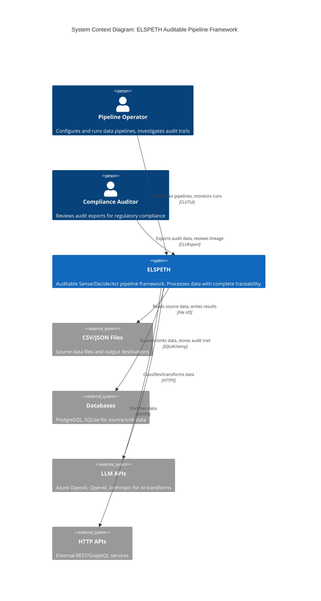

### Context Diagram Notes

**Key External Actors:**
- **Pipeline Operator:** Primary user who configures YAML settings, runs pipelines via CLI, and investigates issues using the audit trail
- **Compliance Auditor:** Secondary user focused on audit exports for regulatory review

**External Systems:**
- **Data Sources/Sinks:** CSV, JSON files, PostgreSQL/SQLite databases
- **AI Services:** LLM providers (Azure OpenAI primary) for classification transforms
- **HTTP APIs:** Generic REST services for data enrichment

**Critical Issue (CRIT-1):** Rate limiting for LLM/HTTP APIs is implemented but **disconnected** from the engine. The `RateLimitRegistry` exists in `core/rate_limit/` but is never instantiated by the orchestrator or executors.

---

## Level 2: Container Diagram

The container diagram shows the major subsystems (containers) within ELSPETH and their interactions.

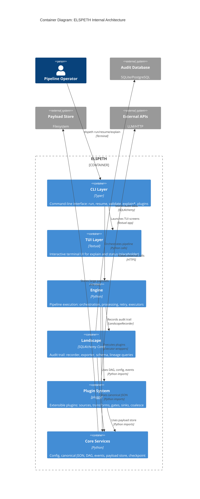

### Container Interaction Notes

**Data Flow:**
1. **CLI** receives commands and loads config from **Core**
2. **CLI** initializes **Engine** with config and plugin instances
3. **Engine** executes plugins, recording every operation to **Landscape**
4. **Plugins** make external calls (LLM/HTTP) and return results to **Engine**
5. **Landscape** writes audit data to database and coordinates with **PayloadStore**

**Critical Issues:**
- **CRIT-4:** TUI is placeholder - `explain_screen.py` (314 LOC) and `lineage_tree.py` (198 LOC) exist but aren't wired
- **HIGH-8:** OpenTelemetry claimed in logging.py docstring but no actual tracer configuration exists

---

## Level 3: Component Diagrams

### Engine Subsystem

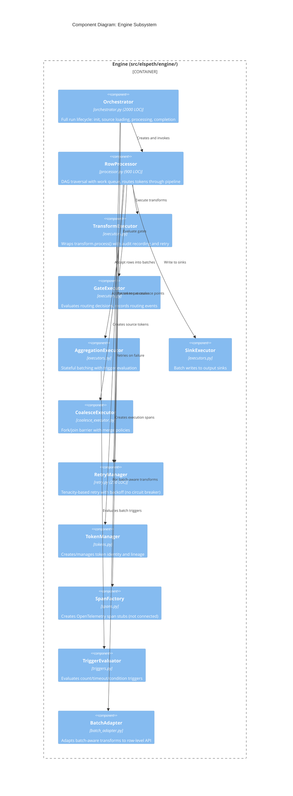

#### Engine Issues Highlighted

| Component | Issue ID | Description |
|-----------|----------|-------------|
| Orchestrator | HIGH-13 | 123 lines duplicated between `_execute_pipeline()` and `_execute_pipeline_with_instances()` |
| RowProcessor | CRIT-3 | `check_timeouts()` in CoalesceExecutor never called during processing |
| RetryManager | Arch | No circuit breaker - cascading failures if external service down |
| SpanFactory | HIGH-8 | Creates spans but no tracer configured - spans go nowhere |
| CoalesceExecutor | HIGH-3 | `_completed_keys` grows unbounded - memory leak |

---

### Landscape Subsystem

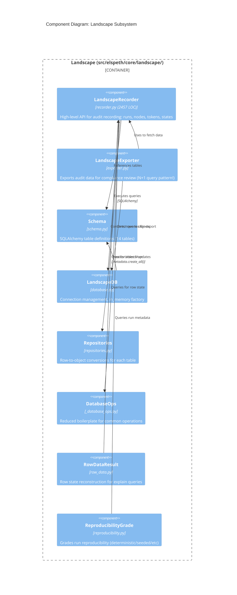

#### Landscape Issues Highlighted

| Component | Issue ID | Description |
|-----------|----------|-------------|
| LandscapeRecorder | HIGH-1 | `checkpoints_table` defined in schema but no `create_checkpoint()` method |
| LandscapeRecorder | MED-3 | Call index counter in-memory only - resume could create duplicates |
| LandscapeExporter | HIGH-2 | N+1 query pattern: 21,001 queries for 1000 rows |
| Schema | MED-9 | Missing composite index on `token_outcomes(run_id, token_id)` |
| LandscapeDB | MED-8 | `in_memory()` factory bypasses schema validation |

---

### Plugin Subsystem

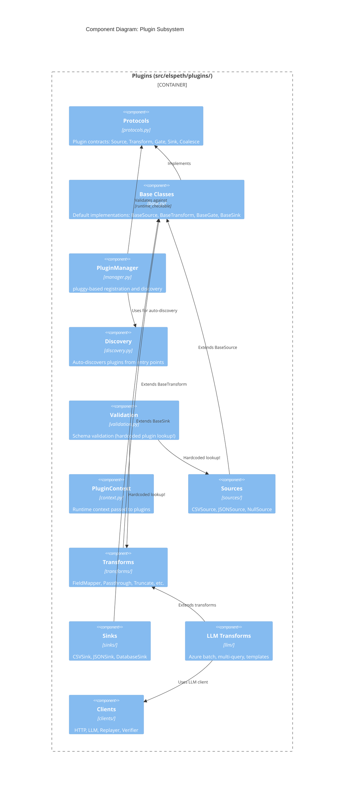

#### Plugin Issues Highlighted

| Component | Issue ID | Description |
|-----------|----------|-------------|
| Protocols + Base | HIGH-6 | Duality creates maintenance burden - `_on_error` already has doc drift |
| Protocols | Missing | `CoalesceProtocol` exists but no `BaseCoalesce` class |
| Validation | MED-4 | Hardcoded plugin lookup tables instead of using PluginManager |
| LLM Transforms | HIGH-10 | `process()` raises NotImplementedError - violates LSP |
| LLM Transforms | CRIT-2 | Defensive `.get()` chain on Azure response violates trust model |
| HTTP Client | HIGH-4 | Silent JSON parse fallback - returns string instead of dict |

---

### Core Subsystem

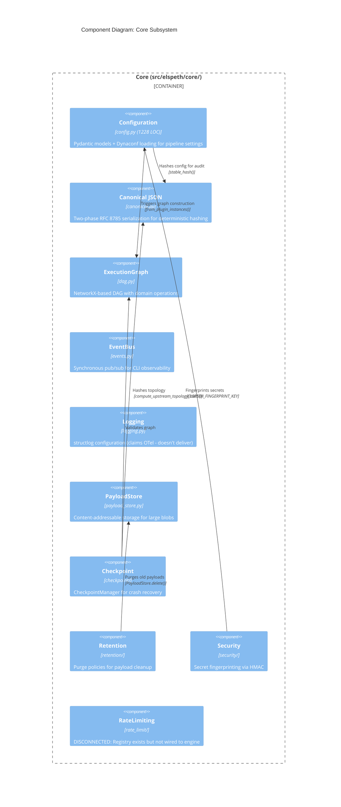

#### Core Issues Highlighted

| Component | Issue ID | Description |
|-----------|----------|-------------|
| RateLimiting | CRIT-1 | Fully implemented but **never instantiated** by engine |
| Checkpoint | HIGH-11 | Hardcoded `cutoff_date = datetime(2026, 1, 24)` for format changes |
| PayloadStore | HIGH-7 | Duplicate protocols in `payload_store.py` and `retention/purge.py` |
| Config | Layer | Imports `ExpressionParser` from engine - layer violation |
| Logging | HIGH-8 | Docstring claims OpenTelemetry integration that doesn't exist |

---

## Data Flow Diagrams

### Pipeline Execution Flow

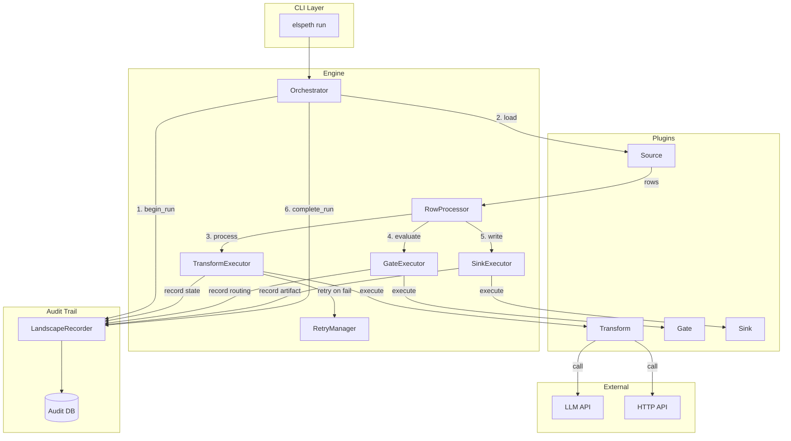

### Token Lineage Flow (Fork/Coalesce)

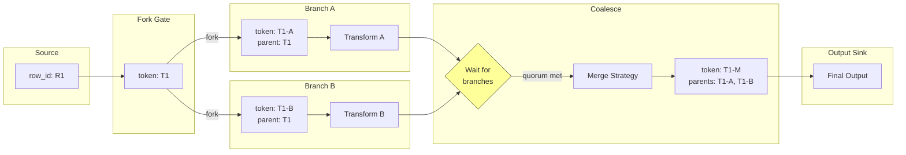

**Note (CRIT-3):** The wait at coalesce point can hang indefinitely during processing because `check_timeouts()` is only called during `flush_pending()` at end-of-source.

---

## Dependency Graph

### Layer Violations Detected

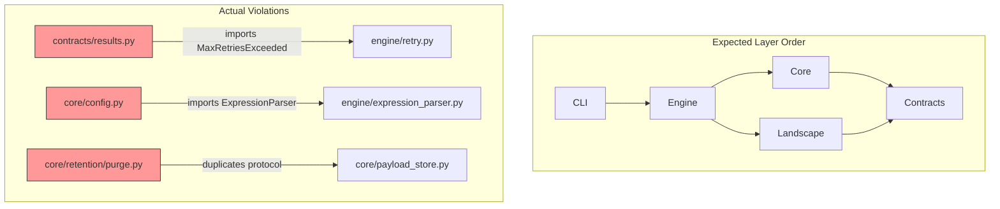

### Module Import Structure

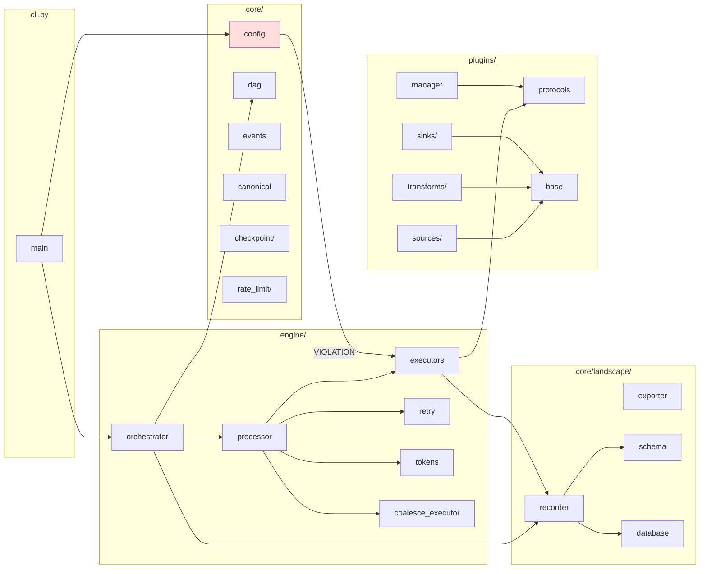

---

## Problematic Areas Summary

### Disconnected Code (High Risk)

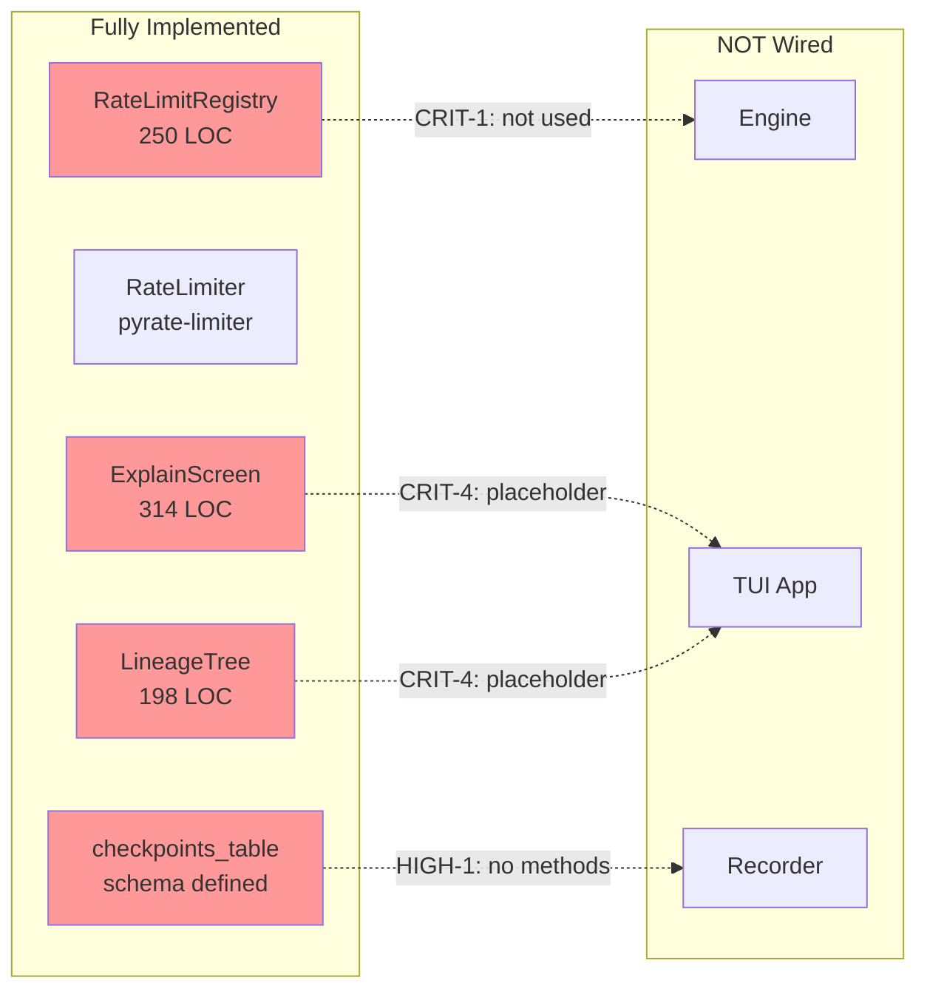

### Performance Bottlenecks

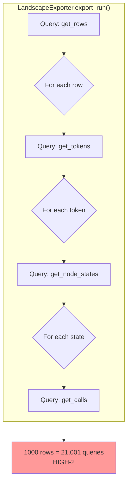

---

## Confidence Assessment

**Confidence Level:** High

**Evidence Trail:**
- Read all key source files (orchestrator, processor, executors, recorder, exporter, config, dag)
- Verified disconnections via grep searches (rate limit, check_timeouts)
- Traced import graphs for layer violations
- Counted query patterns in nested loops
- Cross-referenced discovery findings with source exploration

**Diagrams Based On:**
- `01-discovery-findings.md` - 47 issues identified by 17 agents
- Direct source code reading of 20+ files
- Module structure from glob patterns
- Import analysis from file headers

**Information Gaps:**
- Did not diagram Alembic migration flow
- TUI internal state machine not fully mapped
- Batch transform internal architecture simplified
