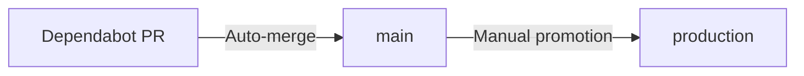

# Branch Protection Setup for Dependabot Auto-Merge

**Purpose:** Configure GitHub branch protection rules to enable automated security patches while requiring manual review for regular updates.

**Target Audience:** Repository administrators

---

## Overview

This guide configures branch protection for the `main` branch to support:
- ✅ **Automated security patches** (auto-merge after CI passes)
- ✅ **Manual review for regular updates** (1 approver required)
- ✅ **Comprehensive CI gates** (all checks must pass)
- ✅ **Status checks** (prevent bypass of CI)

---

## Quick Setup (GitHub UI)

### Step 1: Navigate to Branch Protection Settings

1. Go to repository on GitHub
2. Click **Settings** (top menu)
3. Click **Branches** (left sidebar)
4. Under "Branch protection rules", click **Add rule**
5. In "Branch name pattern", enter: `main`

### Step 2: Configure Protection Rules

Check the following boxes:

#### ✅ Require a pull request before merging
- ✅ **Required approvals:** `1`
- ⚠️ **DO NOT CHECK:** "Dismiss stale pull request approvals when new commits are pushed"
  - *(Allows auto-merge to work with bot approvals)*
- ⚠️ **DO NOT CHECK:** "Require review from Code Owners"
  - *(Optional: Enable when you have multiple team members)*
- ✅ **Require approval of the most recent reviewable push**
- ✅ **Allow specified actors to bypass required pull requests**
  - Add: `dependabot[bot]`
  - Add: `github-actions[bot]`

  **Why:** Allows automated workflows to merge security patches

#### ✅ Require status checks to pass before merging
- ✅ **Require branches to be up to date before merging**
- **Required status checks** (add these):
  - `lint-and-test` (from ci.yml)
  - `security-scan` (from ci.yml)
  - `dependency-review` (from dependency-review.yml)
  - `Dependabot Auto-Merge Security Patches / auto-merge-security` (conditional)

**How to find check names:**
- Run CI on a PR
- Scroll to bottom of PR → "Checks" tab
- Copy exact names of check boxes

#### ✅ Require conversation resolution before merging
- Ensures all PR comments are addressed

#### ✅ Require signed commits (Optional but recommended)
- Enforces commit signature verification

#### ✅ Require linear history
- Prevents merge commits, enforces rebase or squash

#### ✅ Include administrators
- Applies rules to admins (recommended for audit trail)

#### ⚠️ Allow force pushes (UNCHECKED)
- Leave unchecked for main branch

#### ⚠️ Allow deletions (UNCHECKED)
- Leave unchecked for main branch

### Step 3: Save Rules

Click **Create** or **Save changes**

---

## Configuration via GitHub CLI (Automated Setup)

```bash
#!/bin/bash
# Setup branch protection for main branch

REPO="tachyon-beep/elspeth"  # Change to your repo

gh api \
  --method PUT \
  -H "Accept: application/vnd.github+json" \
  "/repos/${REPO}/branches/main/protection" \
  -f required_status_checks='{"strict":true,"contexts":["lint-and-test","security-scan","dependency-review"]}' \
  -f enforce_admins=true \
  -f required_pull_request_reviews='{"dismissal_restrictions":{},"dismiss_stale_reviews":false,"require_code_owner_reviews":false,"required_approving_review_count":1,"require_last_push_approval":true,"bypass_pull_request_allowances":{"users":[],"teams":[],"apps":["dependabot","github-actions"]}}' \
  -f restrictions=null \
  -f required_linear_history=true \
  -f allow_force_pushes=false \
  -f allow_deletions=false \
  -f required_conversation_resolution=true
```

**Run with:**
```bash
bash scripts/setup-branch-protection.sh
```

---

## Verification Steps

### 1. Test Regular PR (Should Require Approval)

```bash
# Create test branch
git checkout -b test/branch-protection
echo "# Test" >> README.md
git add README.md
git commit -m "test: branch protection"
git push origin test/branch-protection

# Create PR
gh pr create --base main --head test/branch-protection --title "Test: Branch Protection" --body "Testing branch protection rules"

# Try to merge (should fail without approval)
gh pr merge <PR-NUMBER> --squash
# Expected: Error - review required

# Add approval
gh pr review <PR-NUMBER> --approve

# Merge (should succeed)
gh pr merge <PR-NUMBER> --squash

# Cleanup
gh pr close <PR-NUMBER> --delete-branch
```

### 2. Test Security PR (Should Auto-Merge)

**Wait for Dependabot to create a security PR, or simulate one:**

```bash
# Check for security PRs
gh pr list --label "security"

# Verify labels
gh pr view <PR-NUMBER> --json labels

# Expected labels: "dependencies", "security", "auto-merge-enabled"

# Wait for CI to complete
gh pr checks <PR-NUMBER> --watch

# Auto-merge should trigger automatically
# Check workflow run
gh run list --workflow=dependabot-auto-merge.yml --limit 1
```

### 3. Verify Status Checks

```bash
# List required checks for main branch
gh api /repos/tachyon-beep/elspeth/branches/main/protection/required_status_checks

# Expected output should include:
# - lint-and-test
# - security-scan
# - dependency-review
```

---

## Common Issues & Solutions

### Issue: "Changes requested" blocks auto-merge

**Problem:** Someone requested changes on security PR, blocking auto-merge

**Solution:**
```bash
# Dismiss review
gh pr review <PR-NUMBER> --dismiss --reason "Security patch auto-approved by workflow"

# Or: Remove 'changes requested' review via GitHub UI
# PR → Reviews → ... menu → Dismiss review
```

### Issue: Status check not found

**Problem:** Branch protection requires a check that doesn't exist

**Solution:**
```bash
# List all checks from a recent PR
gh pr view <PR-NUMBER> --json statusCheckRollup --jq '.statusCheckRollup[].name'

# Update branch protection with exact names
gh api --method PATCH \
  /repos/tachyon-beep/elspeth/branches/main/protection/required_status_checks \
  -f contexts[]="lint-and-test" \
  -f contexts[]="security-scan" \
  -f contexts[]="dependency-review"
```

### Issue: Dependabot can't push to branch

**Problem:** Dependabot PR creation fails with permissions error

**Solution:**
```bash
# Ensure Dependabot has write access
# Go to: Settings → Actions → General → Workflow permissions
# Select: "Read and write permissions"
# Check: "Allow GitHub Actions to create and approve pull requests"
```

### Issue: Auto-merge doesn't trigger

**Problem:** Security PR created but workflow doesn't run

**Solution:**
```bash
# Check workflow is enabled
gh workflow view dependabot-auto-merge.yml

# If disabled, enable it
gh workflow enable dependabot-auto-merge.yml

# Check recent runs
gh run list --workflow=dependabot-auto-merge.yml --limit 5

# Check workflow logs
gh run view <RUN-ID> --log
```

---

## Adjusting for Team Size

### Solo Developer (Current Setup)
```yaml
required_approving_review_count: 1
bypass_pull_request_allowances:
  apps: ["dependabot", "github-actions"]
```

**Allows:**
- Automated security patches (no human approval)
- Regular updates require 1 approval (you)

### Small Team (2-5 developers)
```yaml
required_approving_review_count: 1
require_code_owner_reviews: true
bypass_pull_request_allowances:
  apps: ["dependabot", "github-actions"]
```

**Add CODEOWNERS file:**
```
# .github/CODEOWNERS
# Default owners for everything
* @team-lead @senior-dev

# Security-sensitive files require security team
/docs/security/ @security-team
/.github/workflows/ @devops-team
```

### Large Team (6+ developers)
```yaml
required_approving_review_count: 2
require_code_owner_reviews: true
dismiss_stale_reviews: true
bypass_pull_request_allowances:
  apps: ["dependabot", "github-actions"]
  teams: ["security-team"]  # Can bypass for emergency patches
```

---

## Security Considerations

### Allowing Bots to Bypass Reviews

**Risk:** Bots can merge code without human review

**Mitigations:**
1. ✅ Comprehensive CI gates (tests, coverage, security scans)
2. ✅ Only security-labeled PRs auto-merge
3. ✅ Dependency review action blocks bad dependencies
4. ✅ Manual override available ('hold' label)
5. ✅ Full audit trail (PR, commits, releases)
6. ✅ Signed commits + images

**Industry Standard:** This is common practice for automated security patching (GitHub, GitLab, Atlassian all support this model)

### Audit Requirements

For compliance (SOC 2, ISO 27001, FedRAMP):

**Document:**
1. ✅ Automated approval policy (this doc)
2. ✅ CI gate requirements (all checks must pass)
3. ✅ Manual override procedures ('hold' label)
4. ✅ Retention policy (PRs, logs, images)
5. ✅ Rollback procedures

**Evidence:**
- Branch protection configuration export
- Sample auto-merged security PRs
- CI workflow configurations
- Audit trail from merged PRs

---

## Maintenance

### Quarterly Review Checklist

**Every 3 months:**

- [ ] Review required status checks (are they all still relevant?)
- [ ] Update bypass allowances (add/remove bots as needed)
- [ ] Test auto-merge workflow with sample PR
- [ ] Verify CI gates are comprehensive
- [ ] Update documentation if rules changed

### When Adding Team Members

**New developer:**
1. No changes needed (rules apply equally)

**New admin:**
1. Review "Include administrators" setting
2. Consider requiring admin reviews for sensitive paths (CODEOWNERS)

**New bot/automation:**
1. Add to bypass allowances if needed
2. Document purpose and risks
3. Test in staging branch first

---

## Alternative: Staging Branch Strategy

For maximum safety, use a staging branch:



**Setup:**
```bash
# Create production branch (protected)
git checkout -b production
git push origin production

# Branch protection for production:
# - Require 2 approvals
# - No bot bypass
# - All checks must pass
# - Manual promotion only

# Promote main to production weekly (or after verification)
git checkout production
git merge main
git push origin production
```

**Benefit:** Security patches auto-merge to `main` for testing, manual promotion to `production` after verification

---

## Related Documentation

- Security patch automation: `docs/operations/security-patch-automation.md`
- Dependabot configuration: `docs/operations/dependabot.md`
- CI workflows: `.github/workflows/`
- Incident response: `docs/architecture/incident-response.md`

---

## Quick Reference

**Enable auto-merge for current PR:**
```bash
gh pr merge <PR-NUMBER> --auto --squash
```

**Prevent auto-merge (add hold label):**
```bash
gh pr edit <PR-NUMBER> --add-label "hold"
```

**Check branch protection status:**
```bash
gh api /repos/tachyon-beep/elspeth/branches/main/protection
```

**List required checks:**
```bash
gh api /repos/tachyon-beep/elspeth/branches/main/protection/required_status_checks
```

**Add/remove required checks:**
```bash
# Add check
gh api --method POST \
  /repos/tachyon-beep/elspeth/branches/main/protection/required_status_checks/contexts \
  -f contexts[]=new-check-name

# Remove check
gh api --method DELETE \
  /repos/tachyon-beep/elspeth/branches/main/protection/required_status_checks/contexts \
  -f contexts[]=old-check-name
```

---

**Status:** ✅ Production Ready
**Last Updated:** 2025-10-21
**Next Review:** 2025-11-21
