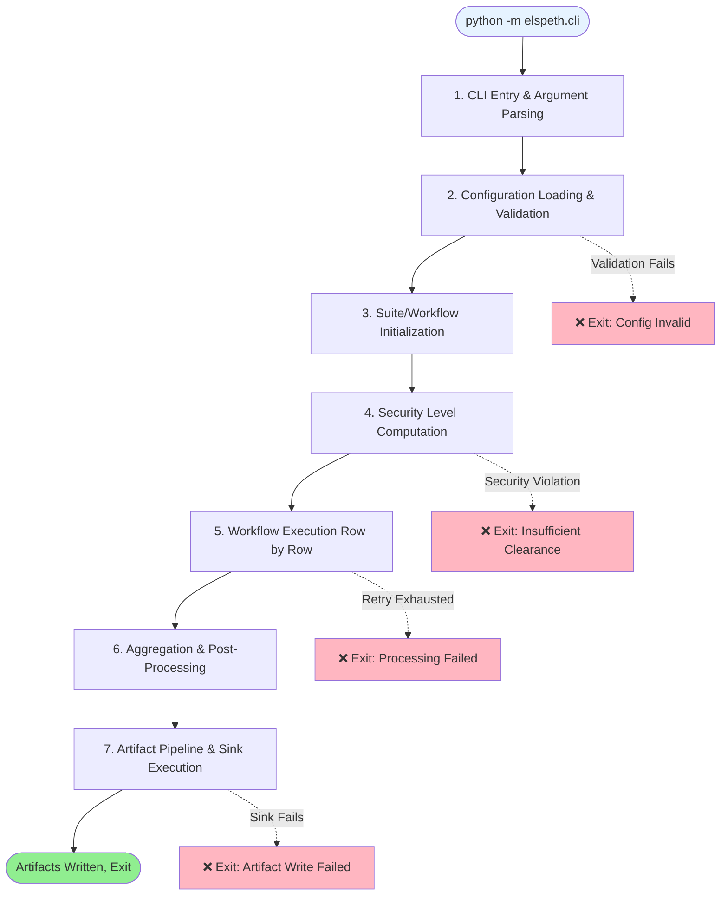
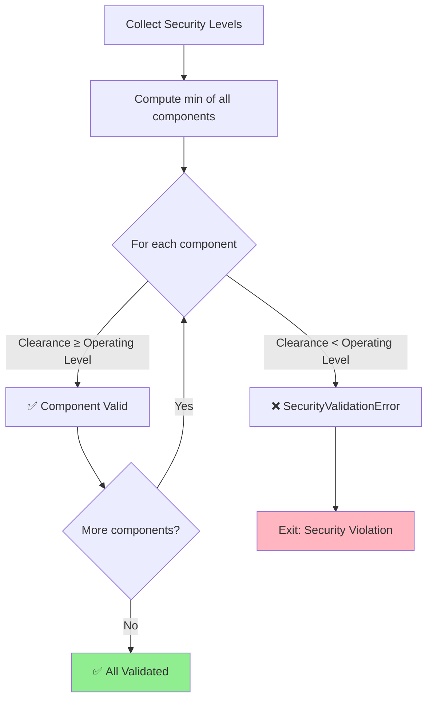
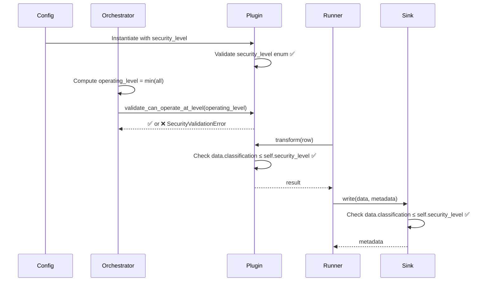

# Execution Flow

Complete trace of Elspeth's execution from CLI invocation to artifact generation.

!!! info "Purpose"
    This document provides both **logical flow** (high-level stages) and **detailed trace** (function-by-function execution) to help developers understand the system and debug issues.

---

## Quick Navigation

- [Logical Flow Overview](#logical-flow-overview) - High-level stages with decision points
- [Detailed Trace](#detailed-trace) - Function-by-function execution with code references
- [Security Checkpoints](#security-checkpoints) - Where/when/what security validation happens
- [Debugging Guide](#debugging-guide) - What to check at each stage

---

## Logical Flow Overview

Elspeth execution follows a **seven-stage pipeline** with validation at each boundary:



### Stage Breakdown

| Stage | Responsible Component | Key Actions | Exit on Failure? |
|-------|----------------------|-------------|------------------|
| **1. CLI Entry** | `src/elspeth/core/cli/suite.py` | Parse arguments, setup logging | ✅ Yes (invalid args) |
| **2. Config Loading** | `src/elspeth/core/cli/config_utils.py` | Load YAML, merge configs, validate schemas | ✅ Yes (invalid config) |
| **3. Suite Init** | `src/elspeth/core/experiments/suite_runner.py` | Instantiate plugins, bind components | ✅ Yes (plugin errors) |
| **4. Security Computation** | `ExperimentOrchestrator` | Compute operating level (min of all), validate clearances | ✅ Yes (security violation) |
| **5. Workflow Execution** | `src/elspeth/core/experiments/runner.py` | Process rows with transforms + middleware | ⚠️ Configurable (retry/skip) |
| **6. Aggregation** | Aggregator plugins | Compute statistics, cost summaries | 🔹 Optional (may skip) |
| **7. Artifact Pipeline** | `src/elspeth/core/pipeline/artifact_pipeline.py` | Write sinks in dependency order | ✅ Yes (sink failures) |

---

## Detailed Trace

### Stage 1: CLI Entry & Argument Parsing

**File**: `src/elspeth/core/cli/suite.py`

**Entry Point**: `python -m elspeth.cli --settings <path> --suite-root <path>`

```python
# Execution path:
1. __main__.py → dispatch to suite.main()
2. suite.main()
   ├─ Parse CLI arguments (argparse)
   ├─ Setup logging configuration
   ├─ Validate required arguments (settings, suite-root)
   └─ Call run_suite()
```

**Arguments Parsed**:
- `--settings` (required) → Path to settings.yaml
- `--suite-root` (required) → Directory containing experiments/
- `--reports-dir` (optional) → Output directory for reports
- `--head` (optional) → Preview N rows before execution
- `--live-outputs` (optional) → Enable real-time output display

**Debug Checkpoint**: If CLI fails, check:
- ✅ File paths exist (`settings.yaml`, suite root directory)
- ✅ Correct argument names (check `--help` output)
- ✅ Logging configured (should see log initialization messages)

---

### Stage 2: Configuration Loading & Validation

**File**: `src/elspeth/core/cli/config_utils.py`

```python
# Execution sequence:
1. load_suite_config(settings_path, suite_root)
   ├─ Load settings.yaml (YAML parse)
   ├─ Discover experiments in suite_root/experiments/
   ├─ For each experiment:
   │  ├─ Load experiment YAML
   │  ├─ Merge: suite defaults → prompt packs → experiment overrides
   │  └─ Validate merged config against JSON schemas
   └─ Return: SuiteConfig object

2. validate_schemas(config)
   ├─ Validate datasource schema
   ├─ Validate transform schema (LLM/custom)
   ├─ Validate sink schemas (each sink)
   └─ Validate middleware schemas
```

**Merge Order** (per ADR-009):
```
1. Suite defaults (settings.yaml → defaults:)
        ↓ (deep merge)
2. Prompt packs (if prompt_pack: specified)
        ↓ (deep merge)
3. Experiment overrides (experiments/<name>.yaml)
        ↓ (final result)
Merged Configuration
```

**Environment Variable Resolution**:
```yaml
# Before resolution:
llm:
  api_key: ${AZURE_OPENAI_KEY}

# After resolution:
llm:
  api_key: "sk-actual-key-value"  # From environment
```

**Debug Checkpoint**: If config loading fails:
- ✅ Valid YAML syntax (`yamllint settings.yaml`)
- ✅ All required fields present (datasource, transform, sinks)
- ✅ Environment variables set (check `${VAR}` references)
- ✅ Schema validation errors → Check plugin-specific required fields

---

### Stage 3: Suite/Workflow Initialization

**File**: `src/elspeth/core/experiments/suite_runner.py`

```python
# Execution sequence:
1. SuiteRunner.__init__(suite_config)
   ├─ Store suite configuration
   ├─ Initialize shared middleware instances
   └─ Create experiment orchestrators (one per experiment)

2. For each experiment in suite:
   ExperimentOrchestrator.__init__(experiment_config)
   ├─ Instantiate datasource plugin
   │  └─ DatasourceRegistry.create_from_config(config.datasource)
   ├─ Instantiate transform plugin (LLM/custom)
   │  └─ TransformRegistry.create_from_config(config.llm)
   ├─ Instantiate sink plugins (list)
   │  └─ SinkRegistry.create_from_config(sink_config) for each
   ├─ Instantiate middleware plugins
   │  └─ MiddlewareRegistry.create_from_config(mw_config) for each
   └─ Store component references
```

**Plugin Instantiation Pattern**:
```python
# All plugins follow this pattern:
1. Registry.create_from_config(config_dict)
2. Registry validates config against plugin schema
3. Registry calls PluginClass(**config)
4. Plugin.__init__() validates security_level
5. Plugin stores configuration
6. Return initialized plugin instance
```

**Debug Checkpoint**: If suite initialization fails:
- ✅ Plugin type exists in registry (check available plugins)
- ✅ Plugin configuration matches schema (required fields)
- ✅ Security level is valid enum value (UNOFFICIAL, OFFICIAL, etc.)
- ✅ Plugin dependencies available (e.g., azure-storage-blob for azure_blob)

---

### Stage 4: Security Level Computation & Validation

**Execution sequence**:

```python
1. orchestrator.compute_operating_level()
   ├─ Collect security levels:
   │  ├─ datasource_level = datasource.get_security_level()
   │  ├─ transform_level = transform.get_security_level()
   │  └─ sink_levels = [sink.get_security_level() for sink in sinks]
   │
   ├─ Compute minimum:
   │  operating_level = min(datasource_level, transform_level, *sink_levels)
   │
   └─ Return operating_level (e.g., SecurityLevel.OFFICIAL)

2. orchestrator.validate_security()
   For each component:
   ├─ component.validate_can_operate_at_level(operating_level)
   │  ├─ If component.security_level < operating_level:
   │  │  └─ Raise SecurityValidationError("Insufficient clearance")
   │  └─ Else: Pass (component can downgrade or exact match)
   └─ Continue to next component
```

**Security Validation Logic** (per ADR-002):
```
Component Clearance: SECRET
Operating Level: OFFICIAL
Validation: SECRET ≥ OFFICIAL → ✅ PASS (trusted downgrade)

Component Clearance: UNOFFICIAL
Operating Level: OFFICIAL
Validation: UNOFFICIAL < OFFICIAL → ❌ FAIL (insufficient clearance)
```

**Mermaid Flow**:


**Debug Checkpoint**: If security validation fails:
- ✅ Check `security_level` on failing component (should be ≥ operating level)
- ✅ Verify operating level computation (may be lower than expected due to min())
- ✅ Review Bell-LaPadula rules: [Security Model](../user-guide/security-model.md)
- ✅ Common fix: Increase component's `security_level` to match operating level

---

### Stage 5: Workflow Execution (Row-by-Row Processing)

**File**: `src/elspeth/core/experiments/runner.py`

This is the **core execution loop** where actual data processing happens.

```python
# High-level execution:
1. runner.run(datasource, transform, sinks, middleware)
   ├─ datasource.load_data() → ClassifiedDataFrame
   ├─ For each row in frame:
   │  ├─ Apply middleware.before_request(row)
   │  ├─ transform.transform(row) → result
   │  ├─ Apply middleware.after_response(row, result)
   │  ├─ Validate result (JSON schema, regex, etc.)
   │  └─ Store result or retry on error
   └─ Return: results DataFrame
```

**Detailed Row Processing**:

```python
# For each row (sequential or concurrent):
1. Extract row data → dict

2. Middleware.before_request(row_data)
   ├─ pii_shield: Check for PII patterns
   ├─ classified_material: Check for classified markings
   ├─ prompt_shield: Check for banned terms
   └─ If any middleware blocks → skip row or abort

3. Transform.transform(row_data)
   ├─ Render prompt template (Jinja2 strict)
   ├─ Call LLM API / custom transform logic
   ├─ Parse response
   └─ Return transformed data

4. Middleware.after_response(row_data, response)
   ├─ audit_logger: Log request/response
   ├─ health_monitor: Track latency, success rate
   ├─ azure_content_safety: Check response safety
   └─ If any middleware blocks → retry or skip

5. Validate response
   ├─ JSON schema validation (if specified)
   ├─ Regex pattern validation (if specified)
   └─ If validation fails → retry or skip

6. Handle result:
   ├─ Success → Store result, increment row counter
   ├─ Transient error → Retry with exponential backoff
   └─ Permanent error → Log failure, continue or abort
```

**Retry Logic**:

```python
# Retry with exponential backoff:
max_retries = 3
base_delay = 1.0  # seconds

for attempt in range(1, max_retries + 1):
    try:
        result = transform.transform(row)
        return result  # Success
    except TransientError as e:
        if attempt < max_retries:
            delay = base_delay * (2 ** (attempt - 1))  # 1s, 2s, 4s
            sleep(delay)
            continue
        else:
            # Retry exhausted
            handle_exhaustion(row, e)
```

**Concurrency Model** (if enabled):

```python
# Concurrent execution with ThreadPoolExecutor:
if concurrency.enabled and not rate_limiter.saturated():
    with ThreadPoolExecutor(max_workers=concurrency.max_workers) as executor:
        futures = [executor.submit(process_row, row) for row in rows]
        results = [future.result() for future in futures]
else:
    # Sequential fallback
    results = [process_row(row) for row in rows]
```

**Debug Checkpoint**: If row processing fails:
- ✅ Check middleware logs (which middleware blocked?)
- ✅ Inspect transform errors (API failures, timeout, rate limit?)
- ✅ Review retry count (exhausted all retries?)
- ✅ Validation errors (response doesn't match expected schema?)
- ✅ Check `logs/run_*.jsonl` for audit trail

---

### Stage 6: Aggregation & Post-Processing

**Execution sequence**:

```python
1. runner.run_aggregation_plugins(results_df, metadata)
   For each aggregation plugin:
   ├─ plugin.aggregate(results_df, metadata)
   ├─ Compute statistics (mean, std, percentiles)
   ├─ Generate cost summaries (token usage, API cost)
   ├─ Baseline comparison (if baseline specified)
   └─ Store aggregation results in metadata

2. Examples of aggregators:
   ├─ score_stats: Calculate mean/median/std of numeric columns
   ├─ cost_summary: Sum prompt_tokens, completion_tokens, total_cost
   ├─ score_significance: Compare to baseline with t-test
   └─ rationale_analysis: Extract common patterns from text
```

**Baseline Comparison Flow**:

```python
# If baseline specified:
1. Load baseline results from previous experiment
2. For each comparison criterion (e.g., accuracy):
   ├─ Extract current values: current_scores
   ├─ Extract baseline values: baseline_scores
   ├─ Compute delta: mean(current) - mean(baseline)
   ├─ Statistical test: t_test(current, baseline)
   ├─ Effect size: cohens_d(current, baseline)
   └─ Store in metadata: {"delta": 0.12, "p_value": 0.03, "significant": true}
```

**Debug Checkpoint**: If aggregation fails:
- ✅ Check aggregator plugin configuration
- ✅ Baseline experiment exists (if baseline comparison requested)
- ✅ Required columns present in results (e.g., "accuracy" for score_significance)
- ✅ Data types match expected (numeric for statistical aggregators)

---

### Stage 7: Artifact Pipeline & Sink Execution

**File**: `src/elspeth/core/pipeline/artifact_pipeline.py`

Final stage: write all outputs in **dependency order**.

```python
1. ArtifactPipeline.execute(results_df, metadata)
   ├─ Topological sort sinks by dependencies
   │  ├─ Independent sinks first (no consumes=[])
   │  └─ Dependent sinks after their dependencies
   │
   ├─ For each sink (in dependency order):
   │  ├─ Validate sink can operate at operating_level
   │  ├─ sink.write(results_df, metadata)
   │  ├─ Capture sink output metadata
   │  └─ Merge into global metadata
   │
   └─ Return aggregated metadata
```

**Dependency Resolution Example**:

```yaml
# Configuration:
sinks:
  - name: csv_output
    type: csv
    path: results.csv

  - name: excel_report
    type: excel_workbook
    base_path: reports/

  - name: signed_bundle
    type: signed_artifact
    consumes: [csv_output]  # Depends on CSV

# Execution order:
1. csv_output, excel_report (parallel - no dependencies)
2. signed_bundle (after csv_output completes)
```

**Sink Execution Detail**:

```python
# For each sink:
1. sink.validate_can_operate_at_level(operating_level)
   └─ If sink.security_level < operating_level:
      Raise SecurityValidationError

2. sink.write(results_df, metadata)
   ├─ Sanitize output (formula injection prevention)
   ├─ Write to destination (file, blob, API)
   ├─ Generate metadata (file paths, checksums, timestamps)
   └─ Return sink-specific metadata

3. Merge sink metadata:
   metadata[sink_name] = sink.write(...) return value
```

**Metadata Chaining**:

```python
# Metadata flows between sinks:
metadata = {}

# First: csv_output writes
metadata["csv_output"] = {"path": "results.csv", "rows": 100}

# Later: signed_bundle accesses CSV path
csv_path = metadata["csv_output"]["path"]
create_signed_bundle(csv_path, ...)
```

**Debug Checkpoint**: If sink execution fails:
- ✅ Check sink security level (≥ operating level)
- ✅ Destination writable (file permissions, network access)
- ✅ Dependency available (if consumes=[] specified)
- ✅ Sink-specific errors (blob auth, API keys, disk space)

---

## Security Checkpoints

Security validation happens at **five critical points**:

| Checkpoint | Location | What's Validated | Failure Mode |
|------------|----------|------------------|--------------|
| **1. Plugin Init** | Plugin `__init__()` | Security level is valid enum | Raises `ValueError` |
| **2. Operating Level Computation** | Orchestrator | Min of all components computed correctly | N/A (computation always succeeds) |
| **3. Component Clearance** | Orchestrator | Each component ≥ operating level | Raises `SecurityValidationError` |
| **4. Data Classification** | Transform execution | Data classification ≤ component clearance | Raises `SecurityValidationError` |
| **5. Sink Write** | Each sink | Sink ≥ data classification | Raises `SecurityValidationError` |

**Security Enforcement Sequence**:



---

## Debugging Guide

### Common Issues & Diagnosis

#### Issue: "SecurityValidationError: Insufficient clearance"

**Where**: Stage 4 (Security Validation)

**Diagnosis**:
```python
# Find the failing component:
1. Check error message for component name
2. Check component's security_level
3. Check computed operating_level
4. Compare: component.security_level ≥ operating_level?
```

**Solution**: Increase component's `security_level` to at least `operating_level`

---

#### Issue: "Config validation failed: Missing required field"

**Where**: Stage 2 (Config Loading)

**Diagnosis**:
```bash
# Check which plugin/field failed:
1. Error message shows: "datasource.path" or "llm.api_key"
2. Check that field exists in YAML config
3. Check field name spelling (case-sensitive)
```

**Solution**: Add missing field to configuration YAML

---

#### Issue: "Retry exhausted" / Transform keeps failing

**Where**: Stage 5 (Row Processing)

**Diagnosis**:
```bash
# Check audit logs:
tail -f logs/run_*.jsonl | grep ERROR

# Look for:
1. API errors (rate limit, auth failure, timeout)
2. Middleware blocks (PII detected, content safety)
3. Validation failures (response doesn't match schema)
```

**Solution**:
- API errors → Check credentials, rate limits, network
- Middleware blocks → Adjust middleware thresholds or disable
- Validation → Fix response schema or transform output

---

#### Issue: Sink fails to write

**Where**: Stage 7 (Artifact Pipeline)

**Diagnosis**:
```bash
# Check:
1. File permissions (can write to output directory?)
2. Disk space (df -h)
3. Network access (if cloud sink like azure_blob)
4. Credentials (API keys, connection strings)
```

**Solution**: Fix infrastructure issue (permissions, network, auth)

---

#### Issue: Slow execution / Hangs

**Where**: Stage 5 (Row Processing)

**Diagnosis**:
```bash
# Check:
1. Concurrency disabled? (sequential processing is slow)
2. Rate limiter saturated? (waiting for quota)
3. Network latency? (slow API responses)
4. Large dataset? (how many rows?)
```

**Solution**:
- Enable concurrency (if not enabled)
- Increase rate limit quota
- Use checkpoint recovery for large datasets
- Monitor with `--live-outputs` flag

---

## Related Documentation

- **[Architecture Overview](overview.md)** - System components
- **[Security Model](../user-guide/security-model.md)** - Bell-LaPadula MLS details
- **[Configuration Guide](../user-guide/configuration.md)** - Config structure and merge order
- **[API Reference](../api-reference/index.md)** - Plugin interfaces

---

## Code References

Key files for deep diving:

| Component | File Path | Lines of Interest |
|-----------|-----------|-------------------|
| **CLI Entry** | `src/elspeth/core/cli/suite.py` | CLI argument parsing |
| **Config Loading** | `src/elspeth/core/cli/config_utils.py` | Merge logic, validation |
| **Suite Runner** | `src/elspeth/core/experiments/suite_runner.py` | Orchestration |
| **Row Processing** | `src/elspeth/core/experiments/runner.py` | Core execution loop |
| **Artifact Pipeline** | `src/elspeth/core/pipeline/artifact_pipeline.py` | Dependency resolution |
| **Security Validation** | `src/elspeth/core/base/plugin.py` | `validate_can_operate_at_level()` |

---

!!! tip "Execution Tracing"
    For detailed execution traces, enable debug logging:
    ```bash
    export ELSPETH_LOG_LEVEL=DEBUG
    python -m elspeth.cli --settings ...
    ```

    Check `logs/run_*.jsonl` for complete audit trail with correlation IDs.
