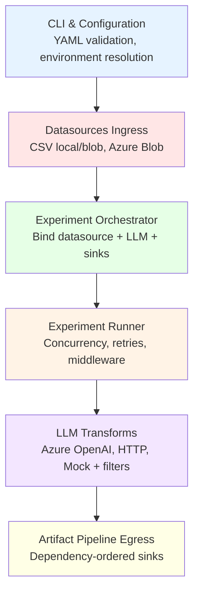
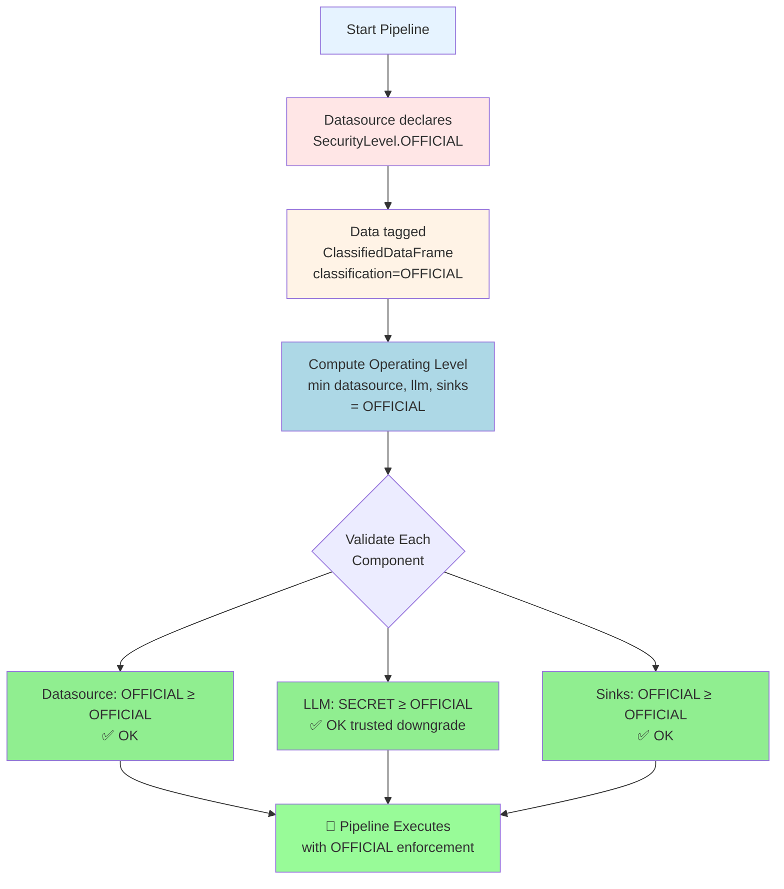

# Architecture Overview

Understand Elspeth's component-based architecture and data flow.

!!! info "Design Philosophy"
    Elspeth follows **security-first** design principles with defense-in-depth, fail-fast validation, and explicit security level propagation throughout the pipeline.

---

## System Architecture

Elspeth is organized into **six core layers**:

```
┌─────────────────────────────────────────────────────────────┐
│  CLI & Configuration                                        │
│  └─ YAML validation, environment resolution, suite loading  │
└─────────────────────────────────────────────────────────────┘
                          ↓
┌─────────────────────────────────────────────────────────────┐
│  Datasources (Ingress)                                      │
│  └─ CSV local/blob, Azure Blob → ClassifiedDataFrame       │
└─────────────────────────────────────────────────────────────┘
                          ↓
┌─────────────────────────────────────────────────────────────┐
│  Experiment Orchestrator                                     │
│  └─ Bind datasource + LLM + sinks + middleware              │
└─────────────────────────────────────────────────────────────┘
                          ↓
┌─────────────────────────────────────────────────────────────┐
│  Experiment Runner                                           │
│  └─ Concurrency, retries, middleware chain, validation      │
└─────────────────────────────────────────────────────────────┘
                          ↓
┌─────────────────────────────────────────────────────────────┐
│  LLM Transforms (with Middleware)                           │
│  └─ Azure OpenAI, HTTP, Mock + security filters             │
└─────────────────────────────────────────────────────────────┘
                          ↓
┌─────────────────────────────────────────────────────────────┐
│  Artifact Pipeline (Egress)                                 │
│  └─ Dependency-ordered sinks with security enforcement      │
└─────────────────────────────────────────────────────────────┘
```



---

## Core Principles

### 1. Defense by Design

All external integrations use **typed protocols** so untrusted components can be swapped without touching orchestration logic.

```python
# Protocols define contracts
class DataSource(Protocol):
    def load_data(self) -> ClassifiedDataFrame: ...

class LLMClient(Protocol):
    def transform(self, frame: ClassifiedDataFrame) -> ClassifiedDataFrame: ...

class Sink(Protocol):
    def write(self, frame: ClassifiedDataFrame, metadata: dict) -> None: ...
```

**Benefits**:
- ✅ Swap implementations without changing core code
- ✅ Plugin boundaries prevent contamination
- ✅ Security enforcement isolated from business logic

---

### 2. Configuration as Code

Profiles are validated YAML merged with prompt packs, preventing runtime surprises and enabling **fail-fast feedback**.

```yaml
# settings.yaml (validated at load time)
llm:
  type: azure_openai
  endpoint: ${AZURE_OPENAI_ENDPOINT}  # ← Validated before run
  middleware:
    - type: pii_shield              # ← Schema validated
```

**Benefits**:
- ✅ Configuration errors caught before data retrieval
- ✅ No runtime surprises from malformed config
- ✅ Environment variable resolution with validation

---

### 3. Traceable Execution

Every run records retries, aggregates, costs, and security classifications for consistent audit trails.

```json
{
  "run_id": "exp-2025-10-26-001",
  "security_level": "OFFICIAL",
  "retries": {"total": 5, "successful": 4, "exhausted": 1},
  "cost_summary": {"total_cost": 0.45, "prompt_tokens": 1250, "completion_tokens": 380},
  "baseline_comparison": {"delta": 0.12, "p_value": 0.03}
}
```

**Benefits**:
- ✅ Full audit trail for compliance
- ✅ Cost tracking per experiment
- ✅ Retry history for debugging

---

### 4. Least Privilege Propagation

Data, middleware, and artifacts carry **explicit security levels** allowing downstream sinks to enforce clearance.

```python
# Data carries classification
frame = ClassifiedDataFrame.create_from_datasource(data, SecurityLevel.OFFICIAL)

# Sink validates clearance before writing
sink.validate_can_operate_at_level(frame.classification)  # ✅ or ❌
```

**Benefits**:
- ✅ No implicit security assumptions
- ✅ Fail-fast on clearance violations
- ✅ Defense-in-depth (multiple validation points)

---

## Component Layers

### Ingress: Datasources

Datasources load tabular data and tag each frame with its classification.

**Built-in Datasources**:
- `csv_local` - Local filesystem CSV
- `csv_blob` - Azure Blob Storage (direct URI)
- `azure_blob` - Azure Blob with profile-based auth

**Key Features**:
- Security level tagging
- `on_error` policies (abort/skip/log)
- Type coercion via `dtype` hints

**Example**:
```python
frame = datasource.load_data()
# → ClassifiedDataFrame(data=DataFrame, classification=OFFICIAL)
```

---

### Configuration Loader

Merges configuration from multiple sources in priority order:

```
1. Suite defaults (settings.yaml)
        ↓
2. Prompt packs (optional)
        ↓
3. Experiment overrides (experiments/*.yaml)
        ↓
4. Runtime plugins instantiated
```

**Validation stages**:
- ✅ YAML syntax validation
- ✅ JSON schema validation per plugin
- ✅ Security level consistency checks
- ✅ Environment variable resolution

---

### Orchestrator

Binds datasource, LLM client, sinks, and optional controls into a cohesive experiment.

**Responsibilities**:
- Instantiate plugins from configuration
- Validate security levels across components
- Compute operating level (minimum of all components)
- Share middleware instances across experiment runs

**Example**:
```python
orchestrator = Orchestrator(
    datasource=csv_datasource,
    llm=azure_openai_client,
    sinks=[csv_sink, excel_sink],
    middleware=[pii_shield, audit_logger]
)

operating_level = orchestrator.compute_operating_level()
# → SecurityLevel.OFFICIAL (minimum across all components)
```

---

### Experiment Runner

Executes the experiment with concurrency, retries, and validation.

**Execution Flow**:
```
1. Load data from datasource
        ↓
2. For each row (with concurrency):
   a. Apply middleware.before_request()
   b. Call LLM.transform()
   c. Apply middleware.after_response()
   d. Validate response
   e. Handle retries on errors
        ↓
3. Run aggregation plugins
        ↓
4. Execute artifact pipeline (sinks)
```

**Key Features**:
- **Concurrency**: Thread pool execution with backlog control
- **Retries**: Exponential backoff with configurable max attempts
- **Checkpointing**: Resume from last processed row
- **Early Stop**: Conditional halt based on metrics
- **Cost Tracking**: Token usage and API cost aggregation

---

### LLM Transforms

Process data through language models with middleware pipeline.

**Middleware Stack**:
```
Request → PII Shield → Classified Material Filter → Prompt Shield → LLM API
                                                                      ↓
Response ← Audit Logger ← Health Monitor ← Content Safety ← LLM API
```

**Middleware Types**:
- **Security Filters**: Block PII, classified markings, banned terms
- **Monitoring**: Audit logging, health metrics, latency tracking
- **Content Safety**: Azure Content Safety API integration

**Example**:
```python
# Middleware runs in declaration order
llm_with_middleware = LLMClient(
    middleware=[
        PIIShield(on_violation="abort"),
        ClassifiedMaterialFilter(on_violation="abort"),
        AuditLogger(include_prompts=False),
        HealthMonitor(heartbeat_interval=60)
    ]
)
```

---

### Artifact Pipeline

Executes sinks in dependency order with security enforcement.

**Dependency Resolution**:
```yaml
sinks:
  # Independent (run first, in parallel)
  - name: csv
    type: csv

  - name: excel
    type: excel_workbook

  # Dependent (runs after csv)
  - name: signed
    type: signed_artifact
    consumes: [csv]
```

**Execution Order**:
```
1. csv, excel (parallel)
       ↓
2. signed (waits for csv)
```

**Security Enforcement**:
- Each sink validates it can handle data classification
- Insufficient clearance aborts pipeline
- Security level downgrade attempts are blocked

**Example**:
```python
pipeline = ArtifactPipeline(
    sinks=[csv_sink, excel_sink, signed_sink],
    operating_level=SecurityLevel.OFFICIAL
)

# Each sink validates before writing
pipeline.execute(frame, metadata)
```

---

## Data Flow

### End-to-End Pipeline

```
CSV File (OFFICIAL classification)
    ↓
Datasource.load_data()
    ↓
ClassifiedDataFrame(data, classification=OFFICIAL)
    ↓
ExperimentRunner (operating_level=OFFICIAL)
    ↓
For each row:
  ├─ Middleware.before_request() → PII check, audit log
  ├─ LLM.transform() → Azure OpenAI API call
  ├─ Middleware.after_response() → Content safety, health metrics
  └─ Validation → Regex/JSON validation
    ↓
Aggregation plugins → Statistics, cost summary
    ↓
ArtifactPipeline
  ├─ CSVSink.write() → results.csv
  ├─ ExcelSink.write() → report.xlsx
  └─ SignedSink.write() → signed_bundle.tar.gz + .sig
```

### Security Level Propagation

```
1. Datasource declares: SecurityLevel.OFFICIAL
        ↓
2. Data tagged: ClassifiedDataFrame(classification=OFFICIAL)
        ↓
3. Operating level computed: MIN(datasource, llm, sinks) = OFFICIAL
        ↓
4. Each component validates:
   - Datasource: OFFICIAL clearance, operating at OFFICIAL → ✅ OK
   - LLM: SECRET clearance, operating at OFFICIAL → ✅ OK (trusted downgrade)
   - Sinks: OFFICIAL clearance, operating at OFFICIAL → ✅ OK
        ↓
5. Pipeline executes with OFFICIAL enforcement throughout
```



---

## Security Posture Highlights

### Prompt Hygiene

Prompts render through **StrictUndefined** Jinja environment:

```python
# Missing variables raise errors (no silent failures)
template = jinja_env.from_string("Hello {name}")
template.render({"invalid_key": "value"})  # ❌ Raises UndefinedError
```

### Output Sanitization

Spreadsheet sinks neutralize formula injection:

```python
# Input
value = "=SUM(A1:A10)"

# Sanitized output
sanitized = "'=SUM(A1:A10)"  # Prefixed to prevent execution
```

### Signed Artifacts

Bundles embed HMAC manifests for tamper evidence:

```
experiment_results.tar.gz          # Bundle
experiment_results.tar.gz.sig      # HMAC-SHA256 signature
experiment_results.tar.gz.manifest # Metadata (files, checksums, security level)
```

### Middleware Security Stack

Production middleware order:

```yaml
llm:
  middleware:
    - type: pii_shield              # 1. Block PII
    - type: classified_material     # 2. Block classified markings
    - type: prompt_shield           # 3. Block banned terms
    - type: azure_content_safety    # 4. External content safety check
    - type: audit_logger            # 5. Log sanitized prompts
    - type: health_monitor          # 6. Track performance
```

---

## Advanced Features

### Concurrency Control

Thread pool execution with rate limiter awareness:

```yaml
concurrency:
  max_workers: 4
  backlog_threshold: 100
  enabled: true
```

**Decision tree**:
```
Is concurrency.enabled? → No → Sequential execution
        ↓ Yes
Is rate_limiter saturated? → Yes → Sequential (avoid backpressure)
        ↓ No
Launch ThreadPoolExecutor(max_workers=4) → Parallel execution
```

### Checkpoint Recovery

Resume experiments from last processed row:

```yaml
checkpoint:
  path: checkpoints/experiment.json
  field: id  # Row identifier
```

**Behavior**:
- Skips rows with IDs already in checkpoint file
- Appends new results incrementally
- Minimizes replay during resume

### Baseline Comparison

Compare experiment results against baseline:

```yaml
baseline:
  experiment_name: previous_run
  comparison_plugins:
    - type: score_significance
      criteria: [accuracy, relevance]
      alpha: 0.05
```

**Output**:
```json
{
  "baseline_comparison": {
    "delta": 0.12,
    "p_value": 0.03,
    "significant": true,
    "effect_size": "medium"
  }
}
```

### Early Stop

Halt experiment when condition met:

```yaml
early_stop:
  - type: threshold
    metric: accuracy
    threshold: 0.95
    comparison: greater
    min_rows: 100
```

**Behavior**:
- Evaluates after each row
- Halts queue submission when triggered
- Records trigger metadata for audit

---

## Extension Points

### Custom Plugins

Elspeth supports custom implementations of:

| Plugin Type | Interface | Example Use Case |
|-------------|-----------|------------------|
| **Datasource** | `load_data()` | PostgreSQL, REST API, Snowflake |
| **Transform** | `transform()` | Custom LLM, Rule engine, ML model |
| **Sink** | `write()` | S3, BigQuery, Kafka, Webhook |
| **Middleware** | `before_request()`, `after_response()` | Custom security filter, Telemetry |
| **Validation** | `validate()` | JSON Schema, Regex, Custom rules |
| **Aggregation** | `aggregate()` | Custom statistics, Business metrics |

See [API Reference](../api-reference/index.md) for plugin development guide.

---

## Areas to Monitor

### Credential Management

**Secure practices**:
- ✅ Use environment variables for secrets
- ✅ Inject via CI/CD secret stores
- ✅ Never commit secrets to Git
- ✅ Rotate credentials regularly
- ✅ Use managed identities (Azure, AWS IAM) when possible

**Plugins requiring credentials**:
- Azure Blob sinks
- GitHub/Azure DevOps repository sinks
- Signed artifact sinks (signing keys)
- Azure Content Safety middleware
- LLM clients (API keys)

### Network Boundaries

**Outbound HTTP calls**:
- Azure Content Safety middleware
- GitHub/Azure DevOps repository sinks
- LLM API calls (Azure OpenAI, OpenAI HTTP)

**Security controls**:
- Configure outbound firewall rules
- Set timeouts appropriately
- Use allowlisted endpoints only
- Monitor for failed connections

### Dependency Management

**Optional extras**:
- Statistical plugins → scipy, numpy
- Excel sinks → openpyxl
- Visual analytics → matplotlib, seaborn

**Best practices**:
- Pin exact versions (requirements lockfiles)
- Monitor for vulnerabilities
- Regular dependency audits
- Use `--require-hashes` for installs

---

## Performance Characteristics

### Scalability

| Component | Bottleneck | Mitigation |
|-----------|------------|------------|
| **Datasource** | File I/O | Stream large files, use blob storage |
| **LLM API** | Rate limits | Adaptive rate limiter, concurrency control |
| **Sinks** | Disk writes | Parallel execution, async writes |
| **Memory** | Large datasets | Process in chunks, streaming DataFrames |

### Optimization Tips

1. **Use concurrency** for I/O-bound workloads (LLM calls)
2. **Checkpoint frequently** for long-running experiments
3. **Use adaptive rate limiting** to maximize throughput
4. **Filter data early** (datasource-level filtering)
5. **Minimize middleware** (only necessary security filters)

---

## Related Documentation

- **[ADR Catalogue](adrs.md)** - Architecture Decision Records
- **[Security Model](../user-guide/security-model.md)** - Bell-LaPadula MLS enforcement
- **[Configuration Guide](../user-guide/configuration.md)** - YAML configuration reference
- **[API Reference](../api-reference/index.md)** - Plugin development

---

## Key Design Decisions

| Decision | Rationale | ADR |
|----------|-----------|-----|
| **Nominal typing (ABC not Protocol)** | Prevent security bypass attacks via duck typing | ADR-004 |
| **Immutable classification** | Prevent data laundering and downgrade attacks | ADR-002 |
| **Frozen dataclass** | Classification cannot be modified after creation | ADR-002a |
| **min() for operating level** | "Weakest link" determines pipeline security | ADR-002 |
| **@final security methods** | Prevent subclass override of security enforcement | ADR-004 |
| **Constructor protection** | Only datasources create ClassifiedDataFrame | ADR-002a |
| **Frozen plugins** | Dedicated infrastructure (allow_downgrade=False) | ADR-005 |

See [ADR Catalogue](adrs.md) for complete decision history.

---

!!! success "Architecture Summary"
    Elspeth implements a **security-first pipeline architecture** with:

    - ✅ **6 core layers** (CLI → Datasource → Orchestrator → Runner → LLM → Sinks)
    - ✅ **4 design principles** (Defense, Configuration as Code, Traceability, Least Privilege)
    - ✅ **Multiple extension points** for custom plugins
    - ✅ **Defense-in-depth** with middleware, validation, and signing
    - ✅ **Fail-fast enforcement** at every security boundary

    The architecture balances **flexibility** (plugin system) with **security** (immutable classification, typed protocols, validation).
